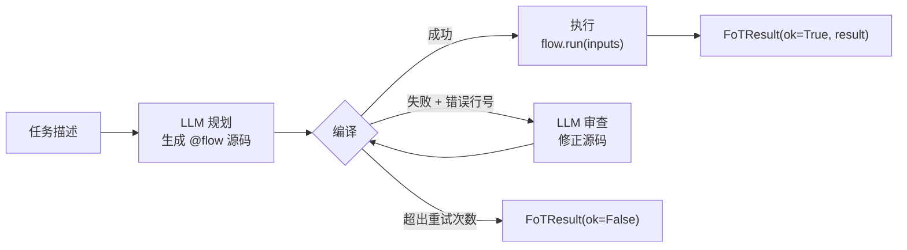

# FoT Agent（FoTAgent）

`FoTAgent`（Flow-of-Thought Agent）是一种**一次性规划**模式：

1. LLM 根据任务描述生成完整 `@flow` 源码
2. 编译校验，失败则带错误回灌 LLM 自纠
3. 编译通过后执行，返回结果

适合任务语义清晰、需要生成确定性流程图的场景。

## 安装

```bash
pip install "plaita-ai[agent,openai]"
```

## 快速上手

```python
from langchain.tools import tool
from plaita_ai.agent.fot import FoTAgent

def weather(city: str) -> str:
    """查询城市天气。"""
    return f"{city}：晴，25°C"

agent = FoTAgent(
    model="openai:gpt-4o-mini",
    tools=[weather],
    instruction="工具调用用 TOOL 节点，不要编造工具名",
)

result = agent.invoke({"task": "查北京天气", "city": "北京"})
print(result.ok)      # True
print(result.result)  # "北京：晴，25°C"
print(result.source)  # 生成的 @flow 源码
print(result.attempts) # 编译自纠轮数（通常 1）
```

## 构造参数

```python
FoTAgent(
    model,                  # str 或 BaseChatModel 实例
    tools=[],               # Python 可调用或 LangChain BaseTool，注册为 TOOL 节点
    instruction="",         # 追加到规划 prompt 的额外指令
    max_compile_retries=3,  # 编译失败最多重试次数
    globals_ctx={},         # 注入 flow.global_context（$GLOBAL.*）
    flow_id=None,           # 指定主流程函数名（多 @flow 定义时）
)
```

## `invoke` 方法

```python
result = agent.invoke(inputs: dict)
```

`inputs` 字典规则：
- `"task"` 或 `"input"` key：必填，LLM 看到的任务描述
- 其他 key：作为 `@flow` 的输入字段（`INPUT.*`）传入执行
- `"instruction"` key 不被特殊过滤，可作为普通 flow 输入字段

示例：

```python
result = agent.invoke({
    "task": "把用户名转大写并返回问候",
    "name": "alice",    # → INPUT.name
    "lang": "zh",       # → INPUT.lang
})
```

## 返回值（`FoTResult`）

```python
result.ok             # bool：是否成功（编译通过且执行成功）
result.result         # Any：@flow 执行结果（ok=True 时有效）
result.source         # str：最终 @flow 源码
result.attempts       # int：实际编译尝试次数
result.compile_errors # List[CompileError]：编译失败时的错误列表（ok=False 时有值）
result.run            # RunResult | None：执行结果对象（ok=True 时有值）
result.to_dict()      # 序列化为 dict
```

## 工具注册

传给 `tools=` 的函数注册为 `ToolNode`，在生成的 `@flow` 里用 `TOOL(action="name", params={...})` 调用：

```python
def search(query: str, top_k: int = 5) -> list:
    """搜索知识库。"""
    return [...]

agent = FoTAgent(model="...", tools=[search])
# LLM 生成的 @flow 里可以：
# results = TOOL(action="search", params={"query": INPUT.q, "top_k": 3})
```

LangChain `@tool` 装饰的函数同样支持：

```python
from langchain.tools import tool

@tool
def translate(text: str, target: str = "zh") -> str:
    """翻译文本。"""
    ...

agent = FoTAgent(model="...", tools=[translate])
```

!!! warning "ToolNode 全局状态"

    工具注册到进程级全局 `ToolNode._tools`，多个 Agent 实例注册同名工具会触发警告并覆盖。
    测试时用 `ToolNode.clear()` 重置：

    ```python
    from plaita_ai.agent.fot.tools import ToolNode
    ToolNode.clear()
    ```

## 编译自纠循环



失败时 `result.compile_errors` 包含结构化错误：

```python
if not result.ok:
    for err in result.compile_errors:
        print(f"第 {err.line} 行：{err.message}")
```

## 离线测试（无需 API key）

用 `FakeListChatModel` 注入脚本化回复，测试整条 plan → compile → run 链路：

```python
from langchain_core.language_models.fake_chat_models import FakeListChatModel
from plaita_ai.agent.fot import FoTAgent

FLOW = '''```python
@flow("greet", input_type="object")
def greet(INPUT):
    name = F.upper(INPUT.name)
    return F.concat("hi ", name)
```'''

model = FakeListChatModel(responses=[FLOW])
agent = FoTAgent(model=model)
result = agent.invoke({"task": "打招呼", "name": "alice"})
assert result.ok
assert result.result == "hi ALICE"
```

## 异步支持（`ainvoke`）

FoT 的规划循环内部使用同步 LLM 调用。`ainvoke` 通过 `asyncio.to_thread` 将整条 plan → compile → run 流水线卸载到线程池，事件循环不会被阻塞：

```python
# FastAPI 示例
from fastapi import FastAPI
from plaita_ai.agent.fot import FoTAgent

app = FastAPI()
agent = FoTAgent(model="openai:gpt-4o-mini", tools=[weather])

@app.post("/run")
async def run_flow(task: str, city: str):
    result = await agent.ainvoke({"task": task, "city": city})
    return result.to_dict()
```

!!! note
    FoTAgent 不支持 `astream`，因为 FoT 模式先规划再执行，不产生逐步可流式的文本回复。
    如果需要流式输出，使用 `PlaitaAgent.astream`。

## 与 ReAct Agent 对比

| | `FoTAgent` | `PlaitaAgent`（ReAct） |
|---|---|---|
| 规划模式 | 一次生成整段 @flow | 多轮 function-call，遇到复杂任务再写 @flow |
| 工具调用 | 只能在 @flow TOOL 节点里 | 直接 function-call 或 @flow TOOL 两种路径 |
| 输出 | 确定性流程图 + 执行结果 | 自然语言 + 工具调用记录 |
| 适合场景 | 任务明确、批量、需可审计 | 通用对话、交互探索 |
