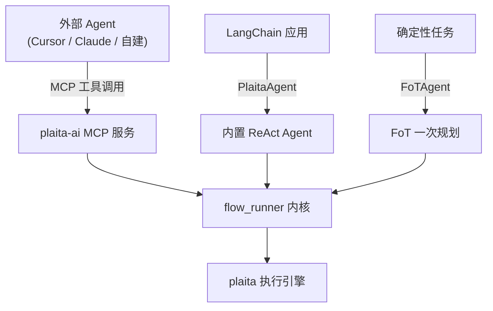

# AI 集成（plaita-ai）

`plaita-ai` 是 plaita 的 **AI 集成层**，把 `@flow` 编译与执行能力以多种形式交给 AI Agent 使用。

## 两个包，各司其职

| 包 | 职责 |
|---|---|
| `plaita` | 核心执行引擎：流程 IR、节点、表达式、分布式 |
| `plaita-ai` | AI 集成：MCP 服务、CLI、FoT Agent、ReAct Agent、flow-coder skill |

plaita 本身不是 Agent 运行时；`plaita-ai` 负责"LLM 规划 + `@flow` 生成 + 编译校验 + 执行"这一插件层。

## 三种集成方式



### 方式 1：MCP 服务（推荐，适合任何 Agent 环境）

以 stdio MCP 服务运行，任何支持 MCP 的 Agent（Cursor、Claude Desktop、自建 Agent）都能调用 `flow_compile` / `flow_run` 等工具。

→ [MCP 服务使用指南](mcp.md)

### 方式 2：内置 ReAct Agent（LangChain 生态）

`PlaitaAgent` 是基于 LangChain 1.x `create_agent` 的 ReAct Agent，内置 plaita compile/run 工具。适合通用对话 Agent，默认直接调工具，遇到复杂多步任务自行决定是否用 `@flow` 编排。

→ [ReAct Agent 使用指南](react-agent.md)

### 方式 3：FoT Agent（Flow-of-Thought）

`FoTAgent` 是一次性规划模式：LLM 根据任务描述直接生成整段 `@flow` 源码 → 编译校验 → 自纠重试 → 执行。适合任务明确、需要可复现流程图的场景。

→ [FoT Agent 使用指南](fot-agent.md)

## 安装

```bash
# 仅 MCP 服务 + CLI（无需 LangChain）
pip install plaita-ai

# + 内置 Agent（ReAct / FoT，需要 LangChain 1.x）
pip install "plaita-ai[agent]"

# + OpenAI 模型集成
pip install "plaita-ai[agent,openai]"

# + Anthropic 模型集成
pip install "plaita-ai[agent,anthropic]"
```

## flow-coder Skill

`plaita-ai` 内置了 `flow-coder` skill，指导 AI 用 `@flow` DSL 生成并执行流程。可安装到 Cursor：

```bash
ln -sf "$(pwd)/plaita-ai/plaita_ai/skills/flow-coder" ~/.cursor/skills/flow-coder
```

→ [Skill 说明](skills.md)
