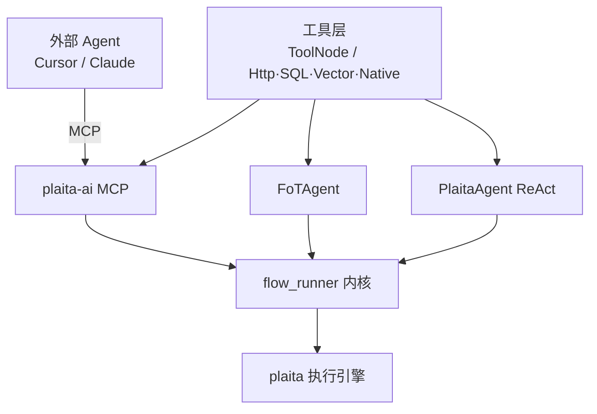

# AI 集成（plaita-ai）

`plaita-ai` 是 plaita 的 **AI 集成层**，把 `@flow` 编译与执行能力以多种形式交给 AI Agent 使用。

## 两个包，各司其职

| 包 | 职责 |
|---|---|
| `plaita` | 核心执行引擎：流程 IR、节点、表达式、分布式 |
| `plaita-ai` | AI 集成：工具节点、MCP 服务、CLI、FoT/ReAct Agent、flow-coder skill |

plaita 本身不是 Agent 运行时；`plaita-ai` 负责「工具注册 + LLM 规划 + `@flow` 生成 + 编译校验 + 执行」这一插件层。

## 能力地图



| 能力 | 说明 | 文档 |
|------|------|------|
| **工具节点与数据源** | `@tool`、YAML 工具清单、HTTP/SQL/向量、可选 LangChain toolkit | [tools.md](tools.md) |
| **MCP 服务** | `flow_compile` / `flow_run` / `flow_list_tools` … | [mcp.md](mcp.md) |
| **ReAct Agent** | LangChain 工具循环 + 可选 `@flow` 升级 | [react-agent.md](react-agent.md) |
| **FoT Agent** | 一次规划生成整段 `@flow` | [fot-agent.md](fot-agent.md) |
| **Skill** | `flow-coder` 等供 Coding Agent 使用 | [skills.md](skills.md) |

## 安装

```bash
# 仅 MCP 服务 + CLI + 工具注册（无需 LangChain）
pip install plaita-ai

# + 内置 Agent（ReAct / FoT）与 LangChain toolkit 适配
pip install "plaita-ai[agent]"

# + OpenAI / Anthropic
pip install "plaita-ai[agent,openai]"
pip install "plaita-ai[agent,anthropic]"
```

!!! note "LangChain 是可选依赖"

    核心工具注册（`@tool`、`HttpToolSource`、`load_tool_bundle`）不依赖 LangChain。
    只有使用 `FoTAgent` / `PlaitaAgent` 或 `register_langchain_*` 时才需要 `plaita-ai[agent]`。

## flow-coder Skill

`plaita-ai` 内置了 `flow-coder` skill，指导 AI 用 `@flow` DSL 生成并执行流程。可安装到 Cursor：

```bash
ln -sf "$(pwd)/plaita-ai/plaita_ai/skills/flow-coder" ~/.cursor/skills/flow-coder
```

→ [Skill 说明](skills.md)
