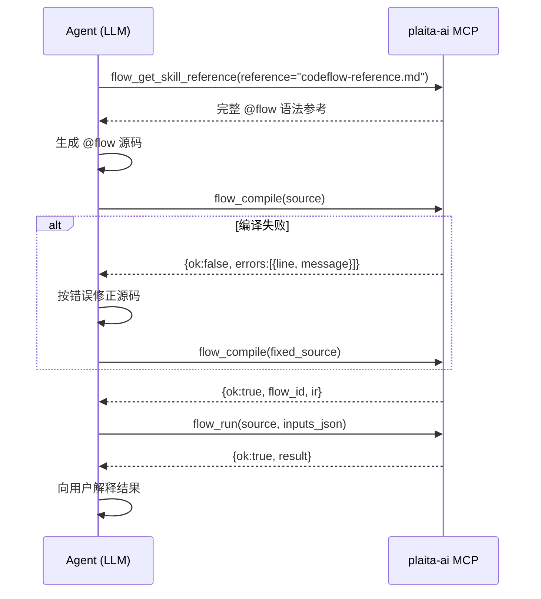

# MCP 服务

`plaita-ai` 提供一个 **MCP stdio 服务**，把 `@flow` 的编译与执行能力以标准 MCP 工具形式暴露给任何支持 MCP 的 Agent 环境（Cursor、Claude Desktop、自建 Agent 等）。

## 快速启动

```bash
# 安装
pip install plaita-ai

# 启动 MCP 服务（stdio 模式）
plaita-ai mcp
```

## Cursor 配置示例

在 `~/.cursor/mcp.json` 里添加：

```json
{
  "mcpServers": {
    "plaita-flow": {
      "command": "plaita-ai",
      "args": ["mcp"]
    }
  }
}
```

## 可用工具

| 工具 | 描述 |
|------|------|
| `flow_compile` | 编译 `@flow` 源码，返回 IR 或带行号的错误列表 |
| `flow_run` | 编译并执行 `@flow`，返回结果或错误 |
| `flow_list_nodes` | 列出已注册节点类型（含自定义节点占位符） |
| `flow_get_skill` | 返回内置 skill 全文（如 `flow-coder`） |
| `flow_get_skill_reference` | 返回 skill 参考文档（如完整 @flow 语法参考） |

### `flow_compile`

```
flow_compile(source, flow_id?)
→ {"ok": bool, "flow_id": str|null, "ir": dict|null, "errors": [{"line": int|null, "message": str}]}
```

编译校验 `@flow` 源码，**不执行**。`ok=false` 时 `errors` 含带行号的错误列表，回灌给 LLM 修正后重试。

### `flow_run`

```
flow_run(source, inputs_json?, flow_id?, globals_json?)
→ {"ok": bool, "result": any, "error": str|null, "error_type": str|null}
```

- `inputs_json`：对应 `@flow` 的 `INPUT.*` 字段，JSON 字符串，如 `'{"name": "alice"}'`
- `globals_json`：注入 `flow.global_context`（`$GLOBAL.*`），可传 API 客户端等运行时依赖

### `flow_list_nodes`

返回已注册节点类型数组，帮助 Agent 了解当前环境下可用的 `@flow` 占位符：

```json
[
  {"node_type": "http", "placeholder": "HTTP", "node_name": "HTTP 请求"},
  {"node_type": "tool", "placeholder": "TOOL", "node_name": "工具"},
  {"node_type": "llm",  "placeholder": "LLM",  "node_name": "LLM"}
]
```

## Agent 典型闭环



## 加载自定义节点

默认的 MCP 服务只有 plaita 内置节点（`http`、`code`、`event` 等）。若你有自定义节点（如 `LLMNode`、`ToolNode`），需在服务启动时导入注册模块：

### 方式 1：`--plugin` 参数

```bash
plaita-ai mcp --plugin myapp.nodes --plugin myapp.llm_nodes
```

多次 `--plugin` 指定多个模块，它们在 MCP 服务启动前按顺序被 `import`，节点注册作为副作用生效。

```bash
# 模块在项目目录下，不在 PYTHONPATH 时用 --plugin-path 补充
plaita-ai mcp --plugin-path /path/to/myproject --plugin myapp.nodes
```

### 方式 2：环境变量

```bash
export PLAITA_PLUGINS="myapp.nodes,myapp.llm_nodes"
export PLAITA_PLUGIN_PATH="/path/to/myproject"
plaita-ai mcp
```

适合在 `mcp.json` 里配置：

```json
{
  "mcpServers": {
    "plaita-flow": {
      "command": "plaita-ai",
      "args": ["mcp"],
      "env": {
        "PLAITA_PLUGINS": "myapp.nodes",
        "PLAITA_PLUGIN_PATH": "/path/to/myproject"
      }
    }
  }
}
```

### 自定义节点示例

```python
# myapp/nodes.py — 在服务启动时 import 即注册
from typing import ClassVar, Optional, Any
from plaita import Node
from plaita.node import get_default_registry

class LLMNode(Node):
    node_type: ClassVar[str] = "llm"
    node_name: ClassVar[str] = "LLM"
    prompt: Optional[str] = None
    model: Optional[str] = None

    def execute(self, execution: Any) -> Any:
        # 实际调用 LLM 的逻辑
        ...

get_default_registry().register(LLMNode)
```

注册后，`flow_list_nodes` 就会返回 `{"node_type": "llm", "placeholder": "LLM", ...}`，Agent 生成的 `@flow` 里就能用 `LLM(prompt=..., model=...)` 了。

## CLI 等价命令

MCP 工具与 CLI 共用同一个 `flow_runner` 内核：

```bash
plaita-ai compile flow.py          # 等价 flow_compile
plaita-ai run flow.py --input '{}'  # 等价 flow_run
plaita-ai list-nodes               # 等价 flow_list_nodes
plaita-ai skill                    # 等价 flow_get_skill
```
