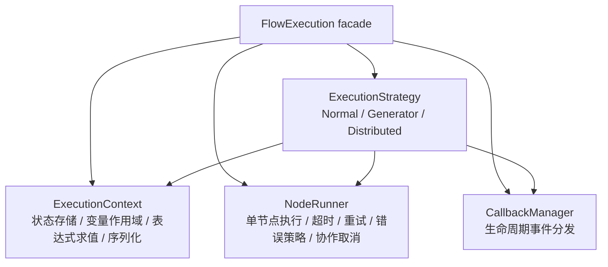

# 执行引擎

`FlowExecution` 是一个**薄 facade**，自身几乎不持有逻辑，而是组合四个独立组件 + 一组策略类完成执行。这种拆分让每个组件可独立测试与替换。

## 组件职责



| 组件 | 模块 | 职责 |
|------|------|------|
| `ExecutionContext` | `plaita.core.context` | 状态、变量作用域、父子链、event bus 获取、`to_dict`/`from_dict` |
| `NodeRunner` | `plaita.core.runner` | 单节点执行 + 超时 + 重试 + 错误策略 + 协作式取消 |
| `CallbackManager` | `plaita.core.callback` | 把 `on_*` 事件分发给多个 `FlowCallback` |
| `ExecutionStrategy` | `plaita.core.strategies` | 模式相关的控制流：`NormalStrategy` / `GeneratorStrategy` / `DistributedStrategy` |

`FlowExecution` 本体保持 SC-003 预算（< 200 LOC）：显式委托属性在 `plaita.core._execution_delegates`，公共入口（`run` / `run_compatible` / `run_distributed` 等）在 `plaita.core._execution_entry`。对外 API 与导入路径不变。

## facade 的显式委托

`FlowExecution` 是一个薄壳 facade，把节点允许访问的状态/方法**显式**委托给底层 `ExecutionContext`：

- 每次运行配置（`mode` / `timeout`）归拢到 `RunOptions` dataclass，由 facade 持有；`execution.mode` / `execution.timeout` 仍是具名 property 读写，落到 `self.options`。
- `context` / `execution_id` / `event_bus` / `cancel_event` / `express_prefix` 等 context 上的字段通过**具名 property** 读写，setter 直接落到 `ExecutionContext`。
- typed 系统状态（`flow_id` / `last_node_id` / `last_branch`）走 `execution.state.xxx` 视图（`_StateView`，`None` 归一化），不再以裸属性透传——这是 0.4.0 break change，见 MIGRATION。
- state 访问走显式方法：`set_state` / `get_state` / `evaluate` / `get_global_variable` / `get_or_create_event_bus` / `update_node_result` / `clean` / `setup_flow` / `get_child_execution`。

没有 `__getattr__` / `__setattr__` 兜底，也没有 `trigger_*` → `on_*` 魔法映射。未声明的属性就是普通 Python 实例属性——拼写错误（如 `tiemout`）不会再静默落进 context state 被分布式持久化，而是停留为一个普通属性，调试时一目了然。要手动触发回调，直接调 `execution.callback_manager.on_xxx(...)`。

## sync/async 桥接与错误归一化

facade 自身不再手写 sync/async × lazy/eager 四套桥接，而是下沉到 `plaita.core.async_utils.drive_strategy`，`run_compatible` / `arun_compatible` 退化为传一个 `_prepare_strategy` 产物 + 两个回调（`finish_coro` / `on_lazy_finally`）。

错误归一化集中在 `plaita.core._error_normalization`，三条**故意不同**的策略放一处便于对照：

- `finish_normal` — normal 模式：`FlowExecutionException` 子类透传（自带 `on_flow_end`），其它异常包成 `FlowErrorException` / `-500`。
- `raise_distributed_error` — distributed 模式：所有异常（含子类）统一拍平成 `FlowErrorException` / `-500`，对外单一契约。
- `emit_flow_end_on_close` — lazy 生成器 `finally`：非子类异常发 `-500` 的 `on_flow_end`，否则发 `result=None` 的 `on_flow_end`。

> 不要把 normal 与 distributed 两条归一化合并——它们的对外契约是**有意不同**的（distributed 调用方期望单一错误形态，子类细节只作内部抛点）。

## 执行策略

三种策略实现同一 `ExecutionStrategy` Protocol：

### NormalStrategy

```python
next_node = flow.start_node
while next_node:
    result, branch = await runner.run_node(flow, next_node, max_timeout_ms=remaining, ...)
    if next_node is End: break
    next_node = flow.next_node(next_node, branch)
return result
```

同步阻塞跑到 `End`，维护流程级剩余超时预算下传给每个节点。

### GeneratorStrategy

与 Normal 类似，但每节点 `yield` 一次 `_create_lazy_output`，把 `(id, type, result, branch, context, is_end)` 交给调用方。`on_flow_end` 推迟到生成器消费完毕或关闭时触发。

### DistributedStrategy

每次调用只推进一个节点：

1. 若有 `saved_context`：恢复上下文；否则 `clean` + `setup_flow` + `on_flow_start`
2. 若 `resume_type != "continue"`：走 `_handle_resume`（cancel/timeout/event 唤醒事件节点）
3. 否则确定当前节点（从 `LAST_NODE` 续跑或从 start 开始），执行一个节点
4. 若是 `EventNode`：订阅事件 → `on_node_suspend` / `on_flow_suspend` → 返回 `is_suspend=True` 的输出

## NodeRunner 详解

`NodeRunner.run_node` 负责一个节点的完整执行周期：

1. `callback_manager.on_node_start`
2. `_execute_with_retry`：按 `retryTimes` 重试，每次按 `min(节点timeout, 剩余预算)` 设超时
3. 成功：写 `LAST_NODE` / `BRANCH` / `$NODE[id]`，`on_node_end`，返回 `(result, branch)`
4. 异常分支处理：
    - `FlowResultError` → 包装为 `FlowExecutionException(ERROR_RESULT)`
    - `TimeoutError` → 走 `timeoutHandler`（abort 抛异常 / continue 返 None / continue_with 返默认值）
    - 其它异常 → 重试耗尽后走 `errorHandler`（abort/continue/continue_with）

### 同步/异步执行桥接

- **异步节点**（`async_node=True` 或有 `arun` 协程）：`asyncio.wait_for(node.arun(ctx), timeout)`
- **同步节点**：跑在 daemon 线程上，经 `loop.create_future()` + `call_soon_threadsafe` 桥接结果；超时时 set `cancel_event` 并放弃线程（不 join，保持事件循环自由）

## 超时合并

`_merge_timeout` 把"流程 `timeout`"与"调用方 `timeout`"取更严者；节点执行时再与"节点自身 `timeout`"取更严。任一为空表示"无限制"。

## 公共入口

| 方法 | 用途 |
|------|------|
| `Flow.run()` / `Flow.arun()` / `Flow.debug()` | Normal / 异步 Normal / Generator 入口 |
| `FlowExecution.run_compatible(flow, lazy, *args)` | 同步执行（lazy=True 返回同步生成器） |
| `FlowExecution.arun_compatible(flow, lazy, *args)` | 异步执行（lazy=True 返回异步生成器） |
| `FlowExecution.run_distributed(flow, params, *, saved_context, resume_type, resume_data)` | Distributed 推进一步 |
| `FlowExecution.run(..., mode=...)` | 类方法入口，distributed 路由到 `run_distributed` |

## 下一步

- [状态管理](state-management.md)
- [时序图](sequence-diagrams.md)
- [API: plaita.core.executor](../api/executor.md)
