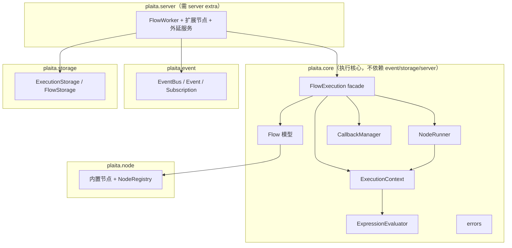

# 架构

本章节深入 plaita 的内部设计：分层依赖、执行引擎的职责拆分、状态管理、以及三种执行模式的时序图。

## 章节导览

- [总览](overview.md) —— 设计理念、核心类、分层依赖
- [执行引擎](execution-engine.md) —— `FlowExecution` facade + 三策略 + `NodeRunner` + `CallbackManager`
- [状态管理](state-management.md) —— `$INPUT` / `$NODE` / `$GLOBAL` / `$PARENT` / `$ENV` 与父子链
- [分层约束](layering.md) —— `core → event → storage → server` 依赖方向与反转
- [时序图](sequence-diagrams.md) —— Normal / Generator / Distributed 交互时序
