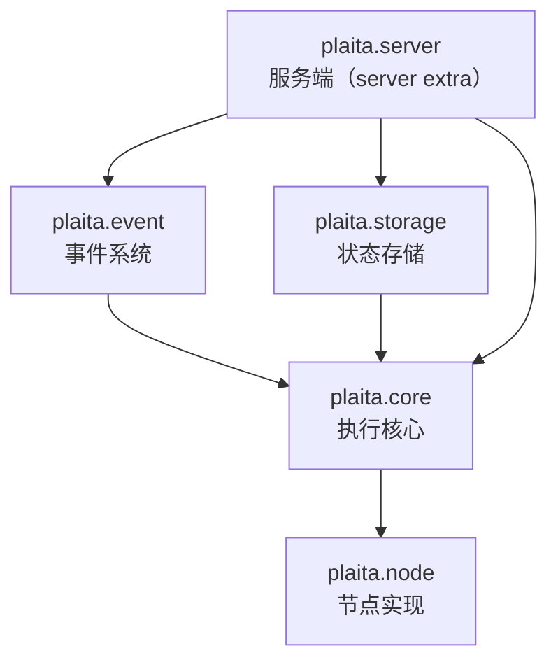

# 分层约束

plaita 把模块按依赖方向严格分层，并有专门的测试强制约束（`tests/` 下的 layering 测试）。

## 分层与依赖方向



允许的依赖方向（下游 → 上游）：

| 层 | 可依赖 |
|----|--------|
| `plaita.core` | 仅标准库 + pydantic/pyparsing/isodate，**不依赖 event/storage/server** |
| `plaita.node` | `plaita.core` |
| `plaita.event` | `plaita.core`（桥接工具从 core 取） |
| `plaita.storage` | `plaita.core` |
| `plaita.server` | `plaita.core` + `plaita.event` + `plaita.storage` |

**禁止**：`core` 反向 import `event` / `storage` / `server`。这是被测试守护的硬约束。

## 为什么 core 不能依赖 event

`EventNode` 与 `DistributedStrategy` 需要订阅事件总线，而总线实现（memory/redis/sqlalchemy）在 `plaita.event`，属于"上层"。若 `core` 直接 import `plaita.event`，就会把可选后端（redis/sqlalchemy 的重依赖）拖进核心，破坏"核心极轻"的设计。

## 依赖反转：默认 event bus provider

`plaita.core.context` 持有一个模块级 `_default_event_bus_provider`（一个可调用对象），由**顶层 `plaita` 包**在 import 时注册：

```python
# plaita/__init__.py
def _default_event_bus_provider():
    from plaita.event import get_default_event_bus
    return get_default_event_bus()

from plaita.core.context import set_default_event_bus_provider
set_default_event_bus_provider(_default_event_bus_provider)
```

`ExecutionContext.get_or_create_event_bus()` 只在**真正需要总线时**才调用这个 provider，从而惰性触发 `plaita.event` 的 import。这样：

- `core` 永不直接 import `event`
- 用户仍保留"未注入 event_bus 时自动取默认总线"的旧行为
- 注册失败仅记 DEBUG 日志，不阻断 import

## 桥接工具下沉

同步 API 需要在事件循环上驱动异步内核，桥接逻辑（`run_async_from_sync` / `async_gen_to_sync`）放在 `plaita.core.async_utils`，而非 `plaita.event`。`plaita.event.core` 也从这里导入，避免 `event → core` 之外又出现 `core → event` 的环。

## 顶层包的懒 re-export

`plaita/__init__.py` 通过 `__getattr__` 懒加载公共 API：

- `from plaita import Flow` 解析到 `plaita.core.flow.Flow`，但**不在 import 期**把 core 拉入内存
- 可选功能（`FlowWorker` / `HTTP` / `RedisEventBus` / `CodeNode` 等）访问时校验对应 extra，缺失则抛**可操作的 ImportError**
- 旧路径 `plaita.flow` / `plaita.errors` / `plaita.types` 是 shim，转发到 `plaita.core.*` 并触发 `DeprecationWarning`

## 测试守护

layering 测试会扫描 `plaita/core/**/*.py` 的 import，断言不出现 `plaita.event` / `plaita.storage` / `plaita.server`，确保重构不破坏分层。

## 下一步

- [执行引擎](execution-engine.md)
- [断点续执 - 事件系统](../distributed/event-system.md)
