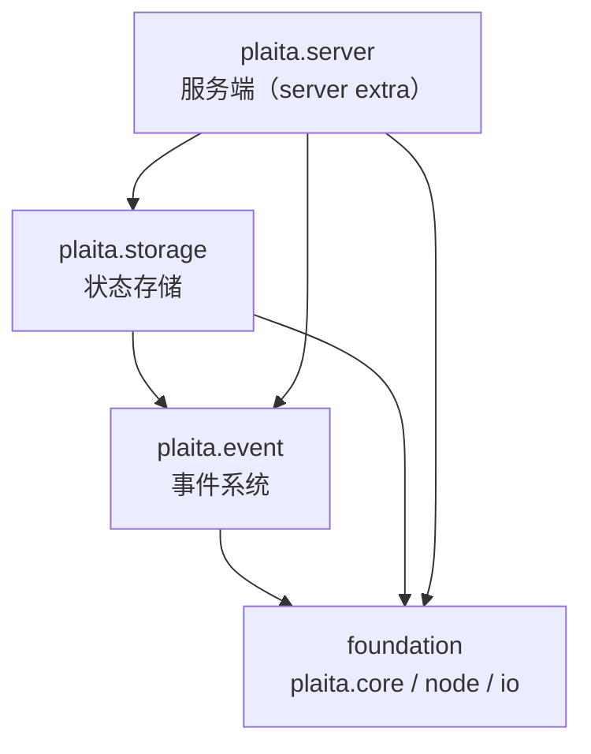

# 分层约束

plaita 把模块按依赖方向严格分层，并有专门的测试强制约束（`tests/integration/test_layering.py`、`tests/e2e/test_import_layering.py`）。

## 分层与依赖方向



允许的依赖方向：

| 层 | 可依赖 |
|----|--------|
| foundation（`plaita.core` / `plaita.node` / `plaita.io`） | 彼此可互引；**禁止**顶层 import `plaita.event` / `storage` / `server` |
| `plaita.event` | foundation；**禁止** `storage` / `server` |
| `plaita.storage` | foundation + `event`；**禁止** `server` |
| `plaita.server` | 任意（顶层） |

**禁止**：foundation / event / storage 反向依赖更上层。这是被 AST 扫描测试守护的硬约束。

## 为什么 foundation 不能顶层依赖 event

`EventNode` 与 `DistributedStrategy` 需要事件总线，实现（memory/redis/sqlalchemy）在 `plaita.event`。若 `core` **在模块顶层**直接 `import plaita.event`，会把可选后端的重依赖拖进每个 foundation 消费者，破坏「核心极轻」。

## 默认 EventBus：函数体内 lazy import（非全局 provider）

历史上曾用模块级 `_default_event_bus_provider` + `set_default_event_bus_provider` 做依赖反转。该全局可变 singleton 已删除。

当前做法：`ExecutionContext.get_or_create_event_bus()` 在需要默认总线时，调用 `_resolve_default_event_bus()`，**仅在函数体内** lazy import：

```python
# plaita/core/context.py（示意）
def _resolve_default_event_bus():
    try:
        from plaita.event import get_default_event_bus
        return get_default_event_bus()
    except ImportError:
        return None
```

解析优先级：

1. 自身已设的 `event_bus`
2. 父链上的 `event_bus`
3. 上述 lazy fallback
4. 都没有则 `None`

约束含义：

- **允许**：foundation 在函数体内 `from plaita.event import ...`（默认总线 fallback）
- **禁止**：foundation 在模块顶层 import `plaita.event`（会强制每个消费者拖入 event 依赖）
- 顶层包 `plaita/__init__.py` **不再**注册任何 provider

详见 [状态管理](state-management.md#event-bus-获取)。

## 桥接工具下沉

同步 API 需要在事件循环上驱动异步内核，桥接逻辑（`run_async_from_sync` / `async_gen_to_sync`）放在 `plaita.core.async_utils`。`plaita.event` 也可从这里导入，避免额外环依赖。

## 顶层包的懒 re-export

`plaita/__init__.py` 通过 `__getattr__` 懒加载公共 API：

- `from plaita import Flow` 解析到 `plaita.core.flow.Flow`，但不在 import 期把整个 core 拉入内存
- 可选功能（`FlowWorker` / `HTTP` / `RedisEventBus` / `CodeNode` 等）访问时校验对应 extra，缺失则抛**可操作的 ImportError**
- 兼容 shim：`plaita.errors` / `plaita.types` 转发到 `plaita.core.*` 并触发 `DeprecationWarning`；`plaita.flow` 已在 0.5.0 **删除**（见 [迁移指南](../reference/migration-guide.md)）

## 测试守护

| 测试 | 作用 |
|------|------|
| `tests/integration/test_layering.py` | 全层 AST 扫描；允许 foundation **函数体内** lazy import event |
| `tests/e2e/test_import_layering.py` | 断言 `plaita.core` 不 import `server` / 重型 storage 后端 |

## 下一步

- [执行引擎](execution-engine.md)
- [断点续执 - 事件系统](../distributed/event-system.md)
