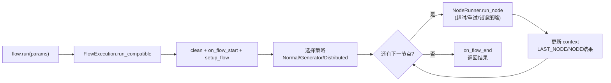

# 总览

plaita 是 Plaita 逻辑编排系统的 Python 运行时，设计用于执行 JSON 格式定义的逻辑流程。它将**流程定义**（`Flow`）与**执行逻辑**（`FlowExecution`）分离，并采用**插件式架构**管理 `Node` 定义。

## 设计理念

1. **定义与执行分离** —— `Flow` 是静态数据（Pydantic 模型），`FlowExecution` 是运行时引擎，二者可独立演化。
2. **插件化节点** —— 节点通过 `NodeRegistry` 注册，内置节点与用户自定义节点同等对待，支持 entry_points 自动发现。
3. **分层与依赖反转** —— `core` 层不依赖 `event` / `storage` / `server`；需要协作时由上层注入 provider，避免反向依赖。
4. **内核全异步** —— 同步 API 通过桥接工具（`async_utils`）在事件循环上驱动异步内核。
5. **向后兼容** —— 旧导入路径与字段名保留为 shim，触发 `DeprecationWarning` 而非直接失效。

## 核心类

| 类 | 职责 |
|----|------|
| `Flow` | 流程静态定义，解析 JSON、持有节点列表、维护 id 索引与图遍历 |
| `Node` | 所有执行单元的抽象基类，子类实现 `execute(self, execution)` |
| `FlowExecution` | 运行时 facade，组合 `ExecutionContext` / `NodeRunner` / `CallbackManager` + 执行策略 |
| `ExecutionContext` | 执行状态：变量作用域、父子链、表达式求值、event bus 获取、序列化 |
| `NodeRunner` | 单节点执行：超时、重试、错误策略、协作式取消 |
| `CallbackManager` | 生命周期事件分发到多个 `FlowCallback` |
| `EventBus` | 事件发布/订阅抽象，支撑断点续执的挂起与恢复 |

## 类图

## 执行总览

调用 `flow.run()` 时，`Flow` 把执行委托给 `FlowExecution`。引擎初始化上下文、找到开始节点，进入循环逐个处理节点，直到到达 `End` 节点或流程终止。

## 状态管理

`ExecutionContext` 维护一个 dict 作为流程内存，按命名空间组织：

- `$INPUT` —— 初始输入参数
- `$NODE` —— 已执行节点结果，按节点 id 索引
- `$GLOBAL` —— 全局上下文变量（含 `flow_id`）
- `$PARENT` —— 父流程上下文（子流程中可用）
- `$ENV` —— 环境变量（自动过滤敏感前缀）

详见 [状态管理](state-management.md)。

## 错误处理

- **重试**：节点级 `errorHandler.retryTimes`
- **错误策略**：`abort` / `continue` / `continue_with`
- **超时**：节点级与流程级，ISO 8601 或毫秒
- **回调通知**：错误事件传播到所有回调

详见 [错误处理与超时](../guide/error-handling.md)。

## 下一步

- [执行引擎](execution-engine.md) —— facade 与策略的内部拆分
- [分层约束](layering.md) —— 依赖方向如何被约束
