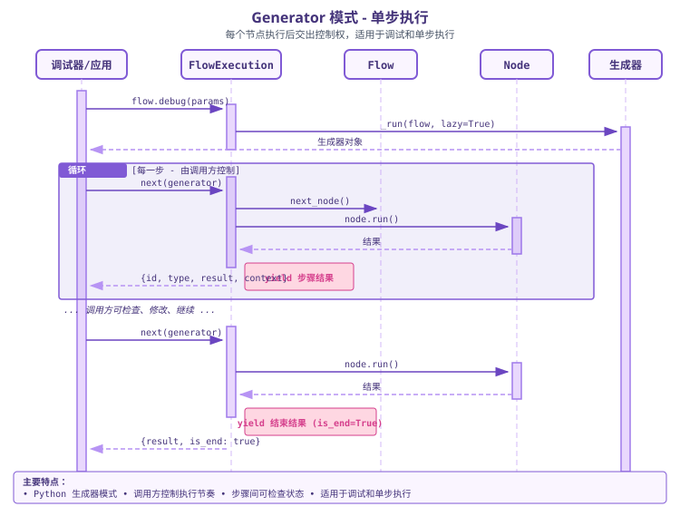
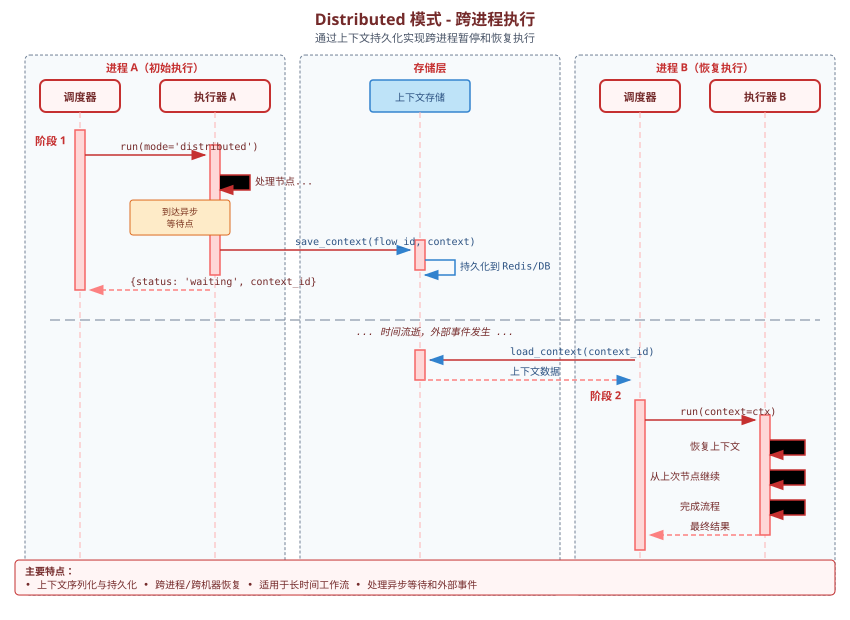

# 时序图

本页用图示展示 plaita 三种执行模式的交互时序，以及断点续执的挂起/恢复流程。SVG 取自 `docs/zh/images`，与代码实现保持一致。

## Normal 模式

同步阻塞，调用方一次拿到完整结果。

要点：

- `flow.run()` → `FlowExecution.run_compatible(lazy=False)` → 同步桥接驱动异步策略
- `clean` → `on_flow_start` → `setup_flow` → `NormalStrategy.execute` 循环跑节点
- 每节点：`on_node_start` → `NodeRunner.run_node`（超时/重试/错误策略）→ 写 `$NODE[id]` / `$LAST_NODE` → `on_node_end`
- 到达 `End` → `on_flow_end(result)` → 返回

## Generator 模式

异步生成器，每节点 yield 一次，调用方控制节奏。

要点：

- `flow.debug()` → `run_compatible(lazy=True)` → 返回同步生成器
- 每节点 yield `{id, type, result, branch, context, is_end}`
- `on_flow_end` 推迟到生成器消费完毕/关闭时触发

## Distributed 模式

每次调用推进一个节点，事件节点处挂起，外部事件到达后恢复。

要点：

- 首次：`clean` → `on_flow_start` → `setup_flow` → 跑到第一个 `EventNode`
- `EventNode` 订阅 event bus → `on_node_suspend` / `on_flow_suspend` → 返回 `is_suspend=True` 与 `context`
- 调用方持久化 `context`（存入 `ExecutionStorage`）
- 恢复：`run_distributed(saved_context=..., resume_type="event", resume_data=...)` → `on_flow_resume` / `on_node_resume` → `node.on_event(...)` → 续跑后续节点

## 执行总览

## 断点续执组件关系

更多断点续执的架构图（整体架构、组件关系、执行流程）见 [断点续执](../distributed/index.md) 章节，包括：

- 
- 
- 

## 下一步

- [执行模式](../guide/execution-modes.md)
- [断点续执](../distributed/checkpoint.md)
