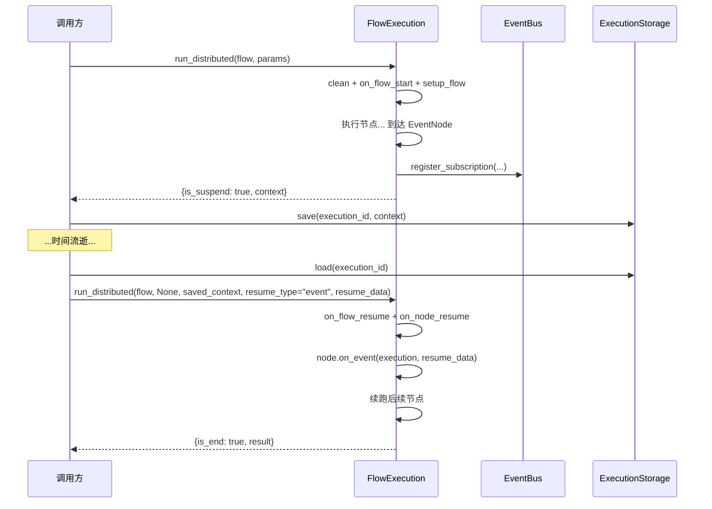

# Checkpoint 概念

本页讲清断点续执的执行模型：什么时候挂起、上下文怎么存、怎么恢复。

## 执行模型

Distributed 模式下，每次 `run_distributed` **只推进一个节点**。遇到 `EventNode` 时订阅事件并挂起，调用方拿到挂起快照后持久化，等外部事件到达再恢复。



## 挂起

`DistributedStrategy._execute_current_node` 检测到当前节点是 `EventNode` 时：

1. `_subscribe_event`：从上下文取 event bus，调用 `register_subscription(event_type, filter_condition, correlation_id=execution_id, flow_id, node_id)`，把订阅 id 回写到节点状态
2. `on_node_suspend(flow, node)` / `on_flow_suspend(flow)` 触发回调
3. 返回 `_create_lazy_output(..., is_suspend=True, context=...)`

调用方拿到 `context`（含 `$LAST_NODE` / `$NODE[event_node_id]` 状态）后，自行存入 `ExecutionStorage`。

## 恢复

恢复时调用 `run_distributed(flow, None, saved_context=ctx, resume_type=..., resume_data=...)`。`resume_type` 决定如何唤醒挂起的事件节点：

| resume_type | 行为 | 调用 |
|-------------|------|------|
| `event` | 事件到达 | `node.on_event(execution, resume_data)` |
| `timeout` | 等待超时 | `node.on_timeout(execution)` |
| `cancel` | 取消等待 | `node.on_cancel(execution)` |
| `continue` | 不唤醒，从 `LAST_NODE` 之后继续下一节点 | — |

恢复前会校验：挂起节点确实是 `EventNode`、其状态为 `pending`、`resume_type` 在允许集合内，否则抛 `FlowExecutionException`。

## 复用 execution 实例

!!! tip "贯穿步骤保留回调"

    ```python
    execution = FlowExecution(callback_handlers=[MyCallback()])
    step = execution.run_distributed(flow, params)             # 挂起
    save(execution._ctx.execution_id, step["context"])
    # ...
    step = execution.run_distributed(flow, None, saved_context=load(...),
                                     resume_type="event", resume_data=data)  # 恢复
    ```

    **复用同一个 `FlowExecution` 实例**，回调与上下文贯穿所有步骤。
    若用类方法 `FlowExecution.run(..., mode='distributed')`，每次会新建实例，回调不保留。

## 执行流程图


## 上下文序列化

`ExecutionContext.to_dict()` 返回 `CheckpointState.to_checkpoint_dict()`（与旧 `dict(self._context)` 格式逐键兼容，可 JSON 序列化存入 `ExecutionStorage`）。恢复时由 `DistributedStrategy` 把 `saved_context`（plain dict）赋给 `context.context`，setter 经 `CheckpointState.from_checkpoint_dict` 解析回 typed model。

注意 `cancel_event`（`threading.Event`）不可 pickle，子进程会拿到全新未触发事件——跨进程取消不支持（见 [状态管理](../architecture/state-management.md#cancellation)）。

## EventNode 状态

`EventNode` 维护状态机（`EventNodeStatus`）：

```
pending (等待) --on_event--> completed
            \---on_timeout-> timeout
             \--on_cancel--> cancelled
              \-on_error---> error
```

`on_event` 把 `event_data` 写进状态并置 `completed`，节点输出可在后续被 `$NODE.event_node_id.event_data` 引用。

## 下一步

- [事件系统](event-system.md) —— EventBus 如何连接挂起流程与外部触发
- [FlowWorker](flow-worker.md) —— 把上述能力封装成可运行的工作器
- [执行模式 - Distributed](../guide/execution-modes.md#distributed)
