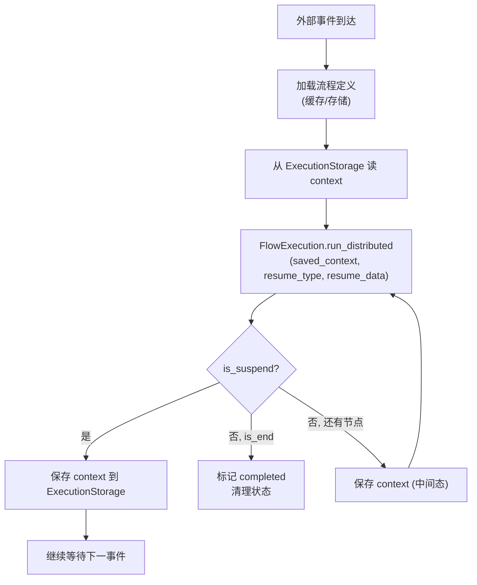

# FlowWorker

`FlowWorker`（`plaita.server.flow_worker`，需 `server` extra）是断点续执的生产级封装：它把 `FlowExecution` 的分布式推进与 `ExecutionStorage` / `FlowStorage` / `EventBus` 串起来，负责执行流程、持久化状态、处理恢复任务。

## 职责

- 从 `FlowStorage` 加载流程定义（带 TTL 缓存）
- 用 `ExecutionStorage` 保存/读取执行状态
- 推进 Distributed 流程：跑到 `EventNode` 挂起，或从断点恢复
- 监听 `EventBus`，把外部事件路由到对应的挂起流程触发恢复
- 贯穿所有步骤地保留用户回调

## 构造

```python
from plaita.server.flow_worker import FlowWorker
from plaita.storage.redis import RedisExecutionStorage, RedisFlowStorage  # 需 redis extra
from plaita.event.redis import RedisEventBus

worker = FlowWorker(
    execution_storage=RedisExecutionStorage(client=redis_client),
    flow_storage=RedisFlowStorage(client=redis_client),
    event_bus=RedisEventBus(client=redis_client),
    cache_size=100,
    cache_ttl=300,
    callback_handlers=[MyCallback()],
)
```

| 参数 | 说明 |
|------|------|
| `execution_storage` | 执行状态存储（`ExecutionStorage`） |
| `flow_storage` | 流程定义存储（`FlowStorage`） |
| `event_bus` | 事件总线 |
| `cache_size` / `cache_ttl` | 流程定义 `TTLCache` 容量与过期秒数 |
| `callback_handlers` | 贯穿所有分布式步骤的回调列表 |

## 流程定义缓存

`get_flow_definition(flow_id, version)` 先查 `TTLCache`，未命中再查 `FlowStorage` 并回填，避免反复反序列化流程 JSON。缓存键为 `flow_id:version`（version 缺省时用 `latest`）。

## 推进与恢复



## 状态模型

`ExecutionState`（`plaita.storage.base`）记录一次执行的完整状态：

| 字段 | 含义 |
|------|------|
| `execution_id` | 执行 ID |
| `flow_id` / `flow_version` | 所属流程与版本 |
| `context` | 执行上下文（即 Checkpoint） |
| `status` | `running` / `suspended` / `completed` / `error` |
| `start_time` / `last_update_time` / `end_time` | 时间戳（ISO 字符串） |
| `error` | 错误详情（status=error 时） |
| `invoker` | 发起方标识 |

## 存储后端

| 后端 | 模块 | extra |
|------|------|-------|
| memory | `plaita.storage.memory` | — |
| redis | `plaita.storage.redis` | `redis` |
| sqlalchemy | `plaita.storage.sqlalchemy` | `server` |

`ExecutionStorage` 接口：`save_execution_state` / `load_execution_state` / `delete_execution_state` / `list_executions`，并提供 `serialize_state` / `deserialize_state`（JSON）。

## 与 ServiceManager 协作

`FlowWorker` 负责执行流程，`ServiceManager` 负责监听外部触发源（定时器、队列、HTTP 回调、审批系统）并 `publish` 事件。二者通过 `EventBus` 解耦。完整闭环见 [外延服务](services.md)。

## 下一步

- [扩展节点](extended-nodes.md) —— 在流程里声明等待
- [外延服务](services.md) —— 在流程外触发恢复
- [API: plaita.server.flow_worker](../api/server.md)
