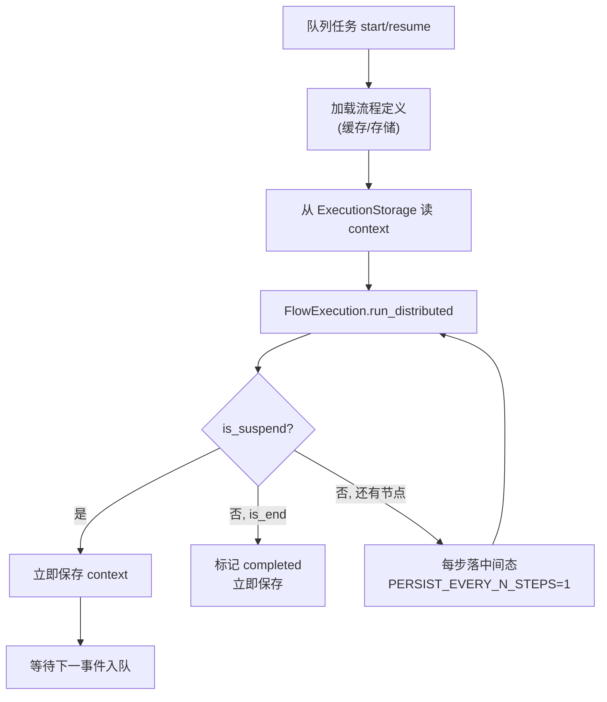

# FlowWorker

`FlowWorker`（`plaita.server.flow_worker`，需 `server` extra）把 `FlowExecution.run_distributed` 与 `ExecutionStorage` / `FlowStorage` / `EventBus` 串起来：加载流程、持久化 checkpoint、处理 start/resume 任务。

把它当成 **suspend/resume 编排器**，而不是 Temporal/Cadence 级「容错工作流引擎」。API 名里的 Distributed 指「可跨进程挂起/恢复」。

## 可靠性边界（必读）

| 机制 | 当前行为 | 后果 |
|------|----------|------|
| 任务队列（`RedisFlowWorker`） | Redis **Stream** + consumer group；成功 `XACK`，否则 pending 可回收；超 `--max-deliveries` 进 DLQ | **at-least-once**（需 Redis 5+）。业务侧应幂等；毒丸进 `<queue>:dlq` |
| 中间态落盘 | `FlowWorker.PERSIST_EVERY_N_STEPS`（默认 **1**） | 连续推进每步写盘；崩溃不丢步进进度 |
| 挂起 / 结束 / 出错 | **立即** `save_execution_state` | 这些边界点相对安全 |
| 并发 resume | Redis `SET NX EX` lease（`plaita.server.execution_lease`） | 同一 `execution_id` 最多一个 resume；抢租约失败的任务**不** XACK，待 TTL 过期后 reclaim |
| 控制面 | Registry / Control / Log / Queue / EventFilter 硬绑 Redis | 换 EventBus 后端 ≠ 换部署拓扑 |

选型含义：

- 适合：审批回调、HTTP 回调、延迟唤醒等「挂起等待外部事件」、可接受**重复投递**（幂等 resume）的场景。
- 不适合：把「恰好一次」「自动故障转移」「金融级幂等」当默认承诺的场景——无 DLQ；副作用仍须幂等。

CLI：`--consumer-group`、`--consumer-name`、`--claim-min-idle-ms`（默认 60000）、`--lease-ttl-seconds`（默认 120）、`--max-deliveries`（默认 5）、`--dlq-key`。`--queue-name` 为 **Stream 键名**（与旧 List 不兼容）。

部署步骤与故障手册见 [运维 Runbook](ops-runbook.md)；副作用设计见 [幂等 Resume](idempotent-resume.md)。

## 职责

- 从 `FlowStorage` 加载流程定义（带 TTL 缓存）
- 用 `ExecutionStorage` 保存/读取执行状态
- 推进 Distributed 流程：跑到挂起节点，或从断点恢复
- 与 EventFilter / 外延服务配合：外部事件入队后由 worker `resume`
- 贯穿所有步骤地保留用户回调（须复用同一 `FlowExecution` 实例）

## 构造

```python
from plaita.server.flow_worker import FlowWorker
from plaita.storage.redis import RedisExecutionStorage, RedisFlowStorage  # 需 redis extra
from plaita.event.redis import RedisEventBus

worker = FlowWorker(
    execution_storage=RedisExecutionStorage(client=redis_client),
    flow_storage=RedisFlowStorage(client=redis_client),
    event_bus=RedisEventBus(client=redis_client),
    cache_size=100,
    cache_ttl=300,
    callback_handlers=[MyCallback()],
)
```

| 参数 | 说明 |
|------|------|
| `execution_storage` | 执行状态存储（`ExecutionStorage`，同步契约） |
| `flow_storage` | 流程定义存储（`FlowStorage`） |
| `event_bus` | 事件总线 |
| `cache_size` / `cache_ttl` | 流程定义 `TTLCache` 容量与过期秒数 |
| `callback_handlers` | 贯穿所有分布式步骤的回调列表 |

## 流程定义缓存

`get_flow_definition(flow_id, version)` 先查 `TTLCache`，未命中再查 `FlowStorage` 并回填，避免反复反序列化流程 JSON。缓存键为 `flow_id:version`（version 缺省时用 `latest`）。

## 推进与恢复



## 状态模型

`ExecutionState`（`plaita.storage.base`）记录一次执行的完整状态：

| 字段 | 含义 |
|------|------|
| `execution_id` | 执行 ID |
| `flow_id` / `flow_version` | 所属流程与版本 |
| `context` | 执行上下文（即 Checkpoint） |
| `status` | `running` / `suspended` / `completed` / `error` |
| `start_time` / `last_update_time` / `end_time` | 时间戳（ISO 字符串） |
| `error` | 错误详情（status=error 时） |
| `invoker` | 发起方标识 |

## 存储后端

生产路径（`FlowWorker` CLI / `create_storage_component`）仅支持同步契约后端：

| 后端 | 模块 | extra | 备注 |
|------|------|-------|------|
| memory | `plaita.storage.memory` | — | 单测 / 本地 |
| redis | `plaita.storage.redis` | `redis` | **推荐**生产默认 |

`ExecutionStorage` 接口为**同步**方法：`save_execution_state` / `load_execution_state` / `delete_execution_state` / `list_executions`，并提供 `serialize_state` / `deserialize_state`（JSON）。

> `plaita.storage.sqlalchemy` 仍存在，但其方法为 `async def`，与上述同步契约及 Worker 调用方式不兼容。公开路径已拒绝 `db` 作为 execution/flow 存储；详见根目录 `MIGRATION.md`「Storage：db 执行/流程存储从公开路径下架」。

## 与 ServiceManager 协作

`FlowWorker` 负责执行流程，`ServiceManager` 负责监听外部触发源（定时器、队列、HTTP 回调、审批系统）并 `publish` 事件。二者通过 `EventBus` 解耦。完整闭环见 [外延服务](services.md)。

## 下一步

- [扩展节点](extended-nodes.md) —— 在流程里声明等待
- [外延服务](services.md) —— 在流程外触发恢复
- [API: plaita.server.flow_worker](../api/server.md)
