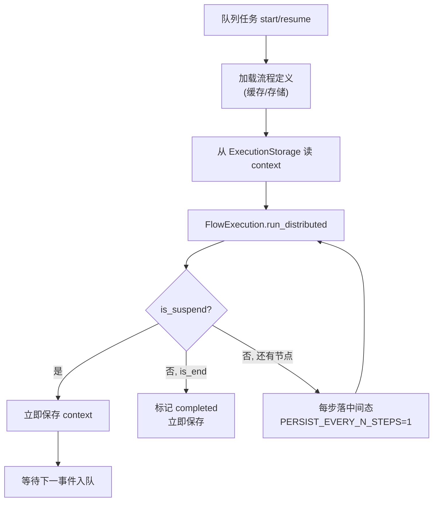

# FlowWorker

`FlowWorker`（`plaita.server.flow_worker`，需 `server` extra）把 `FlowExecution.run_distributed` 与 `ExecutionStorage` / `FlowStorage` / `EventBus` 串起来：加载流程、持久化 checkpoint、处理 start/resume 任务。

把它当成 **suspend/resume 编排器**，而不是 Temporal/Cadence 级「容错工作流引擎」。API 名里的 Distributed 指「可跨进程挂起/恢复」。

## 可靠性边界（必读） {#可靠性边界必读}

| 机制 | 当前行为 | 后果 |
|------|----------|------|
| 任务队列（`RedisFlowWorker`） | Redis **Stream** + consumer group；成功 `XACK`，否则 pending 可回收；超 `--max-deliveries` 进 DLQ | **at-least-once**（需 Redis 5+）。业务侧应幂等；毒丸进 `<queue>:dlq` |
| 队列残留回收（#43） | `XACK` 与 best-effort `XDEL` 之间进程被杀会留下「已 ack 未删」条目（`XDEL` 只出现在 `ack()`，残留只可能来自这个窗口）；worker 启动时扫一次 + 每 300s（`residue_sweep_interval_seconds`）best-effort `XDEL`，单轮上限 256 条，只删 id ≤ 消费组 `last-delivered-id` **且不在本组 PEL 中**的条目 | `XLEN` 不再被已终结条目长期污染（否则读成假「有积压」，2026-10-07 实测误判）；残留按每轮 ≤256 条 / 300s 逐轮收敛（如 1 万条约需数小时），期间 `XPENDING`/`lag` 仍如实反映真实积压；未投递积压与 pending 语义不变 |
| claim 前的本机盘预检（#49） | `--min-free-disk-gib` / `PLAITA_WORKER_MIN_FREE_DISK_GIB` > 0 时，消费循环在 `XREADGROUP` **之前**查 `--disk-guard-path`（默认当前工作目录）的可用盘；低于守线就不领任务，按 15s 空转重探（`stop()`/draining 可即时打断），盘回线自动恢复领取；默认 0 = 关闭 | 多 worker 池下低盘机器不再「抢单白跑」（flow preflight 判盘不足 → `retry-later`，实测一夜 11 次）：低盘机零 claim、不烧 delivery、不产生 retry-later 回评，任务留给富盘 worker；退避升档不再把瞬时低盘放大成数小时停机。探测失败（路径不存在）放行——预检自身故障不得停摆整池 |
| 中间态落盘 | `FlowWorker.PERSIST_EVERY_N_STEPS`（默认 **1**） | 连续推进每步写盘；崩溃不丢步进进度 |
| 挂起 / 结束 / 出错 | **立即** `save_execution_state`；返回 False（Redis 后端吞异常的失败形态）即抛 `StatePersistError`，消息**不** ack 走重投 | 落盘失败不再静默成僵尸执行（2026-10 评审修复；start 路径此前已检查，其余调用点统一收口 `_persist_state_or_raise`） |
| 挂起服务任务派发 | `rpush` 到 `plaita:{subtype}:queue` 失败（有 redis 时）抛 `ServiceDispatchError`；suspended 状态保留、消息重投后重新执行挂起节点再派发 | 重投会重复注册订阅——EventFilter 终态 GC 只回收终态，孤儿订阅留到 TTL 过期（可接受） |
| 并发 start / resume | Redis `SET NX EX` lease（`plaita.server.execution_lease`） | 同一 `execution_id` 最多一个推进者——start 与 resume 同一套租约：start 从落 running 行前 acquire、处理结束 finally 释放，因此长任务的 start 消息被 XCLAIM 重派后，重派者拿不到租约、消息被 ack 释放（#23）。抢租约失败的任务**不**烧 delivery（ack 释放） |
| 控制面 | Registry / Control / Log / Queue / EventFilter 硬绑 Redis | 换 EventBus 后端 ≠ 换部署拓扑 |

选型含义：

- 适合：审批回调、HTTP 回调、延迟唤醒等「挂起等待外部事件」、可接受**重复投递**（幂等 resume）的场景。
- 不适合：把「恰好一次」「自动故障转移」「金融级幂等」当默认承诺的场景——副作用仍须幂等。
- **崩溃恢复的如实语义（2026-10 更新，#23）**：worker 崩溃后 pending 里的 start 任务被重投时，会**创建全新执行从头重跑**（新 execution_id，即从首节点起全部节点重跑——**首节点必须幂等**）——每步落盘的 checkpoint 不会被 start 任务消费；旧执行会停留在 `running` 状态，需要运维侧用 [`scripts/reap_zombie_executions.py`](ops-runbook.md#僵尸执行巡检) 巡检清理（租约在则跳过、条件写落盘——单看 `last_update_time` 会误杀长节点）。**存活持有者不会被重派双跑**：start 消息被 XCLAIM 重派后，重派者因租约被原持有者持有而拿不到租约、消息被 ack 释放（#23）；只有持有者真死（租约过期）后重投才会从头重跑。resume 任务的重投是安全的：终态执行会被幂等短路（原样返回，不再推进，也不会被改写状态）。

CLI：`--consumer-group`、`--consumer-name`、`--claim-min-idle-ms`（默认 60000）、`--lease-ttl-seconds`（默认 120）、`--max-deliveries`（默认 5）、`--dlq-key`。`--queue-name` 为 **Stream 键名**（与旧 List 不兼容）。

## 长步骤与消息回收（claim_min_idle_ms / XCLAIM） {#长步骤与消息回收}

一条任务从被 `XREADGROUP` 读到 `XACK` 前一直留在 consumer group 的 pending
列表。**单个步骤**执行超过 `--claim-min-idle-ms`（默认 60000ms）后，这条
「仍在处理中」的消息就对其他 consumer 的 XCLAIM 回收可见——回收本身不是
故障，双跑由执行租约拦截（**start 与 resume 同一套租约**，#23）：

1. 抢到消息的 worker resume 时拿不到租约 → `ExecutionLeaseError`。冲突分支
   **先核实持有者存活再决定 ack**（#50，2026-10-08）：租约值嵌有持有者的
   注册表 instance id，回收方查 `plaita:registry:flow_worker:{instance}`——
   在册（活持有者，正常竞争）→ **ack 释放**（否则对端每 `claim_min_idle_ms`
   XCLAIM 一次烧一次 delivery，超限即假死信）；**不在册**（持有者已死、
   租约键是 ≤TTL 的尾巴）→ **不 ack** 留 pending，等租约过期后下一轮回收
   从 checkpoint 续跑（代价 ≤TTL+60s，远小于 zombie reap）。信号缺失
   （旧格式租约 / `--no-registry` / Redis 瞬断）按「存活未知」退化 ack；
   `PLAITA_DISABLE_HOLDER_LIVENESS=1` 整体旁路回到无条件 ack；
2. 持租约的活 worker 由看门狗每 lease TTL/3（默认 120s → 40s）续租，步骤
   执行期间租约不会过期——XCLAIM 真正接手的只有已死 worker 的消息；续租成功
   时顺带把**在跑节点**的进度写进 `node_timings`（长节点期间唯一的活性心跳，
   见下节「在跑节点心跳」）；
3. 退化路径：`PLAITA_DISABLE_LEASE_WATCHDOG=1` 且单步超过 lease TTL 时，
   租约可能在步骤中途过期、接管者拿到更新的 fence 世代——旧 worker 的
   下一次落盘被 fencing CAS 拒绝、步界续租失败自爆（均 `ExecutionLeaseError`
   且不 ack），状态不会被双写，但当前步副作用可能重复，业务侧仍须幂等。

因此调小 `claim_min_idle_ms` 只加快「死 worker 消息」的回收，不会中断活
worker 的执行；调大到超过最长步骤耗时，可减少 `lease_conflicts` 噪音。
**对 start 同样成立**：无租约时代的「数小时 run 消费 60s 后被空闲 worker
重派、整条 flow 从头双跑」已被租约窗口根除（#23）；持有者死亡后重派消息
照常取得租约接管——start 的接管点是从头重跑（checkpoint 由后续 resume
消费），租约只保证「同一时刻至多一个推进者」。

**死信守卫**：超过 `--max-deliveries` 的消息进 DLQ 前，先查消息体
`execution_id` 的执行状态与 resume 租约（键 `{ns}:execution:lease:{id}`，`ns` 按消息体
`tenant_id` 路由：default/空 = `plaita`，其余 = `plaita:{tenant_id}`）——
执行已终态直接放行；租约仍在（活 worker 正处理长步骤）则跳过死信、消息留
pending；执行仍非终态但**节点重试计数已达预算**（见下节）则终态化 error 后
放行（不再重入队——重入队会让 delivery 归 1 再耗尽，无限循环）；租约/状态
查询失败同样保守跳过；非终态且租约空（持有者已死）重入队一份 delivery 归 1
的恢复消息后放行。

部署步骤与故障手册见 [运维 Runbook](ops-runbook.md)；副作用设计见 [幂等 Resume](idempotent-resume.md)。

## claim 前的本机盘预检（#49） {#claim-前的本机盘预检}

**问题（2026-10-08 实测）**：多 worker 池里，「本机盘够不够」这件事此前只有
**flow 内部**的 preflight 节点在管（跑在领取任务的宿主上：`os.statvfs(repo)`
→ `free_gib < 阈值` → 返回 `retry-later`）。而 worker 是「谁先 `XREADGROUP`
谁拿走」，于是一夜出现 11 次连续白跑：低盘机先抢到任务 → flow preflight 判
盘不足 → `retry-later` 回评 + 重排；同时刻富盘机完全空闲（队列 `XLEN=0`）。
更糟的是 keeper 的 retry-later 退避会升档——瞬时低盘被放大成 ≈6h 停机。

**修法**：把「盘够不够」的判断提到 **claim 之前**，由 worker 自己做：

```bash
python -m plaita.server.flow_worker \
  --min-free-disk-gib 20 \          # 或 PLAITA_WORKER_MIN_FREE_DISK_GIB=20
  --disk-guard-path /home/user/repo # 或 PLAITA_WORKER_DISK_GUARD_PATH（默认 .）
```

语义与边界：

- 阈值 **0（默认）= 关闭**，与 `PLAITA_WORKER_DENY_REPOS` 同口径——存量部署
  零行为变化，是否启用由运营侧显式配置；
- 低于守线时**根本不发** `XREADGROUP`（也不 XCLAIM 回收别人的 pending）：
  不产生 claim、不烧 delivery、不写 `retry-later` 回评，任务自然落到池内
  富盘 worker 手里；
- 空转重探默认 15s（`disk_guard_poll_seconds`），休眠切成 ≤0.2s 小片，
  `SIGTERM`/`request_drain()` 可即时打断；**盘回线自动恢复领取，无需重启**；
- **预检路径要与 flow 内 preflight 节点的判据对齐**（recursive 侧为
  `RECURSIVE_MIN_FREE_DISK_GIB`，默认 20）：worker 侧阈值低于 flow 侧时仍会
  白跑一轮，worker 侧高于 flow 侧则会过早停领（池内可能整体闲置）；
- 探测失败（路径不存在 / 无权限）**放行**：预检自身故障不得让整池停摆，
  宁可回到「可能白跑一次」的旧行为；
- 该闸只管**领取**：已在跑（或本进程 pending 里）的任务照常跑完/重投，
  draining、租约、死信守卫等语义一律不变。

配套的运营动作见 [运维 Runbook · 按宿主资源路由](ops-runbook.md#按宿主资源路由)。

## 节点级有界重试（2026-10 二波） {#节点级有界重试}

分布式路径上**节点执行失败**（LLM/HTTP 网络抖一次）不再直接废掉整个执行：

- **判别**：`run_distributed` 把异常归一化为 `FlowErrorException`（原始异常在
  `__cause__`）。链中出现 `NodeExecutionError`（节点执行异常）→ 可重试；
  链中出现超时（`NodeTimeoutError`/`FlowTimeoutError`）或取消
  （`FlowCancelledException`）→ 维持现状终态化 error；
  **恢复守卫类** `ResumeGuardError`——策略层在**分发到节点 `resume()` 之前**
  逐个标记出来的那几个位点（continue/retry 想绕过 pending 挂起节点、resume 打在
  无挂起/非挂起 checkpoint 上、给出非 continue 的 resume 意图却没有 checkpoint），
  语义是「调用方协议与执行状态不匹配」而非「执行失败」（#33）→ **不终态化**：
  执行保持原状并抛 `ResumeProtocolError`，run() 对其 ack（重投只会重复命中同一
  守卫。这类错误天然由 at-least-once 重投产生——重复投递的 `event` resume 打在
  已推进的 checkpoint 上同族——把挂起执行终态化成 error 会永久切断
  event/cancel/timeout 的唤醒路径）。**裸 `ResumeError` 不在豁免面内**（含未标记的
  `Unsupported resume type for EventNode`）：
  `strategies._handle_resume` 把 `current_node.resume()` 抛出的任何异常
  （事件数据畸形、节点恢复逻辑失败…）包成的 `ResumeError` 是**执行自身失败**，
  静默保持原状只会变成一个「无 error 记录、永远等不到决议」的哑执行——它走
  下面的现状路径（可重试判据 → 终态化 error + poison ack），可观测、可人工
  retry；其余图错误（`NodeNotFoundError` 等）→ 维持现状终态化 error。
  超时不重试是刻意的：确定性信号重试=再烧一次全款。
- **载体**：at-least-once 消息重投本身。重试时执行**不终态化**（磁盘 state
  停在最后成功步 checkpoint——失败节点不写 context），run() **显式重投**同体新副本（先入队再 ack；
  `claim_min_idle_ms`（默认 60s）后被回收重投，resume 从 checkpoint 自然重跑
  失败节点。重投路径不依赖 pending 回收：消息可能已被竞争者的 `ExecutionLeaseError`
  分支 ack 释放，只留 pending 会导致重投永不发生（2026-10-09 plaita#52 实证）。
  重投失败（Redis 抖动）才退化为不 ack 留 pending；两种情况都不计 poison。
- **预算**：重试计数键 `{ns}:execution:noderetry:{id}:{node_id}`（INCR + 滑动
  7 天 EX，租户路由与租约键同规则），默认预算 = `--max-deliveries`（5）。耗尽 →
  终态化 error（`error.node_retries` 记录重试次数、`error.failed_node` 记录失败
  节点 id），消息走 DLQ。刻意**不**用消息 `delivery_count` 判预算：回收路径上报
  的是 XCLAIM 前的投递数（少计 1），且达限消息在队列层就地死信、不进处理函数
  ——按它判预算永不触发。
  计数语义是「当前节点的**连续**失败次数」，**键也必须按节点维度隔离**
  （plaita#123 真因，2026-10-10）：此前键只含 `execution_id`（执行维度），而成功
  推进时把**整个执行**的计数清零 ⇒ 在「前序节点稳定成功 + 某节点稳定失败」的
  flow 上，前序节点每轮成功都把失败节点的计数抹平 ⇒ 永远到不了预算 ⇒ 永不终态化
  ⇒ **无限重投**（实测 2026-10-10 13:0x 本机 Redis db1：`keeper-watch` 累积
  667 个悬停 `running` 执行、最老 40 小时。**该数字为当时快照、随时间增长，
  勿当常量；复现需在同期环境用 `SCAN plaita:execution:*` 采集**）。
  现版：键带失败节点 id（取自异常链 `NodeExecutionError.node`，**不能**用 checkpoint
  的 `$LAST_NODE`——失败节点不写 context，那是上一个成功节点），成功推进**只清该
  节点**的键。取不到节点 id 时退化为执行维度键（保守，不比修复前差）。
  存量扁平旧键（无节点维度）不迁移、不被新逻辑读取，靠 7 天 TTL 过期；代价是
  升级瞬间在途执行多拿一轮预算。
- **兜底总上限**（plaita#123 评审建议）：`{ns}:execution:noderefetch:{id}`
  （INCR + 7 天 EX，**不含任何会漂移的段**）——只按 `execution_id` 累计「本执行
  一共放行过多少次节点重试」，达 `NODE_RETRY_TOTAL_MAX`（默认 100）即终态化 error。
  节点维度预算依赖「键里的节点段稳定」，任何键空间漂移（节点 id 动态变化、定义被改）
  都会让单节点预算失效而退回无界重投；该计数**不看键名、只看次数**，是「预算机制
  整体失效」时的最后一道闸。正常执行永远碰不到（100 ≫ 单节点预算 5 × 合理节点数）。
- **与 G1 retry 唤醒的组合**（43828aa）：预算耗尽终态化的执行仍可经人工
  `resume_type=retry` 唤醒（error 态断点续跑）——唤醒放行即清零该执行下**所有节点**
  的计数键，人工唤醒后拿全新预算；flow 定义指纹校验先于唤醒，定义被改时执行保持
  error（修复定义后仍可再 retry）。
- **唤醒/失败次数是有界的（plaita#73，2026-10-10）**：只清预算不限次数的循环是
  自毁的（`唤醒 → 清零预算 → 跑 5 次 → 又终态化 → 再唤醒`，实测某执行一天被
  唤醒 5 轮、每轮烧 5 次沙箱）。两道**上限**都落在 `FlowWorker` 类常量上，
  达限时 `resume_flow` 对 `retry` **幂等拒绝**（返回 `already_terminal=True` +
  `g1_wakeups_exhausted` / `deterministic_failure_exhausted`，不抛异常、不改
  状态），消息层重投随之短路（**仅对 `error` 态执行**，见下节
  [running 执行的 retry](#running-执行的-retry)）：
  - `{ns}:execution:g1wakeups:{id}`（`G1_MAX_WAKEUPS`，默认 2）：同一执行被
    `retry` 唤醒的次数。**人工与自动共用这个额度**——达限后运维点「从断点重试」
    不再生效（BFF 会返回 409 并给出要删的键，见 ops-runbook）；
  - `{ns}:execution:nofail:{id}`（`DETERMINISTIC_FAILURE_MAX`，默认 12）：
    **连续**确定性失败次数（`exited 1` / `sync_in` / 超时…）。任一节点成功推进
    即清零，跨节点的偶发失败不会累计判死；G1 唤醒**不**清零（否则永不收敛）；
  - 人工解封：确认失败原因已修好后 `DEL` 对应计数键再 retry——键名与步骤见
    [运维 Runbook · 唤醒预算达限](ops-runbook.md#唤醒预算达限plaita73)。
- **引擎 execution_id 必须与 worker 一致**（plaita#123 配套）：worker 的 resume
  与步进两处 `run_distributed` 显式传 `execution_id=execution_id`。不传时引擎侧
  execution_id 与 worker 脱钩——恢复分支走 `context.context = saved_context` 整体
  替换 checkpoint，若 checkpoint 缺 `$EXECUTION_ID`（resume 常见），引擎
  execution_id 退化为**空串** ⇒ `result.execution_id` 回空、重试计数键沦为空 id
  （运维无法从键反查执行）。注意这**不会**导致无限重投：旧代码
  `_node_failure_retry_decision` 对空串直接 `return None`（连键都不写、直接终态化），
  属可观测性缺陷而非重投根因——**重投根因见下方「节点维度预算」**。
- **节点维度预算**（plaita#123 真因，2026-10-10）：计数键
  `{ns}:execution:noderetry:{id}:{node}` 按**节点**隔离，成功推进只清**该节点**
  的键。此前键只含 execution_id（执行维度），而成功推进清**整个执行**的键 ⇒ 在
  「前序节点稳定成功 + 某节点稳定失败」的 flow 上，**同一轮内**前序节点成功先清零、
  失败节点随后 INCR 归 1（`strategies.py`：*"Execute one node per call"*，一次调用
  只推进一个节点），计数永远到不了预算 ⇒ 永不终态化 ⇒ **无限重投**
  （实测 2026-10-10 13:0x 本机 Redis db1：`keeper-watch` 累积 667 个悬停
  `running` 执行、最老 40 小时；**该数字为当时快照、随时间增长，勿当常量；
  复现需在同期环境用 `SCAN plaita:execution:*` 采集**）。
  另设兜底总上限 `{ns}:execution:noderefetch:{id}`（`NODE_RETRY_TOTAL_MAX`，默认
  100），**不看键名只看次数**，防未来任何键空间漂移再次退化为无界重投。

## 挂起执行的 continue/retry 幂等短路（#33） {#挂起执行的-continue-retry-幂等短路}

suspended 执行收到 `resume_type=continue`（挂起双写窗口 crash 后重投的原消息/
start 重派竞速/运维误发）或 `retry` 时，策略层 pending 守卫必拒（continue 不允许
绕过挂起节点）。resume_flow 在**租约之前**幂等短路：返回
`already_suspended=True`，不推进、不改状态、不取租约——挂起执行只能被真正的
决议路径（`event`/`cancel`/`timeout`）唤醒。此前的行为是守卫 ResumeError 被通用
except 终态化成 error，一次重复投递就把可恢复的挂起执行永久打封（终态短路从此
拒绝一切 resume 类型，retry 也不可入，死局）。兜底路径（绕过入口短路的竞态窗口）
由 `ResumeProtocolError` 豁免承接：**只有策略层守卫 `ResumeGuardError`** 不终态化、
执行保持原状、消息 ack（豁免面刻意窄，见上节「判别」——节点 `resume()` 自身抛错
仍终态化 error）。

## running 执行的 retry 与分支未命中终态化（#53） {#running-执行的-retry}

工单背景：值守实测两例条件假分支后执行停 `running` 88 分钟（无 error、无终态），
且对 `running` 执行 `POST /resume {"resume_type":"retry"}` 返回「已加入队列」却
一行不推进（`node_timings` / `last_update_time` 双双不动）= **假受理**。

- **分支未命中必须显式失败，绝不悬死 `running`**：`if`/`switch` 全部分支未命中
  且无 default 时，`plaita/core/strategies.py` 的 `_get_next_from_last`
  （distributed）与 `_advance_one`（normal/generator）抛
  `FlowExecutionException` → worker 把执行终态化为 `error`（error 里点名节点 id），
  不再带着 `$NODE` 中间态静默收尾、也不停在 `running`。`if` 无 else 的两种形态都
  被这一道拦下：`else_next=""`（分支未命中）与 `else_next="false"`（if 节点的
  占位默认值指向不存在的节点 → `NodeNotFoundError`）。唯一逃生口是节点显式
  `errorHandler.strategy=continue`（降级为 warning + `$NODE` 收尾，与 0.5.x 历史
  行为一致）。**升级核对**：线上 worker 必须含该防御——不含该防御的版本上，条件
  假分支无后继就是「不派发 / 不落终态 / 永久 `running`」（工单「未证实」项）。
- **`running` + `retry` = 断点续派**：`running` 执行没有「失败节点」可重跑，
  `retry` 与 `continue` 同路，从 checkpoint 派发后继节点，并留一行 WARNING
  说明「按从断点续跑处理」。两道唤醒预算幂等拒绝（`g1wakeups` / `nofail`）
  **只对 `status=error` 生效**（plaita#53）：计数键寿命长于状态行（终态化写盘
  失败、状态被回滚等都会留下「running + 计数达限」的组合），若把 `running`
  也按「已终态」拒绝，返回的 `already_terminal=True` 就是**谎报终态 + 一行不
  推进**——即工单里的假受理。
- **resume 被丢弃必须可见**：执行推进租约被**在册** worker 持有时，resume 消息
  按既有语义 ack 释放（#50/#52：留 pending 会烧 delivery 并产生假死信），但会
  额外打 WARNING「**本次 resume 未生效**（不产生任何节点活动）」并给出下一步
  （确认卡死后人工 cancel 再按需重开）——值守据此区分「已救活」与「白等」。
  每次点「从断点重试」都返回 200 却毫无推进时，先 grep 这行日志。

## 在跑节点心跳与 keeper 活性判据 {#在跑节点心跳}

执行状态的落盘只发生在**节点边界**（`_persist_state_or_raise` 的 step_persist /
终态等路径），而 `sandbox_agent` 这类**单个长节点**（实测 35 分钟）期间一次落盘
都不发生 → `node_timings` 停在进入该节点之前。keeper 的活性判据①「有
`started_at`、无 `ended_at` 的节点 = 活证据」于是读不到它，落到判据③「末节点
`ended_at` 停滞超 1800s」→ 健康 run 被误判 zombie 并 cancel（2026-10-10
#27/#31/#32/#55/#62 五单事故）。

修法：看门狗续租成功后顺带落一次在跑节点进度（`_publish_node_progress`，默认
周期 = lease TTL/3 ≈ 40s）——只合并 `node_timings`（在跑节点写
`ended_at: ""`）并刷新 `last_update_time`，**不推进流程、不改 context**。
写侧的两道约束（2026-10-10 评审）：

- **与推进写串行**：心跳是「load → 合并 → save」的**整行写回**，与推进线程的
  `_persist_state_or_raise` 是同一条状态行上的两个写者。若终态写落在心跳的
  load 与 save 之间，心跳会把它整行回滚成 `running` + 旧 checkpoint + 新
  `last_update_time`——既不会被 keeper 回收（open node + 新鲜
  `last_update_time` 正是它的「活着」判据），后续 resume 还会从旧 checkpoint
  重放节点副作用。两者现持**同一把每执行互斥锁**（`_state_write_lock`）。
- **跨进程过 fencing**：心跳跑在**看门狗线程**里，那里没有本执行的 fence 世代
  ContextVar、也没有租户上下文——不带就会（a）写错租户 namespace（多租户下
  心跳整条失效）、（b）退化成 `FencedExecutionStorage` 的裸写分支、**绕开世代
  CAS**（租约已被新世代接管时旧心跳仍能改写新世代的行）。现在 fence 世代与租户
  随租约登记一起带上，世代不符即拒绝写（`ExecutionLeaseError`，日志留痕）。

> **keeper 侧必须给判据①配年龄界**：心跳把在跑节点写进 `node_timings` 后，
> 「open node」既可能是活 worker（每 ~40s 刷新一次 `last_update_time`），也可能是
> **被杀的 worker 留下的最后一份心跳**——单看「有 `started_at`、无 `ended_at`」
> 会把后者永远读成「活着」（keeper 判据① 原样没有年龄上限）。读法应为
> 「open node **且** `last_update_time` 在 N×心跳周期内（建议 N=2~3）」，再叠加
> 租约键 / worker 注册表在册与否兜底；否则僵尸 run 既不进 reap 路径、也没人
> 收尾。

## 运行中改定义（flow 定义指纹，2026-10 二波） {#运行中改定义}

worker 的流程定义 TTLCache 有 300s 窗口、console engine_sync 可直接覆盖 Redis
定义——挂起执行 resume 用 latest 版本定义时，若定义自启动后被改，图遍历会
找不到节点/走错分支且无告警。现版语义：

- `start_flow` 对**实际加载执行的 Flow** 计算指纹
  （sha256 of `model_dump(mode="json")` + sort_keys 规范化 JSON）写入
  `ExecutionState.flow_hash`；
- `resume_flow` 取得租约后比对：不一致 → 终态化 error（message 写明「flow
  定义自启动后已变更，hash 不匹配，执行无法安全续跑」，附前后指纹）+ 消息
  poison ack——**故意选可观测的终态而不是重投风暴**（定义被改是确定性不一致，
  重投 N 次结果相同）；
- 老状态 `flow_hash` 为 None（旧版本 worker 写入）→ 跳过校验，零回归；
- 在租约内判定是为了与活 worker 的推进写串行化：不会把他人正持有租约推进中
  的执行误终态化。

**运维含义**：改定义前应确认没有 running/suspended 的在途执行（console 按
flow_id 查询非终态执行）；确需强升时接受在途执行被终态化 error、由上游重提。

## start 幂等键 dedup_key（2026-10 二波） {#start-幂等键}

start 消息重投（worker 崩溃/保存失败）历史上会新建 execution_id 从头重跑，
首节点副作用双份。现版支持调用方显式声明幂等键：

- 消息体可选 `dedup_key`（console BFF `POST /executions` 请求体 additive 字段
  同名透传）：worker 在**首节点执行之前**以 `SET NX EX 7d` 原子认领
  `{ns}:start-dedup:{key}`，映射值 = G1 预铸的 execution_id（BFF start 时
  铸造随消息透传）或就地铸造的 id——认领在先行落 running 行**之前**，重投/
  双开在任何新行落盘前即被拦截；
- 命中 → 读映射的执行状态，**绝不二次 start**：已终态 → 返回 already 形状；
  running（崩溃/重试搁浅）→ 重入队一份 resume 消息接续执行再 ack start；
  suspended → 只返回现状形状（挂起执行自有 delay/approval 的 resume 链路）；
- 孤儿映射（认领后首次执行从未落盘，如 crash 在 claim 与先行落行之间）→
  释放后重新认领、按新启动继续（首节点可能重跑——首节点须幂等仍是既有约定）；
  G1 先行落行后该窗口已收窄到极小；命中 running 的重入队 resume 对
  context={} 的先行行同样正确（无 last_node_id → 从首节点步进）；
  重入队的 resume 若与原 start 持有者并发，由执行租约串行化（#23）；
- **不传 `dedup_key` 则行为与存量完全一致**；键必须调用方显式提供，worker
  不做 body hash 自动键——同参数定时任务（cron 每小时跑同一 flow）会被误判
  为重复启动而永不执行。键按租户隔离，7 天过期。
- **调度服务是唯一的自动加键方**（#23）：`fire_schedule`（cron 循环与 console
  「立即触发」共用）以确定性键 `sched:{schedule_id}:{触发时点秒}` 入队——
  同一次到期的消息重派/重投收敛到同一 execution，不产生平行执行；下一次
  cron 到期时间戳不同，不会被误吞。手动 `POST /executions` 仍不自动加键。


## 职责

- 从 `FlowStorage` 加载流程定义（带 TTL 缓存）
- 用 `ExecutionStorage` 保存/读取执行状态
- 推进 Distributed 流程：跑到挂起节点，或从断点恢复
- 与 EventFilter / 外延服务配合：外部事件入队后由 worker `resume`
- 贯穿所有步骤地保留用户回调（须复用同一 `FlowExecution` 实例）

## 构造

```python
from plaita.server.flow_worker import FlowWorker
from plaita.storage.redis import RedisExecutionStorage, RedisFlowStorage  # 需 redis extra
from plaita.event.redis import RedisEventBus

worker = FlowWorker(
    execution_storage=RedisExecutionStorage(client=redis_client),
    flow_storage=RedisFlowStorage(client=redis_client),
    event_bus=RedisEventBus(client=redis_client),
    cache_size=100,
    cache_ttl=300,
    callback_handlers=[MyCallback()],
)
```

| 参数 | 说明 |
|------|------|
| `execution_storage` | 执行状态存储（`ExecutionStorage`，同步契约） |
| `flow_storage` | 流程定义存储（`FlowStorage`） |
| `event_bus` | 事件总线 |
| `cache_size` / `cache_ttl` | 流程定义 `TTLCache` 容量与过期秒数 |
| `callback_handlers` | 贯穿所有分布式步骤的回调列表 |

## 流程定义缓存

`get_flow_definition(flow_id, version)` 先查 `TTLCache`，未命中再查 `FlowStorage` 并回填，避免反复反序列化流程 JSON。缓存键为 `flow_id:version`（version 缺省时用 `latest`）。

## 推进与恢复


```mermaid
flowchart TD
    Start["队列任务 start/resume"] --> Load["加载流程定义<br/>(缓存/存储)"]
    Load --> LoadState["从 ExecutionStorage 读 context"]
    LoadState --> Run["FlowExecution.run_distributed"]
    Run --> Suspend{"is_suspend?"}
    Suspend -- 是 --> Save["立即保存 context"]
    Save --> Wait["等待下一事件入队"]
    Suspend -- 否, is_end --> Done["标记 completed<br/>立即保存"]
    Suspend -- 否, 还有节点 --> Maybe["每步落中间态<br/>PERSIST_EVERY_N_STEPS=1"]
    Maybe --> Run
```

## 状态模型

`ExecutionState`（`plaita.storage.base`）记录一次执行的完整状态：

| 字段 | 含义 |
|------|------|
| `execution_id` | 执行 ID |
| `flow_id` / `flow_version` | 所属流程与版本 |
| `flow_hash` | 启动时 Flow 定义指纹（可选；老状态为 None，resume 时比对防运行中改定义，见上） |
| `flow_hash_algo` | 指纹算法标记（可选）。resume 时**分级**判定：算法同→严格比对；算法不同但指纹相同→直接续跑并刷新标记；算法不同且指纹不同→需显式 `allow_flow_hash_change` 放行。见 ops-runbook「flow_hash 兼容门」 |
| `engine_version` | 创建该执行的引擎版本（`plaita.__version__`，可选）。仅观测：跨 minor resume 打 WARNING，不拦截；不随 resume 覆写（保留「创建者版本」语义） |
| `context` | 执行上下文（即 Checkpoint） |
| `status` | `running` / `suspended` / `completed` / `error` |
| `start_time` / `last_update_time` / `end_time` | 时间戳（ISO 字符串） |
| `error` | 错误详情（status=error 时；节点重试耗尽的 error 附 `node_retries`） |
| `invoker` | 发起方标识 |
| `node_timings` | 节点级耗时（可选）：`node_id → {started_at, ended_at, started_ms, ended_ms, duration_ms, total_duration_ms, attempts, failed}`。由 worker 按执行挂载的 `NodeTimingCallback` 采集、在落盘收口处写入；同节点多次执行（循环/重试）时 `duration_ms` 取最后一次、`total_duration_ms` 累计、`attempts` 计数。**老状态/宿主未挂采集器时为 `None`**，读取方必须按缺省处理。 |

## 存储后端

生产路径（`FlowWorker` CLI / `create_storage_component`）仅支持同步契约后端：

| 后端 | 模块 | extra | 备注 |
|------|------|-------|------|
| memory | `plaita.storage.memory` | — | 单测 / 本地 |
| redis | `plaita.storage.redis` | `redis` | **推荐**生产默认 |

`ExecutionStorage` 接口为**同步**方法：`save_execution_state` / `load_execution_state` / `delete_execution_state` / `list_executions`，并提供 `serialize_state` / `deserialize_state`（JSON）。

> `plaita.storage.sqlalchemy` 仍存在，但其方法为 `async def`，与上述同步契约及 Worker 调用方式不兼容。公开路径已拒绝 `db` 作为 execution/flow 存储；详见根目录 `MIGRATION.md`「Storage：db 执行/流程存储从公开路径下架」。

## 与 ServiceManager 协作

`FlowWorker` 负责执行流程，`ServiceManager` 负责监听外部触发源（定时器、队列、HTTP 回调、审批系统）并 `publish` 事件。二者通过 `EventBus` 解耦。完整闭环见 [外延服务](services.md)。

## 下一步

- [扩展节点](extended-nodes.md) —— 在流程里声明等待
- [外延服务](services.md) —— 在流程外触发恢复
- [API: plaita.server.flow_worker](../api/server.md)

## checkpoint 成本警示（2026-09 性能实测）

`$NODE` 保留**每个节点**的结果，且每步 checkpoint 对**全量上下文**重新 JSON
序列化——落盘成本随步数 **二次方**增长，随 payload 大小线性放大：

| payload（10 节点流程，每步落盘） | 单步 save 耗时 | Redis used_memory 峰值 |
|---|---|---|
| 1 MB | 6 → 35 ms（逐步递增） | 25 MB |
| 10 MB | 66 → 306 ms | **223 MB** |

节点执行本身仅 2-13 ms/步：大 payload 下落盘开销是节点执行的 17-24 倍。
**缓解**：让大 payload 只在被消费时进入上下文（避免透传 1MB+ 的中间结果存进
`$NODE`）；调大 `PERSIST_EVERY_N_STEPS`；长流程拆分为 child/子执行。
增量式 checkpoint（每节点结果独立 key）在路线图上，当前版本请按上述方式规避。

## 停机与运维参数（2026-09）

- **优雅停机**：SIGTERM/SIGINT 后 worker 在当前任务完成后退出。消费阻塞窗口
  上限由 `--read-block-ms`（默认 1000ms）控制——XREADGROUP 的 BLOCK 无法被
  信号中断，窗口越大停机延迟越长；默认值保证停机延迟 ≲1s。
- **CLI 日志**：`python -m plaita.server.flow_worker` 默认输出 INFO 级控制台
  日志（`PLAITA_LOG_LEVEL` 可调，`--quiet` 关闭）。
- **本机盘守线（#49）**：`--min-free-disk-gib`（或 `PLAITA_WORKER_MIN_FREE_DISK_GIB`）
  > 0 时，claim 前先查 `--disk-guard-path`（或 `PLAITA_WORKER_DISK_GUARD_PATH`，
  默认工作目录）的可用盘，低于守线就不领任务。默认 0 = 关闭；
  详见 [claim 前的本机盘预检](#claim-前的本机盘预检)。
- **Langfuse 观测**：`--langfuse`（或 `PLAITA_WORKER_LANGFUSE=1`）启用
  [LangfuseCallback](../guide/callbacks.md#集成-langfuse-plaita-obs-langfusecallback)
  （需 `pip install plaita[langfuse]`，凭据走 `LANGFUSE_*` 环境变量）。trace id =
  运行时 execution_id（随 checkpoint 持久化，跨进程 resume 续写同一 trace）；
  依赖缺失或 SDK 初始化失败只告警降级，不影响执行。
- **writefile 写入 jail（2026-10）**：worker 启动即注入 `writefile` 节点的
  `PLAITA_NODES_WORKSPACE_ROOT`（未显式配置则 fail-closed 推导默认根，`/` 不算
  边界；候选落在引擎自身 checkout 内则上溯到其父目录 = 部署根，跨仓 run 的产物
  才写得出去，见 [plaita#51](ops-runbook.md#jail-默认根不取引擎自身-checkout)）；
  显式放行任意路径用 `PLAITA_ALLOW_UNRESTRICTED_WRITES=1`（仅单机信任
  部署）。见 [运维 Runbook · writefile 写入 jail](ops-runbook.md#writefile-写入-jail)。
- **code 沙箱后端白名单（plaita#22）**：worker 注册 `code` 节点时施加后端白名单
  （`PLAITA_SANDBOX_ALLOWED_BACKENDS`，未配置则 `docker` ∪ 生效后端；生效后端取
  `PLAITA_CODE_BACKEND`，默认 `subprocess`）。流程 JSON 声明的 `sandbox_backend`
  落在白名单外即**解析期拒绝**——否则流程作者可逐节点把后端降级为 `unsafe`
  （进程内 raw `exec`，宿主任意代码执行）。见
  [运维 Runbook · code 沙箱后端白名单](ops-runbook.md#code-沙箱后端白名单)。
- **code 语言白名单（plaita#29）**：worker 同时施加语言白名单
  （`PLAITA_SANDBOX_ALLOWED_LANGUAGES`，未配置则只放行 `python`）。`language: "js"`
  此前绕开整个档位体系（无隔离 / 无超时 / 无取消），故改为须显式放行；放行后 js 仍受
  后端白名单与「语言×档位」约束（`restricted` 没有 js 实现）。见
  [运维 Runbook · code 语言白名单](ops-runbook.md#code-语言白名单)。
- **指标与告警（plaita#26）**：`PLAITA_METRICS_PORT`（或 `--metrics-port`）> 0 时
  本进程起 Prometheus `/metrics` 抓取端，导出队列 `stream_length`/`pending`/
  `dlq_length`、全部进程内计数器与 worker 存活/心跳；死信经
  `RedisStreamTaskQueue(on_dead_letter=...)` 钩子外发，`PLAITA_ALERT_WEBHOOK`
  配置后即为 JSON POST（有界队列 + 后台线程，best-effort，不反压消费）。见
  [运维 Runbook · 指标与告警](ops-runbook.md#指标与告警)。
- **event_filter** 的 `--redis-url` 默认取 `PLAITA_REDIS_URL` 环境变量（与
  flow_worker 一致）。
- **残留订阅 GC**：EventFilter 匹配到已终态（completed/error）执行的订阅时，
  就地注销该订阅而不是入队注定失败的 resume——error 路径泄漏的订阅不再
  需要等 7 天 TTL。
