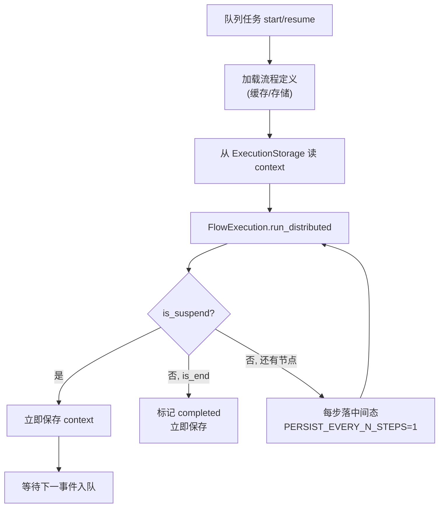

# FlowWorker

`FlowWorker`（`plaita.server.flow_worker`，需 `server` extra）把 `FlowExecution.run_distributed` 与 `ExecutionStorage` / `FlowStorage` / `EventBus` 串起来：加载流程、持久化 checkpoint、处理 start/resume 任务。

把它当成 **suspend/resume 编排器**，而不是 Temporal/Cadence 级「容错工作流引擎」。API 名里的 Distributed 指「可跨进程挂起/恢复」。

## 可靠性边界（必读） {#可靠性边界必读}

| 机制 | 当前行为 | 后果 |
|------|----------|------|
| 任务队列（`RedisFlowWorker`） | Redis **Stream** + consumer group；成功 `XACK`，否则 pending 可回收；超 `--max-deliveries` 进 DLQ | **at-least-once**（需 Redis 5+）。业务侧应幂等；毒丸进 `<queue>:dlq` |
| 队列残留回收（#43） | `XACK` 与 best-effort `XDEL` 之间进程被杀会留下「已 ack 未删」条目（`XDEL` 只出现在 `ack()`，残留只可能来自这个窗口）；worker 启动时扫一次 + 每 300s（`residue_sweep_interval_seconds`）best-effort `XDEL`，单轮上限 256 条，只删 id ≤ 消费组 `last-delivered-id` **且不在本组 PEL 中**的条目 | `XLEN` 不再被已终结条目长期污染（否则读成假「有积压」，2026-10-07 实测误判）；残留按每轮 ≤256 条 / 300s 逐轮收敛（如 1 万条约需数小时），期间 `XPENDING`/`lag` 仍如实反映真实积压；未投递积压与 pending 语义不变 |
| 中间态落盘 | `FlowWorker.PERSIST_EVERY_N_STEPS`（默认 **1**） | 连续推进每步写盘；崩溃不丢步进进度 |
| 挂起 / 结束 / 出错 | **立即** `save_execution_state`；返回 False（Redis 后端吞异常的失败形态）即抛 `StatePersistError`，消息**不** ack 走重投 | 落盘失败不再静默成僵尸执行（2026-10 评审修复；start 路径此前已检查，其余调用点统一收口 `_persist_state_or_raise`） |
| 挂起服务任务派发 | `rpush` 到 `plaita:{subtype}:queue` 失败（有 redis 时）抛 `ServiceDispatchError`；suspended 状态保留、消息重投后重新执行挂起节点再派发 | 重投会重复注册订阅——EventFilter 终态 GC 只回收终态，孤儿订阅留到 TTL 过期（可接受） |
| 并发 start / resume | Redis `SET NX EX` lease（`plaita.server.execution_lease`） | 同一 `execution_id` 最多一个推进者——start 与 resume 同一套租约：start 从落 running 行前 acquire、处理结束 finally 释放，因此长任务的 start 消息被 XCLAIM 重派后，重派者拿不到租约、消息被 ack 释放（#23）。抢租约失败的任务**不**烧 delivery（ack 释放） |
| 控制面 | Registry / Control / Log / Queue / EventFilter 硬绑 Redis | 换 EventBus 后端 ≠ 换部署拓扑 |

选型含义：

- 适合：审批回调、HTTP 回调、延迟唤醒等「挂起等待外部事件」、可接受**重复投递**（幂等 resume）的场景。
- 不适合：把「恰好一次」「自动故障转移」「金融级幂等」当默认承诺的场景——副作用仍须幂等。
- **崩溃恢复的如实语义（2026-10 更新，#23）**：worker 崩溃后 pending 里的 start 任务被重投时，会**创建全新执行从头重跑**（新 execution_id，即从首节点起全部节点重跑——**首节点必须幂等**）——每步落盘的 checkpoint 不会被 start 任务消费；旧执行会停留在 `running` 状态，需要运维侧用 [`scripts/reap_zombie_executions.py`](ops-runbook.md#僵尸执行巡检) 巡检清理（租约在则跳过、条件写落盘——单看 `last_update_time` 会误杀长节点）。**存活持有者不会被重派双跑**：start 消息被 XCLAIM 重派后，重派者因租约被原持有者持有而拿不到租约、消息被 ack 释放（#23）；只有持有者真死（租约过期）后重投才会从头重跑。resume 任务的重投是安全的：终态执行会被幂等短路（原样返回，不再推进，也不会被改写状态）。

CLI：`--consumer-group`、`--consumer-name`、`--claim-min-idle-ms`（默认 60000）、`--lease-ttl-seconds`（默认 120）、`--max-deliveries`（默认 5）、`--dlq-key`。`--queue-name` 为 **Stream 键名**（与旧 List 不兼容）。

## 长步骤与消息回收（claim_min_idle_ms / XCLAIM） {#长步骤与消息回收}

一条任务从被 `XREADGROUP` 读到 `XACK` 前一直留在 consumer group 的 pending
列表。**单个步骤**执行超过 `--claim-min-idle-ms`（默认 60000ms）后，这条
「仍在处理中」的消息就对其他 consumer 的 XCLAIM 回收可见——回收本身不是
故障，双跑由执行租约拦截（**start 与 resume 同一套租约**，#23）：

1. start：`start_flow` 在落 running 行**之前** acquire，持有整个处理窗口；
   resume：`resume_flow` 在推进前 acquire。重派/并发消息的持有者拿不到
   租约 → `ExecutionLeaseError`，消息被 **ack 释放**（持租约的活 worker 在
   正常推进，重投载体已无意义；2026-10-06 修，避免对端每 60s XCLAIM 烧
   delivery 到死信）；
2. 持租约的活 worker 由看门狗每 lease TTL/3（默认 120s → 40s）续租，步骤
   执行期间租约不会过期——XCLAIM 真正接手的只有已死 worker 的消息；
3. 退化路径：`PLAITA_DISABLE_LEASE_WATCHDOG=1` 且单步超过 lease TTL 时，
   租约可能在步骤中途过期、接管者拿到更新的 fence 世代——旧 worker 的
   下一次落盘被 fencing CAS 拒绝、步界续租失败自爆（均 `ExecutionLeaseError`
   且不 ack），状态不会被双写，但当前步副作用可能重复，业务侧仍须幂等。

因此调小 `claim_min_idle_ms` 只加快「死 worker 消息」的回收，不会中断活
worker 的执行；调大到超过最长步骤耗时，可减少 `lease_conflicts` 噪音。
**对 start 同样成立**：无租约时代的「数小时 run 消费 60s 后被空闲 worker
重派、整条 flow 从头双跑」已被租约窗口根除（#23）；持有者死亡后重派消息
照常取得租约接管——start 的接管点是从头重跑（checkpoint 由后续 resume
消费），租约只保证「同一时刻至多一个推进者」。

**死信守卫**：超过 `--max-deliveries` 的消息进 DLQ 前，先查消息体
`execution_id` 的执行状态与 resume 租约（键 `{ns}:execution:lease:{id}`，`ns` 按消息体
`tenant_id` 路由：default/空 = `plaita`，其余 = `plaita:{tenant_id}`）——
执行已终态直接放行；租约仍在（活 worker 正处理长步骤）则跳过死信、消息留
pending；执行仍非终态但**节点重试计数已达预算**（见下节）则终态化 error 后
放行（不再重入队——重入队会让 delivery 归 1 再耗尽，无限循环）；租约/状态
查询失败同样保守跳过；非终态且租约空（持有者已死）重入队一份 delivery 归 1
的恢复消息后放行。

部署步骤与故障手册见 [运维 Runbook](ops-runbook.md)；副作用设计见 [幂等 Resume](idempotent-resume.md)。

## 节点级有界重试（2026-10 二波） {#节点级有界重试}

分布式路径上**节点执行失败**（LLM/HTTP 网络抖一次）不再直接废掉整个执行：

- **判别**：`run_distributed` 把异常归一化为 `FlowErrorException`（原始异常在
  `__cause__`）。链中出现 `NodeExecutionError`（节点执行异常）→ 可重试；
  链中出现超时（`NodeTimeoutError`/`FlowTimeoutError`）或取消
  （`FlowCancelledException`）、或协议/图错误（`ResumeError` 等）→ 维持现状
  终态化 error。超时不重试是刻意的：确定性信号重试=再烧一次全款。
- **载体**：at-least-once 消息重投本身。重试时执行**不终态化**（磁盘 state
  停在最后成功步 checkpoint——失败节点不写 context），消息不 ack 留 pending，
  `claim_min_idle_ms`（默认 60s）后被回收重投，resume 从 checkpoint 自然重跑
  失败节点。`run()` 对重试异常仿照 `ExecutionLeaseError`：不 ack、不计 poison。
- **预算**：重试计数键 `{ns}:execution:noderetry:{id}`（INCR + 滑动 7 天 EX，
  租户路由与租约键同规则），默认预算 = `--max-deliveries`（5）。耗尽 → 终态化
  error（`error.node_retries` 记录重试次数），消息走 DLQ。刻意**不**用消息
  `delivery_count` 判预算：回收路径上报的是 XCLAIM 前的投递数（少计 1），且
  达限消息在队列层就地死信、不进处理函数——按它判预算永不触发。
  计数语义是「当前节点的**连续**失败次数」：任一节点成功推进即清零，不同
  节点的失败不共享预算。
- **与 G1 retry 唤醒的组合**（43828aa）：预算耗尽终态化的执行仍可经人工
  `resume_type=retry` 唤醒（error 态断点续跑）——唤醒放行即清零计数键，人工
  唤醒后拿全新预算；flow 定义指纹校验先于唤醒，定义被改时执行保持 error
  （修复定义后仍可再 retry）。
- **回滚**：`PLAITA_DISABLE_NODE_RETRY=1` 完全回到旧行为（一次失败即终态）。
- **边界**：重试覆盖的是「消息处理中步进失败」；start 消息的首节点（尚未落盘）
  失败本就走 RuntimeError → 重投 → 从头重跑（见可靠性边界的崩溃恢复语义）。

## 运行中改定义（flow 定义指纹，2026-10 二波） {#运行中改定义}

worker 的流程定义 TTLCache 有 300s 窗口、console engine_sync 可直接覆盖 Redis
定义——挂起执行 resume 用 latest 版本定义时，若定义自启动后被改，图遍历会
找不到节点/走错分支且无告警。现版语义：

- `start_flow` 对**实际加载执行的 Flow** 计算指纹
  （sha256 of `model_dump(mode="json")` + sort_keys 规范化 JSON）写入
  `ExecutionState.flow_hash`；
- `resume_flow` 取得租约后比对：不一致 → 终态化 error（message 写明「flow
  定义自启动后已变更，hash 不匹配，执行无法安全续跑」，附前后指纹）+ 消息
  poison ack——**故意选可观测的终态而不是重投风暴**（定义被改是确定性不一致，
  重投 N 次结果相同）；
- 老状态 `flow_hash` 为 None（旧版本 worker 写入）→ 跳过校验，零回归；
- 在租约内判定是为了与活 worker 的推进写串行化：不会把他人正持有租约推进中
  的执行误终态化。

**运维含义**：改定义前应确认没有 running/suspended 的在途执行（console 按
flow_id 查询非终态执行）；确需强升时接受在途执行被终态化 error、由上游重提。

## start 幂等键 dedup_key（2026-10 二波） {#start-幂等键}

start 消息重投（worker 崩溃/保存失败）历史上会新建 execution_id 从头重跑，
首节点副作用双份。现版支持调用方显式声明幂等键：

- 消息体可选 `dedup_key`（console BFF `POST /executions` 请求体 additive 字段
  同名透传）：worker 在**首节点执行之前**以 `SET NX EX 7d` 原子认领
  `{ns}:start-dedup:{key}`，映射值 = G1 预铸的 execution_id（BFF start 时
  铸造随消息透传）或就地铸造的 id——认领在先行落 running 行**之前**，重投/
  双开在任何新行落盘前即被拦截；
- 命中 → 读映射的执行状态，**绝不二次 start**：已终态 → 返回 already 形状；
  running（崩溃/重试搁浅）→ 重入队一份 resume 消息接续执行再 ack start；
  suspended → 只返回现状形状（挂起执行自有 delay/approval 的 resume 链路）；
- 孤儿映射（认领后首次执行从未落盘，如 crash 在 claim 与先行落行之间）→
  释放后重新认领、按新启动继续（首节点可能重跑——首节点须幂等仍是既有约定）；
  G1 先行落行后该窗口已收窄到极小；命中 running 的重入队 resume 对
  context={} 的先行行同样正确（无 last_node_id → 从首节点步进）；
  重入队的 resume 若与原 start 持有者并发，由执行租约串行化（#23）；
- **不传 `dedup_key` 则行为与存量完全一致**；键必须调用方显式提供，worker
  不做 body hash 自动键——同参数定时任务（cron 每小时跑同一 flow）会被误判
  为重复启动而永不执行。键按租户隔离，7 天过期。
- **调度服务是唯一的自动加键方**（#23）：`fire_schedule`（cron 循环与 console
  「立即触发」共用）以确定性键 `sched:{schedule_id}:{触发时点秒}` 入队——
  同一次到期的消息重派/重投收敛到同一 execution，不产生平行执行；下一次
  cron 到期时间戳不同，不会被误吞。手动 `POST /executions` 仍不自动加键。


## 职责

- 从 `FlowStorage` 加载流程定义（带 TTL 缓存）
- 用 `ExecutionStorage` 保存/读取执行状态
- 推进 Distributed 流程：跑到挂起节点，或从断点恢复
- 与 EventFilter / 外延服务配合：外部事件入队后由 worker `resume`
- 贯穿所有步骤地保留用户回调（须复用同一 `FlowExecution` 实例）

## 构造

```python
from plaita.server.flow_worker import FlowWorker
from plaita.storage.redis import RedisExecutionStorage, RedisFlowStorage  # 需 redis extra
from plaita.event.redis import RedisEventBus

worker = FlowWorker(
    execution_storage=RedisExecutionStorage(client=redis_client),
    flow_storage=RedisFlowStorage(client=redis_client),
    event_bus=RedisEventBus(client=redis_client),
    cache_size=100,
    cache_ttl=300,
    callback_handlers=[MyCallback()],
)
```

| 参数 | 说明 |
|------|------|
| `execution_storage` | 执行状态存储（`ExecutionStorage`，同步契约） |
| `flow_storage` | 流程定义存储（`FlowStorage`） |
| `event_bus` | 事件总线 |
| `cache_size` / `cache_ttl` | 流程定义 `TTLCache` 容量与过期秒数 |
| `callback_handlers` | 贯穿所有分布式步骤的回调列表 |

## 流程定义缓存

`get_flow_definition(flow_id, version)` 先查 `TTLCache`，未命中再查 `FlowStorage` 并回填，避免反复反序列化流程 JSON。缓存键为 `flow_id:version`（version 缺省时用 `latest`）。

## 推进与恢复


```mermaid
flowchart TD
    Start["队列任务 start/resume"] --> Load["加载流程定义<br/>(缓存/存储)"]
    Load --> LoadState["从 ExecutionStorage 读 context"]
    LoadState --> Run["FlowExecution.run_distributed"]
    Run --> Suspend{"is_suspend?"}
    Suspend -- 是 --> Save["立即保存 context"]
    Save --> Wait["等待下一事件入队"]
    Suspend -- 否, is_end --> Done["标记 completed<br/>立即保存"]
    Suspend -- 否, 还有节点 --> Maybe["每步落中间态<br/>PERSIST_EVERY_N_STEPS=1"]
    Maybe --> Run
```

## 状态模型

`ExecutionState`（`plaita.storage.base`）记录一次执行的完整状态：

| 字段 | 含义 |
|------|------|
| `execution_id` | 执行 ID |
| `flow_id` / `flow_version` | 所属流程与版本 |
| `flow_hash` | 启动时 Flow 定义指纹（可选；老状态为 None，resume 时比对防运行中改定义，见上） |
| `flow_hash_algo` | 指纹算法标记（可选）。resume 时**分级**判定：算法同→严格比对；算法不同但指纹相同→直接续跑并刷新标记；算法不同且指纹不同→需显式 `allow_flow_hash_change` 放行。见 ops-runbook「flow_hash 兼容门」 |
| `engine_version` | 创建该执行的引擎版本（`plaita.__version__`，可选）。仅观测：跨 minor resume 打 WARNING，不拦截；不随 resume 覆写（保留「创建者版本」语义） |
| `context` | 执行上下文（即 Checkpoint） |
| `status` | `running` / `suspended` / `completed` / `error` |
| `start_time` / `last_update_time` / `end_time` | 时间戳（ISO 字符串） |
| `error` | 错误详情（status=error 时；节点重试耗尽的 error 附 `node_retries`） |
| `invoker` | 发起方标识 |
| `node_timings` | 节点级耗时（可选）：`node_id → {started_at, ended_at, started_ms, ended_ms, duration_ms, total_duration_ms, attempts, failed}`。由 worker 按执行挂载的 `NodeTimingCallback` 采集、在落盘收口处写入；同节点多次执行（循环/重试）时 `duration_ms` 取最后一次、`total_duration_ms` 累计、`attempts` 计数。**老状态/宿主未挂采集器时为 `None`**，读取方必须按缺省处理。 |

## 存储后端

生产路径（`FlowWorker` CLI / `create_storage_component`）仅支持同步契约后端：

| 后端 | 模块 | extra | 备注 |
|------|------|-------|------|
| memory | `plaita.storage.memory` | — | 单测 / 本地 |
| redis | `plaita.storage.redis` | `redis` | **推荐**生产默认 |

`ExecutionStorage` 接口为**同步**方法：`save_execution_state` / `load_execution_state` / `delete_execution_state` / `list_executions`，并提供 `serialize_state` / `deserialize_state`（JSON）。

> `plaita.storage.sqlalchemy` 仍存在，但其方法为 `async def`，与上述同步契约及 Worker 调用方式不兼容。公开路径已拒绝 `db` 作为 execution/flow 存储；详见根目录 `MIGRATION.md`「Storage：db 执行/流程存储从公开路径下架」。

## 与 ServiceManager 协作

`FlowWorker` 负责执行流程，`ServiceManager` 负责监听外部触发源（定时器、队列、HTTP 回调、审批系统）并 `publish` 事件。二者通过 `EventBus` 解耦。完整闭环见 [外延服务](services.md)。

## 下一步

- [扩展节点](extended-nodes.md) —— 在流程里声明等待
- [外延服务](services.md) —— 在流程外触发恢复
- [API: plaita.server.flow_worker](../api/server.md)

## checkpoint 成本警示（2026-09 性能实测）

`$NODE` 保留**每个节点**的结果，且每步 checkpoint 对**全量上下文**重新 JSON
序列化——落盘成本随步数 **二次方**增长，随 payload 大小线性放大：

| payload（10 节点流程，每步落盘） | 单步 save 耗时 | Redis used_memory 峰值 |
|---|---|---|
| 1 MB | 6 → 35 ms（逐步递增） | 25 MB |
| 10 MB | 66 → 306 ms | **223 MB** |

节点执行本身仅 2-13 ms/步：大 payload 下落盘开销是节点执行的 17-24 倍。
**缓解**：让大 payload 只在被消费时进入上下文（避免透传 1MB+ 的中间结果存进
`$NODE`）；调大 `PERSIST_EVERY_N_STEPS`；长流程拆分为 child/子执行。
增量式 checkpoint（每节点结果独立 key）在路线图上，当前版本请按上述方式规避。

## 停机与运维参数（2026-09）

- **优雅停机**：SIGTERM/SIGINT 后 worker 在当前任务完成后退出。消费阻塞窗口
  上限由 `--read-block-ms`（默认 1000ms）控制——XREADGROUP 的 BLOCK 无法被
  信号中断，窗口越大停机延迟越长；默认值保证停机延迟 ≲1s。
- **CLI 日志**：`python -m plaita.server.flow_worker` 默认输出 INFO 级控制台
  日志（`PLAITA_LOG_LEVEL` 可调，`--quiet` 关闭）。
- **Langfuse 观测**：`--langfuse`（或 `PLAITA_WORKER_LANGFUSE=1`）启用
  [LangfuseCallback](../guide/callbacks.md#集成-langfuse-plaita-obs-langfusecallback)
  （需 `pip install plaita[langfuse]`，凭据走 `LANGFUSE_*` 环境变量）。trace id =
  运行时 execution_id（随 checkpoint 持久化，跨进程 resume 续写同一 trace）；
  依赖缺失或 SDK 初始化失败只告警降级，不影响执行。
- **writefile 写入 jail（2026-10）**：worker 启动即注入 `writefile` 节点的
  `PLAITA_NODES_WORKSPACE_ROOT`（未显式配置则 fail-closed 推导默认根，`/` 不算
  边界）；显式放行任意路径用 `PLAITA_ALLOW_UNRESTRICTED_WRITES=1`（仅单机信任
  部署）。见 [运维 Runbook · writefile 写入 jail](ops-runbook.md#writefile-写入-jail)。
- **code 沙箱后端白名单（plaita#22）**：worker 注册 `code` 节点时施加后端白名单
  （`PLAITA_SANDBOX_ALLOWED_BACKENDS`，未配置则 `docker` ∪ 生效后端；生效后端取
  `PLAITA_CODE_BACKEND`，默认 `subprocess`）。流程 JSON 声明的 `sandbox_backend`
  落在白名单外即**解析期拒绝**——否则流程作者可逐节点把后端降级为 `unsafe`
  （进程内 raw `exec`，宿主任意代码执行）。见
  [运维 Runbook · code 沙箱后端白名单](ops-runbook.md#code-沙箱后端白名单)。
- **code 语言白名单（plaita#29）**：worker 同时施加语言白名单
  （`PLAITA_SANDBOX_ALLOWED_LANGUAGES`，未配置则只放行 `python`）。`language: "js"`
  此前绕开整个档位体系（无隔离 / 无超时 / 无取消），故改为须显式放行；放行后 js 仍受
  后端白名单与「语言×档位」约束（`restricted` 没有 js 实现）。见
  [运维 Runbook · code 语言白名单](ops-runbook.md#code-语言白名单)。
- **指标与告警（plaita#26）**：`PLAITA_METRICS_PORT`（或 `--metrics-port`）> 0 时
  本进程起 Prometheus `/metrics` 抓取端，导出队列 `stream_length`/`pending`/
  `dlq_length`、全部进程内计数器与 worker 存活/心跳；死信经
  `RedisStreamTaskQueue(on_dead_letter=...)` 钩子外发，`PLAITA_ALERT_WEBHOOK`
  配置后即为 JSON POST（有界队列 + 后台线程，best-effort，不反压消费）。见
  [运维 Runbook · 指标与告警](ops-runbook.md#指标与告警)。
- **event_filter** 的 `--redis-url` 默认取 `PLAITA_REDIS_URL` 环境变量（与
  flow_worker 一致）。
- **残留订阅 GC**：EventFilter 匹配到已终态（completed/error）执行的订阅时，
  就地注销该订阅而不是入队注定失败的 resume——error 路径泄漏的订阅不再
  需要等 7 天 TTL。
