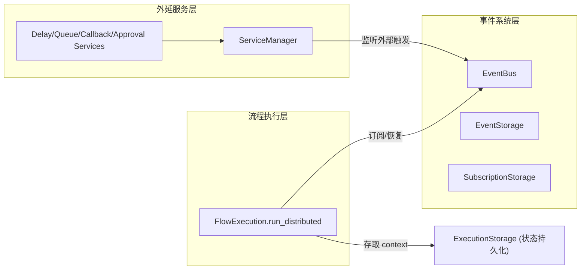

# 断点续执

断点续执（Checkpoint）让流程能在某个节点**挂起**、把上下文**持久化**，等外部事件到达后**恢复**继续执行。这是 **suspend/resume** 能力，不是「至少一次投递」的容错引擎——部署侧可靠性边界见 [FlowWorker](flow-worker.md#可靠性边界必读)。

## 为什么需要它

传统同步阻塞引擎无法支撑需要长时间等待的场景：

- 外部 HTTP 回调（等第三方异步通知）
- 人工审批（等人决策）
- 消息队列触发（等 Redis/Kafka 消息）
- 定时延迟（等指定时间到）

这些场景要求流程"暂停-存档-后被唤醒"。plaita 用 **Distributed 执行模式 + 事件节点 + 事件总线 + 外延服务** 的组合实现这一能力。

## 核心概念

| 概念 | 说明 |
|------|------|
| **Checkpoint** | 流程执行的断点，含完整执行上下文 |
| **挂起 (Suspend)** | 流程在事件节点处暂停，保存状态 |
| **恢复 (Resume)** | 外部事件到达后，从断点继续执行 |
| **EventNode** | 可触发挂起的特殊节点类型 |
| **EventBus** | 事件发布/订阅抽象，连接挂起流程与外部触发源 |
| **外延服务 (Extended Service)** | 处理外部事件的后台服务（延迟/队列/回调/审批） |

## 整体架构




## 零依赖快速体验

!!! tip "不需要 Redis 也能跑断点续执"

    断点续执不强制依赖 Redis 或外部数据库。用内存版实现，无任何额外依赖，适合本地开发验证和演示。

```python
from plaita import Flow, FlowExecution
from plaita.event.memory import InMemoryEventBus
from plaita.storage.memory import MemoryExecutionStorage

# 一个等待外部事件的简单流程（event 节点模拟人工确认）
flow_json = """
{
  "flow_id": "confirm_demo",
  "nodes": [
    {"type": "start", "id": "start", "next": "wait"},
    {"type": "event", "id": "wait", "eventType": "user_confirm", "next": "end"},
    {"type": "end", "id": "end", "output": "$NODE.wait.event_data", "resultType": "success"}
  ]
}
"""
import asyncio
from plaita.event.core import Event

flow = Flow.from_string(flow_json)
bus = InMemoryEventBus()

# 同一个 execution 实例，跨步骤复用
execution = FlowExecution(event_bus=bus)

# 第一步：推进到事件节点，挂起
step1 = execution.run_distributed(flow, {})
assert step1["is_suspend"] is True
exec_id = execution._ctx.execution_id
saved_ctx = step1["context"]          # 可序列化后持久化，此处直接用内存

# 模拟外部事件到达（生产中由 ApprovalService / HTTP 回调等触发）
asyncio.run(bus.publish(Event(
    event_type="user_confirm",
    data={"approved": True},
    correlation_id=exec_id,
)))

# 第二步：用事件数据恢复
step2 = execution.run_distributed(
    flow, None,
    saved_context=saved_ctx,
    resume_type="event",
    resume_data={"approved": True},
)
print(step2["result"])   # -> {"approved": True}
```

**需要跨进程部署？** 把 `InMemoryEventBus` 换成 `RedisEventBus`，把 `MemoryExecutionStorage` 换成 `RedisExecutionStorage`（公开路径仅 memory|redis）。任务经 **Redis Stream** 入队（at-least-once，见 [FlowWorker · 可靠性边界](flow-worker.md#可靠性边界必读)）。

---

## 章节导览

- [Checkpoint 概念](checkpoint.md) —— 挂起/恢复的执行模型与 resume_type
- [事件系统](event-system.md) —— EventBus / Event / Subscription 与三种后端
- [FlowWorker](flow-worker.md) —— 分布式流程工作器，串联存储与执行
- [扩展节点](extended-nodes.md) —— delay/queue/http_callback/approval 节点
- [外延服务](services.md) —— ServiceManager 与后台服务

## 组件关系


