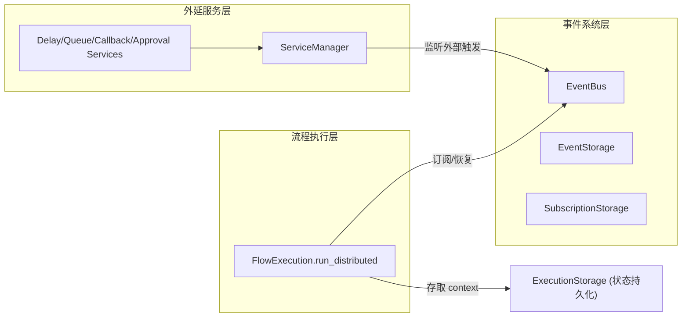

# 断点续执

断点续执（Checkpoint）是 plaita 支持长时间运行工作流的核心特性。它让流程能在某个节点**挂起**、把上下文**持久化**，等外部事件到达后**恢复**继续执行。

## 为什么需要它

传统同步阻塞引擎无法支撑需要长时间等待的场景：

- 外部 HTTP 回调（等第三方异步通知）
- 人工审批（等人决策）
- 消息队列触发（等 Redis/Kafka 消息）
- 定时延迟（等指定时间到）

这些场景要求流程"暂停-存档-后被唤醒"。plaita 用 **Distributed 执行模式 + 事件节点 + 事件总线 + 外延服务** 的组合实现这一能力。

## 核心概念

| 概念 | 说明 |
|------|------|
| **Checkpoint** | 流程执行的断点，含完整执行上下文 |
| **挂起 (Suspend)** | 流程在事件节点处暂停，保存状态 |
| **恢复 (Resume)** | 外部事件到达后，从断点继续执行 |
| **EventNode** | 可触发挂起的特殊节点类型 |
| **EventBus** | 事件发布/订阅抽象，连接挂起流程与外部触发源 |
| **外延服务 (Extended Service)** | 处理外部事件的后台服务（延迟/队列/回调/审批） |

## 整体架构

## 章节导览

- [Checkpoint 概念](checkpoint.md) —— 挂起/恢复的执行模型与 resume_type
- [事件系统](event-system.md) —— EventBus / Event / Subscription 与三种后端
- [FlowWorker](flow-worker.md) —— 分布式流程工作器，串联存储与执行
- [扩展节点](extended-nodes.md) —— delay/queue/http_callback/approval 节点
- [外延服务](services.md) —— ServiceManager 与后台服务

## 组件关系

