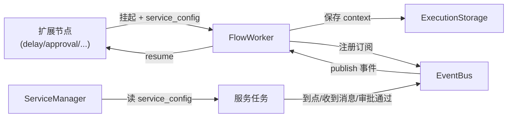

# 外延服务

外延服务（`plaita.server.services`，需 `server` extra）是运行在流程之外的后台服务，负责**监听外部触发源**并把它们转成事件 `publish` 到 `EventBus`，从而唤醒挂起的流程。它们与扩展节点是"触发端"与"声明端"的配对。

## ServiceManager

`ServiceManager` 统一管理所有外延服务的生命周期与任务分发：

```python
from plaita.server.services.service_manager import ServiceManager

manager = ServiceManager(event_bus=bus)
manager.start_all_services(service_configs)
# ... 运行 ...
manager.stop_all_services()
```

它内置五类服务，按扩展节点产出的 `service_config.type` 分发任务：

| type | 服务类 | 配对节点 |
|------|--------|---------|
| `delay` | `DelayService` | `DelayNode` |
| `redis_queue` | `RedisQueueService` | `RedisQueueNode` |
| `kafka_queue` | `KafkaQueueService` | `KafkaQueueNode` |
| `http_callback` | `HttpCallbackService` | `HttpCallbackNode` |
| `approval` | `ApprovalService` | `ApprovalNode` |

可通过 `register_service_class(service_type, service_class)` 注册自定义服务。

## 闭环



1. 流程跑到扩展节点 → 生成 `service_config` → 挂起、存 context、订阅事件
2. `ServiceManager` 拿到 `service_config`，交给对应服务
3. 服务监听外部触发源（定时器/队列/HTTP/审批系统）
4. 触发条件满足 → `publish` 一个 `correlation_id=execution_id` 的事件
5. `FlowWorker` 收到事件 → `run_distributed(resume_type="event", resume_data)` 恢复

## 各服务职责

### DelayService

按 `service_config.delay_ms` 设定定时器，到点发布 `delay_trigger` 事件。适合"X 分钟后继续"的场景。

### RedisQueueService / KafkaQueueService

阻塞监听对应队列，消息到达后包装成事件发布。适合"等某条消息到达再继续"。

### HttpCallbackService

暴露 HTTP 端点接收外部回调，把回调 body 作为 `event_data` 发布。适合"等第三方异步通知"。

### ApprovalService

对接审批系统：通知审批人、收集决策；满足 `approval_strategy`（any/all/majority）后发布 `approval_decision` 事件，`event_data` 含审批结果与意见。支持自动升级（`auto_escalation`）。

## 启动入口

`plaita.server.services.__main__` 提供命令行启动：

```bash
python -m plaita.server.services --help
```

也可在应用代码里手动构造 `ServiceManager` 嵌入自己的服务进程。

## 多实例与负载均衡

`ServiceManager` 支持多实例部署：事件总线（redis/sqlalchemy 后端）与状态存储共享，多个 worker 实例可分担挂起流程的恢复负载，`EventProcessingTracker` 保证事件不重复消费。

## 下一步

- [扩展节点](extended-nodes.md)
- [FlowWorker](flow-worker.md)
- [审批流场景](../scenarios/approval-flow.md)
