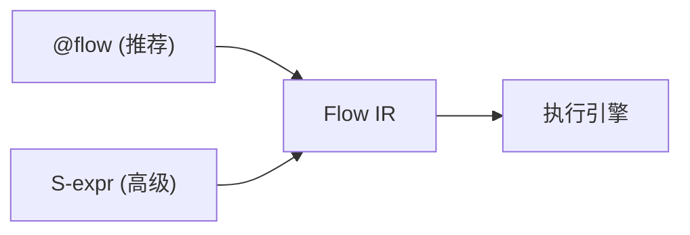

# @flow DSL

`@flow` 是 plaita 的**首选 Python API**，它把普通函数体通过 `ast` 编译为 Flow IR，表达式用真实 Python 语法，IDE 补全最好，AI 生成最友好。



!!! tip "AI Agent 场景"

    `@flow` + [`flow_from_source`](#运行期生成flow_from_source) 最适合 LLM 运行期生成流程（编译期校验 + 无源文件依赖）。端到端场景见 [应用场景 - Agent 编排](../scenarios/agent-orchestration.md)。

---

## AST Python DSL（`@flow`）

`plaita.dsl.codeflow` 是「极致」形态：用户写一个普通 Python 函数，`@flow` 用 `ast` 解析函数体，把 `if`/`for`/`return`/赋值翻译成 flow 节点，把 `INPUT.age >= 18` 编译成 `$INPUT.age` 表达式串。**函数体从不被当作 Python 执行**——它只是一段被静态分析的语法树。

```python
from plaita.dsl.codeflow import flow, F, NODE, MAP, HTTP, ErrorHandler

@flow("create_user", input_type="object", desc="创建用户")
def create_user(INPUT):
    if INPUT.age >= 18:
        resp = HTTP.post(
            url="https://api.example.com/users",
            body={"name": INPUT.name},
            timeout="PT5S",
            on_error=ErrorHandler("continue_with", default={"data": None}),
        )
        return resp.data
    return "未成年"

create_user.run(name="alice", age=20)
```

关键点：

- **写起来就是纯 Python**：有补全、有类型、写错编译期就报。
- **`INPUT` / `F` / `HTTP` 这些名字不需要 import**——它们在函数体里只是语法占位，AST 编译期被识别，运行期不会真正查这几个名字（可选 import 仅用于 IDE 提示）。
- **编译产物仍是 `Flow` IR**，与 JSON/YAML/Builder 完全等价。

### 表达式映射

| 你写的 Python | 编译成的表达式串 |
|----------------|-------------------|
| `INPUT.age` | `$INPUT.age` |
| `F.upper(INPUT.name)` | `$F.upper($INPUT.name)` |
| `resp.data` | `$NODE.resp.data` |
| `INPUT.items[0]` | `$INPUT.items[0]` |
| `a + b` / `a - b` / `a * b` / `a % b` | `$F.add(a,b)` / `$F.sub` / `$F.mul` / `$F.mod` |
| `len(x)` / `abs(x)` | `$F.len(x)` / `$F.abs(x)` |
| `if a >= 18 and b == 1:` | 条件组 `{relation: and, ...}` |
| `if not (x == "blocked"):` | 取反 `{relation: not, ...}` |

> 比较与 `and`/`or`/`not` 只能出现在 `if` 判断位置；算术 `+ - * / %` 编译成 `$F.add/sub/mul/div/mod`（表达式语言没有中缀运算符）。

### 表达式语义边界

`@flow` 用 Python 语法做皮、子集做骨：函数体**不被当 Python 执行**，只走静态 AST 编译。能编译的写法与精确语义如下，**写法不在表里就会在构建 `Flow` 前报错（带行号与重写提示）**。

**支持的 Python 表达式**

| 写法 | 编译产物 | 精确语义 |
|------|----------|----------|
| 字面量 `1` `"x"` `True` `None` `[1,2]` `{"a":1}` | 原值 | 原样；dict key 必须是常量 |
| `INPUT.x` / `NODE.r.data` / `GLOBAL.k` / `PARENT.x` / `ENV.K` | `$INPUT.x` / `$NODE.r.data` / … | 命名空间变量解析 |
| `obj.path[0]` / `obj.path[-1]` | `$obj.path[0]` / `$obj.path[-1]` | 仅整数常量下标 |
| `F.foo(a, b)` | `$F.foo(a, b)` | 调用注册的表达式函数 |
| `len(x)` / `abs(x)` / `round(x)` | `$F.len` / `$F.abs` / `$F.round` | 映射到**真 Python 内置**, 语义精确 |
| `str(x)` | `$F.concat(x)` | **近似映射**: `concat` = `"".join(str(a) for a in args)`, 单参时与 `str()` 等价; `str` 当类型转换的意图被实现成"拼成字符串" |
| `a + b` `a - b` `a * b` `a / b` `a % b` `a ** b` | `$F.add/sub/mul/div/mod/pow` | 直接对应 Python 运算符 (`a + b`), 因此 `+` 对 int/str/list 都按 Python `+` 多态——**类型决定语义, 编译期不做类型检查** |

**不支持、会报错的 Python 写法（含重写提示）**

| 写法 | 报错提示 |
|------|----------|
| f-string `f"hi {name}"` | 用 `F.concat('hi ', INPUT.name)` |
| 三元 `a if c else b` | 用 `if/else` 语句分支 |
| 列表/集合/字典推导式 | 用 `MAP`/`FILTER` 节点 |
| `lambda` / `await` / 海象 `:=` / `*args` 解包 | 不支持, 拆成节点或普通赋值 |
| 比较与 `and`/`or`/`not` 在表达式位置 | 只能出现在 `if` 判断位置 |
| 字面量方法调用 `"x".upper()` / 任意非 `F.*` 非 `len/abs/round/str` 调用 | 表达式里只能调 `F.xxx(...)` 或上述内置 |
| 集合字面量 `{1,2}` | 用列表 |

> **关于 `+` 的多态陷阱**：`name + "!"` 编译成 `$F.add($INPUT.name, "!")`，运行时 `+` 对字符串是拼接、对数字是加——结果**取决于运行时类型**, 编译期不拦。若要强制字符串拼接且对非字符串报错, 显式用 `F.concat(...)`。

### if / elif / else、return、赋值

```python
@flow("grade", input_type="object")
def grade(INPUT):
    if INPUT.score >= 90:
        return "A"
    elif INPUT.score >= 60:
        return "B"
    else:
        return "C"

grade.run(score=95)   # -> "A"
```

赋值会生成 `assignment` 节点，后续用变量名引用其输出：

```python
@flow("greet", input_type="object")
def greet(INPUT):
    name = F.upper(INPUT.name)
    return F.concat("hi ", name)

greet.run(name="alice")   # -> "hi ALICE"
# name = $F.upper($INPUT.name);  return = $F.concat("hi ", $NODE.name)
```

### 集合节点

`map` / `filter` / `find` / `loop` 用 `for x in MAP(...)` 语法，子流程直接写在函数体里：

```python
@flow("double_numbers", input_type="object")
def double_numbers(INPUT):
    for x in MAP(INPUT.numbers, id="dbl"):
        return F.mul(x, 2)
    return NODE.dbl

double_numbers.run(numbers=[1, 2, 3, 4])   # -> [2, 4, 6, 8]
```

`filter` / `find` 的子流程需要返回 bool，惯例是 `if ... return True` / `return False`：

```python
@flow("first_even", input_type="object")
def first_even(INPUT):
    for x in FIND(INPUT.nums, id="fd"):
        if F.mod(x, 2) == 0:
            return True
        return False
    return NODE.fd

first_even.run(nums=[1, 3, 4, 6])   # -> 4
```

### 子流程 @childflow + CHILD

`@childflow` 装饰一个子流程函数，父流程用 `CHILD(...)` 引用：

```python
from plaita.dsl.codeflow import flow, childflow, CHILD, F

@childflow(input_type="object")
def double_each(INPUT):
    return F.mul(INPUT.item, 2)

@flow("double_via_child", input_type="object")
def double_via_child(INPUT):
    r = CHILD(input={"item": INPUT.payload}, flow=double_each)
    return r

double_via_child.run(payload=21)   # -> 42
```

> `CHILD` 的 `input` 要匹配子流程的 `input_type`：`object` 就传 dict，`array` 就传 list。

### 编译期校验

`@flow` 在构建 `Flow` 前做静态分析，报行号：

| 反模式 | 报错 |
|--------|------|
| 用了未定义的名字 | `[codeflow] 第 N 行: 未知名字 'xxx'` |
| 节点调用嵌在表达式里 | `HTTP(...) 是节点调用，只能作为语句或赋值右侧` |
| `not` 出现在非条件位置 | `not 要用在条件位置（if/while 判断）` |
| 赋值后悬空（无 return/后续） | `赋值 xxx 之后悬空：请补 return 或后续语句` |
| f-string / 三元 / 推导式 / lambda 等不支持写法 | 带重写提示（见上文「表达式语义边界」） |
| 非 `F.*` 的方法/函数调用 | `不支持的调用 Xxx.yyy(...)：…` |

只编译不构建：`compile_func(fn, flow_id)` 返回 IR dict，便于审查 / 序列化 / 生成器回写。

```python
from plaita.dsl.codeflow import compile_func
print(compile_func(create_user.__wrapped__, "create_user"))
```

### 运行期生成：`flow_from_source`

`@flow` 装饰器依赖 `inspect.getsource`，要求函数定义在真实 `.py` 源文件里。**运行期动态生成**的场景（AI 拼一段源码字符串、立刻编译执行）走装饰器会失败——动态函数没有源文件。

为此提供源码模式入口 `flow_from_source` / `compile_source`：直接对字符串 `ast.parse`，绕开 `inspect.getsource`：

```python
from plaita.dsl.codeflow import flow_from_source

src = '''
@childflow(input_type="object")
def double_each(INPUT):
    return F.mul(INPUT.item, 2)

@flow("double_via_child", input_type="object")
def double_via_child(INPUT):
    r = CHILD(input={"item": INPUT.payload}, flow=double_each)
    return r
'''
flow = flow_from_source(src)   # 字符串进，Flow 出
flow.run(payload=21)           # -> 42
```

要点：

- 源码里可含多个函数：`@childflow` 装饰的子流程会被收集进注册表，供主流程用 `flow=<name>` 引用（不需要真正执行装饰器）。
- 主流程是 `@flow` 装饰的函数，或唯一一个非 childflow 函数；有多个候选时用 `flow_from_source(src, flow_id="bar")` 指定。
- `@flow("id", input_type=..., desc=...)` 装饰器参数会被自动提取；显式传给 `flow_from_source` 的同名参数覆盖装饰器值。
- `compile_source(src)` 只编译成 IR dict 不构建，便于审查/序列化。

> 装饰器参数只支持字面量（字符串、数字、dict 字面量）。若 `input_type` 写成 `{"age": int}` 这种含类型对象的非字面量，会被兜底成 `object`；需要精确类型时通过 `flow_from_source(src, input_type=...)` 显式传。

### Agent 编排：把 `flow_from_source` 当输出沙箱

`flow_from_source` 是 plaita 与 LLM Agent 结合的**标准入口**：让 LLM 直接产出 `@flow` 源码，运行期编译并执行。相比让 LLM 生成可执行 Python，它有两道安全护栏——

1. **AST 静态校验**：悬空引用、未知名字、节点调用嵌在表达式里、`if` 缺 `else` 都会在构建 `Flow` 前被拦掉，并报行号。
2. **能力受限的表达式层**：函数体不被当 Python 执行，`HTTP`/`CHILD`/`PARALLEL` 等只能作语句或赋值右侧，无法逃逸到任意代码。

一个典型的 Agent 规划-执行闭环：

```python
from plaita.dsl.codeflow import flow_from_source, compile_source

def plan_and_run(user_task: str, planner_llm, tools_hint: str):
    # 1. LLM 规划：根据任务 + 工具说明生成 @flow 源码
    src = planner_llm.generate(prompt=build_prompt(user_task, tools_hint))
    # 2. 先只编译，拿到 IR 供审计/记录
    ir = compile_source(src)              # 校验失败会抛 _CodeflowError，带行号
    log_plan(ir)                          # 持久化计划，便于回放与审计
    # 3. 构建 + 执行
    flow = flow_from_source(src)
    return flow.run(task=user_task)
```

校验失败时把错误回灌给 LLM 让它修复后重试，就是一个**自我纠错的 Agent 规划器**（类似 Agent 平台对 JSON actions 的 jsonpatch 修复循环，但作用在 `@flow` 源码上）。

完整的 Agent 编排模式（多步工具链、条件路由、子 Agent、并行、HITL、trace）见 [应用场景 - Agent 编排](../scenarios/agent-orchestration.md)。

---

## S-表达式 DSL（高级用法）

!!! note "何时用 S-expr"

    S-expr 是一种**可逆**的替代前端：`flow_to_sexpr(data)` 可以把 Flow IR 反编译回 S-expr 源码，这个双向特性在某些「修改后回写」场景很有用。一般用户推荐直接使用 `@flow`。

`plaita.dsl.sexpr` 是可选前端，纯 Python 实现，无额外依赖。

```python
from plaita.dsl.sexpr import parse_sexpr

src = """
(flow adult_check :input-type object :desc "判断成年"
  (start -> check_age)
  (if :id check_age (cond "$INPUT.age" >= 18) -> adult :else minor)
  (end adult :output "成年")
  (end minor :output "未成年"))
"""
flow = parse_sexpr(src)
flow.run(age=20)   # -> "成年"
flow.run(age=15)   # -> "未成年"
```

### 语法元素

| 写法 | 含义 |
|------|------|
| `(flow <id> :input-type ... :desc ... <节点>...)` | 顶层 flow 定义 |
| `(start -> <id>)` | start 节点，`->` 即 `next` |
| `(if :id <id> (cond ...) -> <then> :else <else>)` | if 节点，`->` 是真分支，`:else` 是假分支 |
| `(end <id> :output <expr>)` | end 节点；`resultType` 默认 `success` |
| `(cond <field> <op> <value>)` | 单条件，op 支持 `>=` `==` `!=` `in` … |
| `(and <cond>...)` / `(or ...)` / `(not <cond>)` | 条件组 / 取反 |
| `(dict :k v ...)` / `(dict (k v)...)` | dict 字面量（headers/body 用） |
| `(list ...)` | list 字面量 |
| `:child (childflow ...)` | 集合节点内联子流程 |
| `:id <name>` | 显式节点 id（被分支/`$NODE` 引用时需要） |

不写 `:id` 时自动分配 `_n1`/`_n2`/…；`end`/`assignment` 支持把第一个位置参数当 id（`(end adult :output "成年")`）。

### 集合节点

`(map ...)` / `(filter ...)` / `(find ...)` / `(loop ...)` / `(reduce ...)` 用 `:child` 内联子流程：

```python
src = """
(flow double_numbers :input-type object
  (start -> dbl)
  (map :id dbl :collection "$INPUT.numbers"
    :child (childflow :input-type object
      (start -> e)
      (end e :output "$F.mul($INPUT.item, 2)"))
    -> end)
  (end end :output "$NODE.dbl"))
"""
parse_sexpr(src).run(numbers=[1, 2, 3, 4])  # -> [2, 4, 6, 8]
```

### switch / case

```python
src = """
(flow router :input-type object
  (start -> route)
  (switch :id route
    (branch a :next end_a :when (cond "$INPUT.type" == "A"))
    (branch b :next end_b :when (cond "$INPUT.type" == "B"))
    (branch dft :next end_dft :default true))
  (end end_a :output "A")
  (end end_b :output "B")
  (end end_dft :output "other"))
"""
```

### http / 错误处理

```python
src = """
(flow create_user :input-type object
  (start -> call_api)
  (http :id call_api :method POST :url "https://api.example.com/users"
    :headers (dict :Content-Type "application/json")
    :body (dict :name "$INPUT.name")
    :timeout "PT5S"
    :on-error (on-error continue_with :default (dict :data nil))
    -> end)
  (end end :output "$NODE.call_api.data"))
"""
```

> `http` 节点需要 `pip install plaita[http]`。

### 静态校验与可逆

`parse_sexpr` 在构建 `Flow` 前先跑静态校验，把常见反模式提前拦掉：

| 反模式 | 报错 |
|--------|------|
| 节点 `id` 重复 | `节点 id 重复: [...]` |
| `->` 指向不存在的节点 | `节点 'x' 的 next 指向不存在的节点 id 'y'` |
| `if` 缺 `:else` | `if 节点 'x' 缺少假分支目标（else_next）` |
| `switch` 缺 `:default` | `switch 节点 'x' 缺少 :default 分支` |

只编译不构建：`compile_sexpr(src)` 返回 IR dict；反编译：`flow_to_sexpr(data)` 把 IR dict 转回 S-expr 源码，**双向互转**，便于审查与生成器回写。

```python
from plaita.dsl.sexpr import compile_sexpr, flow_to_sexpr

d = compile_sexpr(src)
print(flow_to_sexpr(d))   # 回到可读的 S-expr
```

---

## 对比：@flow vs S-expr vs Builder

| 维度 | Builder（`plaita.dsl`） | S-expr（`sexpr`） | @flow（`codeflow`） |
|------|----------------------|-------------------|---------------------|
| 写法 | `.add(if_(...)).add(...)` 链 | `(if :id ... (cond ...) -> ...)` | 纯 Python 函数 |
| 表达式 | 字符串 `"$INPUT.age"` | 字符串 `"$INPUT.age"` | 真 Python `INPUT.age` |
| 条件 | `cond("$INPUT.age", ">=", 18)` | `(cond "$INPUT.age" >= 18)` | `INPUT.age >= 18` |
| 拓扑 | 显式 `next` / `linear` 隐式 | 显式 `->` / `:else` | 由 `if`/`for`/`return` 推导 |
| IDE 补全 | 好（关键字参数） | 一般 | 最好（就是 Python） |
| AI 生成友好度 | 中 | 高（结构清晰） | 最高（语言模型最熟） |
| 可逆 | 可导出 JSON/YAML | `flow_to_sexpr` 双向 | `compile_func` 出 IR |
| 构建期校验 | ✅ | ✅ | ✅（带行号） |
| 动态修改流程 | ✅（最适合） | — | — |
| 运行期生成 | — | `compile_sexpr(str)` | `flow_from_source(str)` |
| 推荐场景 | 程序化构建/修改流程 | 可逆回写、结构可审查 | AI 生成、Python 手写 |

---

## 已知边界

- **`reduce`**：子流程输入命名为 `first`（累积值）和 `second`（当前元素）。可选 `initial` 指定初始值（注意：`0`/`[]`/`""` 这类 falsy 值也是有效初始值）。
- **`@flow` 函数须定义在模块级**：`inspect.getsource` 才能取到源码做 AST 编译（函数体内定义的局部函数无法编译）。**运行期动态生成**请改用 `flow_from_source(src)`，它直接解析字符串，无源文件依赖。
- **节点调用位置受限**：`HTTP` / `CODE` / `EVENT` / `CHILD` / `REFERENCE` / `PARALLEL` / 集合调用只能作为语句或赋值右侧，不能嵌在表达式里（如 `return HTTP.post(...)` 需拆成 `resp = HTTP.post(...); return resp.data`）。
- **`str(x)` 是近似映射**：编译成 `$F.concat(x)`（`"".join(str(a) for a in args)`），单参与 `str()` 等价，但语义是"拼成字符串"而非"类型转换"。
- **`+` 多态、编译期不查类型**：`a + b` 编译成 `$F.add(a, b)` 即 Python `a + b`，对 int/str/list 按 Python `+` 各自语义；要强制字符串拼接请显式用 `F.concat(...)`。完整的支持/不支持写法与精确语义见上文「表达式语义边界」。

---

## API 速查

| 入口 | 作用 |
|------|------|
| `plaita.dsl.codeflow.flow(flow_id, ...)` | 装饰器：Python 函数 → `Flow`（需模块级源文件） |
| `plaita.dsl.codeflow.flow_from_source(src, ...)` | 源码字符串 → `Flow`（运行期生成，无源文件依赖） |
| `plaita.dsl.codeflow.compile_source(src, ...)` | 源码字符串 → IR dict（不构建） |
| `plaita.dsl.codeflow.childflow(...)` | 装饰器：子流程函数 |
| `plaita.dsl.codeflow.compile_func(fn, flow_id)` | Python 函数 → IR dict（不构建） |
| `plaita.dsl.codeflow.HTTP / CODE / EVENT / MAP / FILTER / FIND / LOOP / REDUCE / CHILD / REFERENCE / PARALLEL` | 节点调用占位符 |
| `plaita.dsl.codeflow.F / INPUT / NODE / GLOBAL / PARENT / ENV` | 命名空间占位符 |
| `plaita.dsl.codeflow.ErrorHandler(...)` | 错误处理策略构造器 |
| `plaita.dsl.sexpr.parse_sexpr(src)` | S-expr 源码 → `Flow`（含静态校验） |
| `plaita.dsl.sexpr.compile_sexpr(src)` | S-expr 源码 → IR dict（不构建） |
| `plaita.dsl.sexpr.flow_to_sexpr(data)` | IR dict → S-expr 源码（反编译） |
