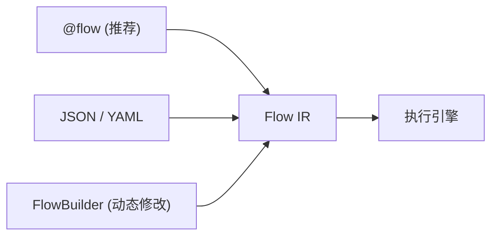

# 流程编写方式

plaita 支持多种格式定义流程，最终均编译为同一个 `Flow` 对象并在相同运行时上执行。



---

## 推荐方式：`@flow`

`@flow` 是 Python 用户的**首选方式**。写普通函数，用 `@flow` 装饰器将函数体编译为 Flow，表达式用真实 Python 语法，IDE 补全最好，AI 生成最友好。

以「判断成年」为例：

```python
from plaita.dsl.codeflow import flow

@flow("adult_check", input_type="object")
def adult_check(INPUT):
    if INPUT.age >= 18:
        return "成年"
    return "未成年"

adult_check.run(age=20)  # -> "成年"
```

**运行期 AI 动态生成**（让 LLM 输出源码字符串后安全执行）：

```python
from plaita.dsl.codeflow import flow_from_source

src = '''
@flow("adult_check", input_type="object")
def adult_check(INPUT):
    if INPUT.age >= 18:
        return "成年"
    return "未成年"
'''
flow_from_source(src).run(age=20)  # -> "成年"
```

→ 完整语法（含集合、子流程、`flow_from_source` Agent 场景）：[@flow DSL](code-dsl.md)

---

## 配置文件格式：JSON / YAML

JSON 是 plaita 的**标准序列化格式**，也是可视化编排工具的导出格式。YAML 与 JSON 完全等价（同构），增加了注释支持和多行字段可读性，适合手写与版本管理。

=== "JSON"

    ```json
    {
      "flow_id": "adult_check",
      "inputType": { "dataType": "object" },
      "nodes": [
        { "type": "start", "id": "start", "next": "check_age" },
        {
          "type": "if", "id": "check_age",
          "condition": { "field": "$INPUT.age", "operator": "gte", "value": 18 },
          "next": "end_adult", "else_next": "end_minor"
        },
        { "type": "end", "id": "end_adult", "output": "成年", "resultType": "success" },
        { "type": "end", "id": "end_minor", "output": "未成年", "resultType": "success" }
      ]
    }
    ```

    ```python
    from plaita import Flow
    flow = Flow.from_string(open("adult_check.json").read())
    flow.run(age=20)  # -> "成年"
    ```

=== "YAML"

    ```bash
    pip install plaita[yaml]
    ```

    ```yaml
    flow_id: adult_check
    inputType: { dataType: object }
    nodes:
      - { type: start, id: start, next: check_age }
      - type: if
        id: check_age
        condition: { field: $INPUT.age, operator: gte, value: 18 }
        next: end_adult
        else_next: end_minor
      - { type: end, id: end_adult, output: 成年, resultType: success }
      - { type: end, id: end_minor, output: 未成年, resultType: success }
    ```

    ```python
    from plaita import Flow
    flow = Flow.from_file("adult_check.yaml")
    flow.run(age=20)  # -> "成年"
    ```

→ 完整字段与控制流说明：[流程定义（JSON）](flow-definition.md)

---

## 动态构建 API：`FlowBuilder`

`FlowBuilder` 适用于**在代码里动态创建或修改流程**——例如根据运行时条件组装流程结构、实现 MCP 接口让 AI 修改现有流程、或在测试中程序化构造测试流程。

```python
from plaita.dsl import build, start, end, if_, cond

flow = (
    build("adult_check", input_type="object")
    .add(start(next="check_age"))
    .add(if_(
        id="check_age",
        condition=cond("$INPUT.age", ">=", 18),
        next="end_adult",
        else_next="end_minor",
    ))
    .add(end("end_adult", output="成年"))
    .add(end("end_minor", output="未成年"))
    .build()
)
flow.run(age=20)  # -> "成年"
```

**动态修改已有流程**（添加、删除、修改节点）：

```python
from plaita.dsl import FlowBuilder
import json

# 从已有 JSON 加载为 builder 并修改
raw = json.load(open("my_flow.json"))
builder = FlowBuilder.from_dict(raw)

builder.remove_node("old_step")          # 删除节点
builder.update_node("greet", output="$F.concat('Hi, ', $INPUT.name)")  # 修改节点属性
builder.reroute("start", next="greet")   # 修改连接
flow = builder.build()
```

→ 完整说明（含 `linear` 简写、序列化）：[YAML 与 Python DSL 编排](yaml-and-dsl.md#python-builder-dsl)

---

## 如何选择

| 我的场景 | 推荐 |
|----------|------|
| 用 Python 写流程逻辑，有 IDE 支持 | **`@flow`** |
| 让 AI 生成可安全执行的流程 | **`@flow` + `flow_from_source`** |
| 用 plaita-console 可视化拖拽后导出 | **JSON** |
| 手写流程配置文件，需要注释与可读性 | **YAML** |
| 程序化动态组装、修改流程 | **`FlowBuilder`** |
| 线性管道，省掉所有 `id` 和 `next` | **`linear`**（FlowBuilder 的简化变体） |

---

## 共同特性

无论哪种格式：

- 产物都是同一个 `Flow` 对象，`flow.run()` / `flow.arun()` / `flow.debug()` 完全通用
- 支持相同的节点、表达式、超时与错误策略
- 可互相导出：`builder.to_json()` / `builder.to_yaml()`

---

## 详细文档

- [流程定义（JSON 字段与控制流）](flow-definition.md)
- [YAML 与 Python Builder DSL](yaml-and-dsl.md)
- [@flow AST DSL](code-dsl.md)
