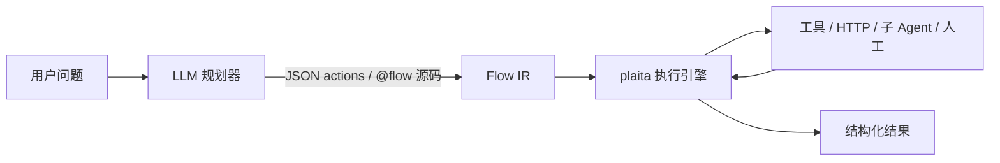
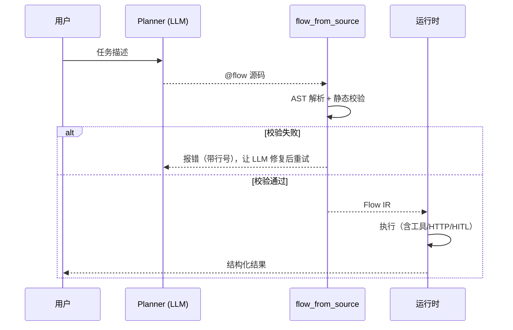

# Agent 编排

> plaita 是当下流行 **Agent 编排** 的理想运行时：让 LLM 负责"想"，Plaita 负责"跑"。

本场景把 LLM 驱动的 Agent 拆成两半——**规划**与**执行**——并用 plaita 的流程引擎承载执行这一半。一个 Agent 不再是一段难以观测、难以恢复的递归提示词调用，而是一张**可审计、可单步、可断点续执**的流程图：



- **规划**：LLM 把任务拆成一组步骤（工具调用、条件分支、子任务），输出一个 flow 定义。
- **执行**：plaita 按图执行，节点间用 `$NODE`/`$INPUT` 传参，遇到错误按策略处理，遇到人工节点挂起，全程有回调可观测。

这种"LLM 规划 + 确定性执行"的分工在生产中已经被验证（例如基于 Plaita 构建的 Agent 平台会用 LLM 生成 JSON actions 数组、再 `compose_flow` 拼成 `Flow` 跑起来）。plaita 在此基础上更进一步：除了 JSON，你还可以让 LLM 直接产出 `@flow` 源码，**编译期就拦掉非法流程**，再交给运行时执行。

## 为什么用 plaita 做 Agent 运行时

| 痛点 | plaita 的解法 |
|------|--------------|
| Agent 多步调用难追踪 | 每个节点是一个步骤，`FlowCallback` 天然就是 Agent trace |
| 工具调用之间数据流转乱 | `$NODE.<id>` 显式引用上一步输出，数据流即图 |
| LLM 生成的计划可能非法 | JSON / S-expr / `@flow` 三种前端都有**构建期静态校验** |
| 长任务等外部事件再继续 | Distributed 挂起/恢复（Stream at-least-once，见 [可靠性边界](../distributed/flow-worker.md#可靠性边界必读) / [幂等 Resume](../distributed/idempotent-resume.md)） |
| 需要人工介入再继续 | `approval` / `event` 节点挂起，事件到达恢复 |
| 多工具/多 Agent 并行 | `parallel` 节点 fan-out，`joinBranches` 汇聚 |

!!! tip "想直接跑起来？"

    仓库 `examples/agent/` 提供了三个**开箱即跑**的案例（RAG / Tool-use / Router），含 `LLMNode`/`ToolNode`/`RetrieverNode` 三个自定义节点与内置 `FakeLLM`，无需 API key：

    ```bash
    # examples/ 不随 wheel 分发，需 clone 仓库后在仓库根目录运行
    git clone https://github.com/jeffkit/plaita.git
    cd plaita
    python -m examples.agent.demo
    ```

    详见 [`examples/agent/README.md`](https://github.com/jeffkit/plaita/tree/main/examples/agent)。

    !!! note "别和 plaita-ai 工具层搞混"

        这里的 `ToolNode` 是 **`examples/agent/nodes.py` 里的教学用自定义节点**（演示「怎么写 Node」），与生产路径 **`plaita-ai` 的工具层**（`@tool` / `HttpToolSource` / YAML 清单 → 动态节点 / `TOOL(...)`）不是同一套实现。生产集成请看 [工具节点与数据源](../ai/tools.md)；本页侧重「用 plaita 跑 Agent 计划」的编排模式。

## 场景一览

下面六个模式覆盖了 Agent 编排的典型形态，每个都给出 **JSON**（最贴近 AI 生成与可视化平台产出）与 **`@flow` / S-expr**（最贴近人写与编译期校验）两种写法。

=== "JSON"

    JSON 是 Agent 平台最常用的交换格式：LLM 产出 actions 数组或 nodes 图，`Flow.from_string` 直接吃。

=== "@flow"

    `@flow` 让 LLM 用最熟悉的 Python 语法生成流程，`flow_from_source(src)` 在运行期编译，**编译期就报错**，比 JSON 更难生成非法图。

---

## 模式 1：多步工具链 + 节点间传参

最基础的 Agent 形态：调一个工具 → 拿结果 → 喂给下一个工具。节点之间用 `$NODE.<id>` 引用前序输出。

业务示例（来自真实 Agent 平台）：用户问"某剧的信息"，Agent 先按名字查剧集 ID，再用 ID 查详情，最后取出第一集的标题。

=== "JSON"

    ```json
    {
        "flow_id": "teleplay_info",
        "inputType": { "dataType": "object" },
        "nodes": [
            { "type": "start", "id": "start", "next": "find_id" },
            {
                "type": "http",
                "id": "find_id",
                "method": "GET",
                "url": "https://api.example.com/teleplays?name=",
                "timeout": "PT3S",
                "next": "get_info"
            },
            {
                "type": "http",
                "id": "get_info",
                "method": "GET",
                "url": "https://api.example.com/teleplays/",
                "timeout": "PT3S",
                "next": "get_episodes"
            },
            {
                "type": "http",
                "id": "get_episodes",
                "method": "GET",
                "url": "https://api.example.com/teleplays//episodes",
                "timeout": "PT3S",
                "next": "end"
            },
            {
                "type": "end",
                "id": "end",
                "output": {
                    "info": "$NODE.get_info.data",
                    "first_episode": "$NODE.get_episodes.data[0]"
                },
                "resultType": "success"
            }
        ]
    }
    ```

=== "@flow"

    ```python
    from plaita.dsl.codeflow import flow, HTTP

    @flow("teleplay_info", desc="查剧集信息与首集")
    def teleplay_info(INPUT):
        find_id = HTTP.get(url="https://api.example.com/teleplays?name=", timeout="PT3S")
        tid = find_id.data[0].id
        get_info = HTTP.get(url="https://api.example.com/teleplays/", timeout="PT3S")
        get_episodes = HTTP.get(url="https://api.example.com/teleplays//episodes", timeout="PT3S")
        return {"info": get_info.data, "first_episode": get_episodes.data[0]}
    ```

    > 注意 `HTTP(...)` 是节点调用，只能作语句或赋值右侧；不能写 `return HTTP.get(...).data[0]`。先赋值，再在 `return` 里引用变量（编译成 `$NODE.<id>`）。

    !!! tip "字符串里的插值用 `$` 语法"

        `body` / `return` / 条件等**表达式位置**写 `INPUT.name`（编译成 `$INPUT.name`）；但 `url` 是**字符串字面量**，里面的 `` 插值要直接写表达式语言 `$INPUT.name` / `$NODE.tid`——codeflow 不会变换字符串里的名字。

=== "S-expr"

    ```scheme
    (flow teleplay_info :input-type object :desc "查剧集信息与首集"
      (start -> find_id)
      (http :id find_id :method GET
        :url "https://api.example.com/teleplays?name="
        :timeout "PT3S" -> get_info)
      (http :id get_info :method GET
        :url "https://api.example.com/teleplays/"
        :timeout "PT3S" -> get_episodes)
      (http :id get_episodes :method GET
        :url "https://api.example.com/teleplays//episodes"
        :timeout "PT3S" -> end)
      (end end :output (dict
        :info "$NODE.get_info.data"
        :first_episode "$NODE.get_episodes.data[0]")))
    ```

运行：

```python
from plaita import Flow

flow = Flow.from_string(open("teleplay_info.json").read())
print(flow.run(name="某剧"))
# => {"info": {...}, "first_episode": {"title": "第一集", ...}}
```

!!! tip "工具不止 HTTP"

    `http` 节点是最通用的工具入口。若工具是 Python 函数，注册成[自定义节点](../nodes/custom.md)或用 `code` 节点包一层即可，节点间传参方式完全相同。

---

## 模式 2：条件分支路由

Agent 常见决策："根据上一步结果决定接下来调哪个工具"。用 `if` 或 `switch` 节点表达。

示例：翻译 Agent 检测到内容需要翻译时走翻译链，否则直接返回原文。

=== "JSON"

    ```json
    {
        "flow_id": "maybe_translate",
        "inputType": { "dataType": "object" },
        "nodes": [
            { "type": "start", "id": "start", "next": "detect" },
            {
                "type": "http",
                "id": "detect",
                "method": "POST",
                "url": "https://api.example.com/detect",
                "body": { "text": "$INPUT.text" },
                "timeout": "PT3S",
                "next": "branch"
            },
            {
                "type": "if",
                "id": "branch",
                "condition": { "field": "$NODE.detect.data.need_trans", "operator": "eq", "value": true },
                "next": "translate",
                "else_next": "end_raw"
            },
            {
                "type": "http",
                "id": "translate",
                "method": "POST",
                "url": "https://api.example.com/translate",
                "body": { "text": "$INPUT.text", "to": "zh" },
                "timeout": "PT5S",
                "next": "end_translated"
            },
            { "type": "end", "id": "end_translated", "output": "$NODE.translate.data.text", "resultType": "success" },
            { "type": "end", "id": "end_raw", "output": "$INPUT.text", "resultType": "success" }
        ]
    }
    ```

=== "@flow"

    ```python
    from plaita.dsl.codeflow import flow, HTTP

    @flow("maybe_translate")
    def maybe_translate(INPUT):
        detect = HTTP.post(url="https://api.example.com/detect", body={"text": INPUT.text}, timeout="PT3S")
        if detect.data.need_trans == True:
            translated = HTTP.post(
                url="https://api.example.com/translate",
                body={"text": INPUT.text, "to": "zh"},
                timeout="PT5S",
            )
            return translated.data.text
        return INPUT.text
    ```

=== "S-expr"

    ```scheme
    (flow maybe_translate :input-type object
      (start -> detect)
      (http :id detect :method POST :url "https://api.example.com/detect"
        :body (dict :text "$INPUT.text") :timeout "PT3S" -> branch)
      (if :id branch (cond "$NODE.detect.data.need_trans" == true)
        -> translate :else end_raw)
      (http :id translate :method POST :url "https://api.example.com/translate"
        :body (dict :text "$INPUT.text" :to "zh") :timeout "PT5S" -> end_translated)
      (end end_translated :output "$NODE.translate.data.text")
      (end end_raw :output "$INPUT.text"))
    ```

`switch` 用于多路路由（按类型分发到不同工具链），写法见 [流程定义 - 控制流](../guide/flow-definition.md#control-flow)。

---

## 模式 3：子 Agent 调用

把一个复杂子任务封装成独立子流程，父 Agent 用 `child` 节点调用——这就是"Agent 调 Agent"。

`child` 共享父上下文（像闭包），`reference` 不共享（像调独立函数）。示例：主 Agent 调一个"摘要子 Agent"。

=== "JSON"

    ```json
    {
        "flow_id": "summarize_then_translate",
        "inputType": { "dataType": "object" },
        "nodes": [
            { "type": "start", "id": "start", "next": "summarize" },
            {
                "type": "child",
                "id": "summarize",
                "input": { "text": "$INPUT.text" },
                "childFlow": {
                    "inputType": { "dataType": "object" },
                    "nodes": [
                        { "type": "start", "id": "s", "next": "llm" },
                        {
                            "type": "http",
                            "id": "llm",
                            "method": "POST",
                            "url": "https://api.example.com/llm",
                            "body": { "prompt": "用一句话总结：" },
                            "timeout": "PT10S",
                            "next": "e"
                        },
                        { "type": "end", "id": "e", "output": "$NODE.llm.data.text", "resultType": "success" }
                    ]
                },
                "next": "translate"
            },
            {
                "type": "http",
                "id": "translate",
                "method": "POST",
                "url": "https://api.example.com/translate",
                "body": { "text": "$NODE.summarize", "to": "en" },
                "timeout": "PT5S",
                "next": "end"
            },
            { "type": "end", "id": "end", "output": "$NODE.translate.data.text", "resultType": "success" }
        ]
    }
    ```

=== "@flow"

    ```python
    from plaita.dsl.codeflow import flow, childflow, CHILD, HTTP

    @childflow()
    def summarize(INPUT):
        llm = HTTP.post(
            url="https://api.example.com/llm",
            body={"prompt": "用一句话总结："},
            timeout="PT10S",
        )
        return llm.data.text

    @flow("summarize_then_translate")
    def summarize_then_translate(INPUT):
        summary = CHILD(input={"text": INPUT.text}, flow=summarize)
        translated = HTTP.post(
            url="https://api.example.com/translate",
            body={"text": summary, "to": "en"},
            timeout="PT5S",
        )
        return translated.data.text
    ```

=== "S-expr"

    ```scheme
    (flow summarize_then_translate :input-type object
      (start -> summarize)
      (child :id summarize
        :input (dict :text "$INPUT.text")
        :child (childflow :input-type object
          (start -> llm)
          (http :id llm :method POST :url "https://api.example.com/llm"
            :body (dict :prompt "用一句话总结：")
            :timeout "PT10S" -> e)
          (end e :output "$NODE.llm.data.text"))
        -> translate)
      (http :id translate :method POST :url "https://api.example.com/translate"
        :body (dict :text "$NODE.summarize" :to "en") :timeout "PT5S" -> end)
      (end end :output "$NODE.translate.data.text"))
    ```

子流程的 `input` 要与其输入形态匹配：`$INPUT` 恒为 dict，`input` 就传 dict。

---

## 模式 4：并行多工具 / 多 Agent

Agent 经常需要同时调多个工具或多个子 Agent 再汇总（例如多源检索、多模型投票）。用 `parallel` 节点 fan-out，`joinBranches` 汇聚结果。

=== "JSON"

    ```json
    {
        "flow_id": "multi_source_lookup",
        "inputType": { "dataType": "object" },
        "nodes": [
            { "type": "start", "id": "start", "next": "fanout" },
            {
                "type": "parallel",
                "id": "fanout",
                "mode": "thread",
                "joinBranches": ["web", "kb"],
                "branches": [
                    {
                        "name": "web",
                        "input": "$INPUT",
                        "flow": {
                            "inputType": { "dataType": "object" },
                            "nodes": [
                                { "type": "start", "id": "s", "next": "q" },
                                {
                                    "type": "http",
                                    "id": "q",
                                    "method": "GET",
                                    "url": "https://api.example.com/search?q=",
                                    "timeout": "PT5S",
                                    "next": "e"
                                },
                                { "type": "end", "id": "e", "output": "$NODE.q.data", "resultType": "success" }
                            ]
                        }
                    },
                    {
                        "name": "kb",
                        "input": "$INPUT",
                        "flow": {
                            "inputType": { "dataType": "object" },
                            "nodes": [
                                { "type": "start", "id": "s", "next": "q" },
                                {
                                    "type": "http",
                                    "id": "q",
                                    "method": "GET",
                                    "url": "https://kb.example.com/query?q=",
                                    "timeout": "PT5S",
                                    "next": "e"
                                },
                                { "type": "end", "id": "e", "output": "$NODE.q.data", "resultType": "success" }
                            ]
                        }
                    }
                ],
                "next": "end"
            },
            {
                "type": "end",
                "id": "end",
                "output": { "web": "$NODE.fanout.web", "kb": "$NODE.fanout.kb" },
                "resultType": "success"
            }
        ]
    }
    ```

=== "@flow"

    ```python
    from plaita.dsl.codeflow import flow, childflow, PARALLEL, HTTP

    @childflow()
    def web_search(INPUT):
        q = HTTP.get(url="https://api.example.com/search?q=", timeout="PT5S")
        return q.data

    @childflow()
    def kb_query(INPUT):
        q = HTTP.get(url="https://kb.example.com/query?q=", timeout="PT5S")
        return q.data

    @flow("multi_source_lookup")
    def multi_source_lookup(INPUT):
        results = PARALLEL(branches={"web": web_search, "kb": kb_query}, join=["web", "kb"], mode="thread")
        return {"web": results.web, "kb": results.kb}
    ```

    > `PARALLEL` 的 `branches` 用 dict 字面量：键是分支名，值是 `@childflow` 函数。`join` 列出要汇聚的分支。

=== "S-expr"

    ```scheme
    (flow multi_source_lookup :input-type object
      (start -> fanout)
      (parallel :id fanout :mode thread
        :join (list "web" "kb")
        :branches (list
          (branch "web" :input "$INPUT" :child (childflow :input-type object
            (start -> q)
            (http :id q :method GET :url "https://api.example.com/search?q="
              :timeout "PT5S" -> e)
            (end e :output "$NODE.q.data")))
          (branch "kb" :input "$INPUT" :child (childflow :input-type object
            (start -> q)
            (http :id q :method GET :url "https://kb.example.com/query?q="
              :timeout "PT5S" -> e)
            (end e :output "$NODE.q.data"))))
        -> end)
      (end end :output (dict :web "$NODE.fanout.web" :kb "$NODE.fanout.kb")))
    ```

!!! warning "并行与副作用"

    `parallel` 与 `map` 的 `concurrent` 会并发执行。并发中不要使用带副作用的表达式函数，也不要在共享上下文上写竞争数据。

---

## 模式 5：人工介入（HITL）

Agent 在敏感动作前（发款、发消息、改库）需要人类确认。用 `approval` 扩展节点挂起，决策到达后恢复。这是 Distributed 模式的典型应用。

```json
{
    "flow_id": "agent_with_approval",
    "inputType": { "dataType": "object" },
    "nodes": [
        { "type": "start", "id": "start", "next": "draft" },
        {
            "type": "http",
            "id": "draft",
            "method": "POST",
            "url": "https://api.example.com/llm/draft",
            "body": { "prompt": "$INPUT.task" },
            "timeout": "PT10S",
            "next": "confirm"
        },
        {
            "type": "approval",
            "id": "confirm",
            "approvalTitle": "Agent 草稿待确认",
            "approvalContent": "草稿: ",
            "approvalType": "manual",
            "approvers": ["reviewer_a"],
            "approvalStrategy": "any",
            "formFields": [],
            "allowComments": true,
            "next": "decide"
        },
        {
            "type": "switch",
            "id": "decide",
            "branches": [
                { "name": "ok", "next": "send", "condition": { "field": "$NODE.confirm.event_data.approved", "operator": "eq", "value": true } },
                { "name": "no", "next": "reject", "isDefault": true }
            ]
        },
        {
            "type": "http",
            "id": "send",
            "method": "POST",
            "url": "https://api.example.com/send",
            "body": { "text": "$NODE.draft.data.text" },
            "timeout": "PT5S",
            "next": "end_ok"
        },
        { "type": "end", "id": "end_ok", "output": "已发送", "resultType": "success" },
        { "type": "end", "id": "reject", "output": "已驳回", "resultType": "success" }
    ]
}
```

挂起-恢复的完整代码闭环（`run_distributed` + `MemoryEventBus` + 事件 `publish`）见 [审批流](approval-flow.md)——把那里面的 `leave_request` 换成上面的 `agent_with_approval` 即可。

---

## 模式 6：运行期生成 flow（Agent 输出沙箱）

这是 Agent 与 plaita 结合**最有价值**的入口：让 LLM 直接产出 `@flow` 源码，`flow_from_source` 在运行期编译并执行。**编译期静态校验**会拦掉非法流程（悬空引用、未知节点、`if` 缺 `else`），比起让 LLM 直接生成可执行 Python 更安全。

```python
from plaita.dsl.codeflow import flow_from_source

# 假设这是 LLM 根据用户问题生成的流程源码
ai_generated_src = '''
@flow("agent_plan", desc="查找并翻译")
def agent_plan(INPUT):
    find = HTTP.get(url="https://api.example.com/items?q=", timeout="PT3S")
    if find.data.need_trans == True:
        translated = HTTP.post(
            url="https://api.example.com/translate",
            body={"text": find.data.text, "to": "zh"},
            timeout="PT5S",
        )
        return translated.data.text
    return find.data.text
'''

flow = flow_from_source(ai_generated_src)   # 编译期校验通过才构建
result = flow.run(q="hello")
```

典型闭环：



校验失败时把错误回灌给 LLM 让它修复（类似 Agent 平台的 jsonpatch 修复循环），就能得到一个**自我纠错的 Agent 规划器**。

!!! tip "为什么用 `flow_from_source` 而非 `@flow` 装饰器"

    `@flow` 依赖 `inspect.getsource`，要求函数定义在真实 `.py` 源文件里。运行期动态生成的函数没有源文件，装饰器会失败。`flow_from_source(src)` 直接 `ast.parse` 字符串，是 Agent 动态生成流程的标准入口。详见 [类代码 DSL](../guide/code-dsl.md#flow_from_source)。

---

## 可观测：把回调当 Agent trace

每个节点 = 一个 Agent 步骤。挂一个 `FlowCallback` 就能拿到完整决策路径，无需额外 instrumentation。

```python
from plaita import Flow, FlowExecution, FlowCallback

class AgentTrace(FlowCallback):
    def on_node_end(self, flow, node, result, error, exception, **kwargs):
        status = "error" if error else "ok"
        print(f"[step] {node.node_type}/{node.id} -> {status}")
        if error:
            print(f"       error: {error}")
        else:
            print(f"       result: {result}")

    def on_flow_end(self, flow, result, error, exception, **kwargs):
        print(f"[done] final -> {result}")

flow = Flow.from_string(open("teleplay_info.json").read())
exec = FlowExecution(callback_handlers=[AgentTrace()])
exec.run_compatible(flow, False, name="某剧")
```

输出形如：

```
[step] http/find_id -> ok
       result: {'data': [{'id': 42, ...}], 'status': 200, ...}
[step] http/get_info -> ok
       result: {'data': {...}, 'status': 200, ...}
[step] http/get_episodes -> ok
       result: {'data': [{...}, ...], 'status': 200, ...}
[done] final -> {'info': {...}, 'first_episode': {...}}
```

要**逐步**看 Agent 推理（甚至每步暂停审批），用 Generator 模式：`for step in flow.debug(...): ...`，见 [生成器调试器](debug-with-generator.md)。

---

## 错误处理

Agent 调外部工具必然失败，plaita 提供三级容错：

- **节点级**：`http` 节点的 `errorHandler`（`abort` 中止 / `continue_with` 用默认值继续 / `continue` 跳过）、`retryTimes`、`timeout`。详见 [HTTP 集成](http-integration.md) 与 [错误处理与超时](../guide/error-handling.md)。
- **工具级判定**：HTTP 200 但业务失败时，在后续 `if`/`switch` 里用 `$NODE.x.data.code` 之类字段判断，走不同分支（而非抛异常）。
- **流程级**：`end` 节点 `resultType: "error"` + `error.code/message`，抛 `FlowResultError` 透传业务错误码给上层 Agent 框架。

```json
{
    "type": "http",
    "id": "risky_call",
    "method": "GET",
    "url": "https://api.example.com/flaky",
    "timeout": "PT3S",
    "errorHandler": {
        "strategy": "continue_with",
        "defaultValue": { "data": { "text": "" } },
        "retryTimes": 2
    },
    "next": "end"
}
```

---

## 要点回顾

- Agent = LLM 规划 + plaita 执行；执行这半有图、有 trace、可恢复、可审计。
- 节点间用 `$NODE.<id>` 传参，`if`/`switch` 路由，`child`/`reference` 调子 Agent，`parallel` 并行多工具，`approval`/`event` 人工介入。
- JSON 最适合平台交换与可视化；`@flow` + `flow_from_source` 最适合 LLM 生成（编译期校验 + 运行期编译）。
- `FlowCallback` 即 Agent trace；Generator 模式可逐步观测。

## 下一步

- [HTTP 集成](http-integration.md) —— `http` 节点细节与错误策略
- [审批流](approval-flow.md) —— HITL 挂起-恢复完整闭环
- [生成器调试器](debug-with-generator.md) —— 逐步观测 Agent 决策
- [类代码 DSL：S-expr 与 @flow](../guide/code-dsl.md) —— `flow_from_source` 与 Agent 输出沙箱
- [工具节点与数据源](../ai/tools.md) —— plaita-ai 生产工具层（非 examples 教学节点）
- [自定义节点](../nodes/custom.md) —— 手写 `Node` 子类（含 examples/agent 教学示例）
