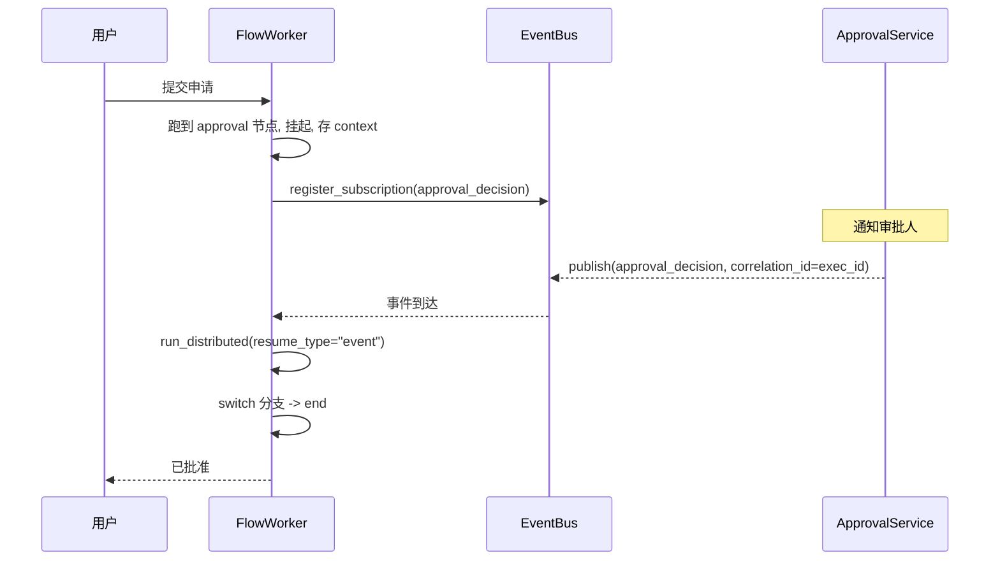

# 审批流

一个长时运行的人工审批流程：提交申请 → 等待经理审批 → 根据结果返回。用 Distributed 模式 + `approval` 扩展节点挂起，外部审批决策到达后恢复。

需安装 `server` extra：

```bash
pip install plaita[server]
```

## 流程定义

```json
{
    "flow_id": "leave_request",
    "inputType": { "dataType": "object" },
    "nodes": [
        { "type": "start", "id": "start", "next": "approve" },
        {
            "type": "approval",
            "id": "approve",
            "event_type": "approval_decision",
            "approval_title": "请假申请",
            "approval_content": "申请人: , 事由: ",
            "approval_type": "manual",
            "approvers": ["manager_a", "manager_b"],
            "approval_strategy": "any",
            "form_fields": [],
            "allow_comments": true,
            "next": "decide"
        },
        {
            "type": "switch",
            "id": "decide",
            "branches": [
                {
                    "name": "approved",
                    "next": "ok",
                    "condition": { "field": "$NODE.approve.event_data.approved", "operator": "eq", "value": true }
                },
                { "name": "rejected", "next": "no", "isDefault": true }
            ]
        },
        { "type": "end", "id": "ok", "output": "已批准", "resultType": "success" },
        { "type": "end", "id": "no", "output": "已驳回", "resultType": "success" }
    ]
}
```

`approval` 节点字段为小写下划线形式（`event_type` 必填，继承自事件节点），无驼峰归一化。挂起恢复后 `event_data` 含审批结果，`switch` 据此分支。

## 提交申请（首次推进，挂起）

```python
from plaita import FlowExecution
from plaita.event.memory import InMemoryEventBus

flow = Flow.from_string(open("leave_request.json").read())
bus = InMemoryEventBus()
execution = FlowExecution(event_bus=bus, callback_handlers=[])

step = execution.run_distributed(flow, {"applicant": "alice", "reason": "年假"})
assert step["is_suspend"] is True

exec_id = step["execution_id"]
save_context(exec_id, step["context"])   # 存入 ExecutionStorage
```

## 启动外延服务

`ApprovalService` 负责通知审批人、收集决策，决策满足策略后 `publish` `approval_decision` 事件。简化演示里我们直接 `publish`：

```python
import asyncio
from plaita.event.core import Event

async def approve(exec_id):
    await bus.publish(Event(
        event_type="approval_decision",
        data={"approved": True, "comment": "同意"},
        correlation_id=exec_id,
        source="manager_a",
    ))

asyncio.run(approve(exec_id))
```

生产中由 `ServiceManager` 启动 `ApprovalService` 监听审批系统回调，自动完成上述发布。

## 恢复流程

`resume_type="event"` 只**消费事件并恢复挂起节点本身**——后续节点要用 `resume_type="continue"` 逐步推进（每次 `run_distributed` 推进一个节点）：

```python
ctx = load_context(exec_id)
step = execution.run_distributed(
    flow,
    None,
    saved_context=ctx,
    resume_type="event",
    resume_data={"approved": True, "comment": "同意"},
)
print(step["id"])       # => "approve"（事件已消费，event_data 已写入）

# 继续推进：switch 分支 -> end，每次一个节点
while not step["is_end"]:
    step = execution.run_distributed(
        flow, None, saved_context=step["context"], resume_type="continue",
    )
print(step["result"])   # => "已批准"
assert step["is_end"] is True
```

## 用 FlowWorker 串联

生产中用 `FlowWorker` 把存储、执行、事件监听串成闭环，免去手动存取 context：

```python
from plaita.server.flow_worker import FlowWorker
from plaita.storage.memory import MemoryExecutionStorage, MemoryFlowStorage

worker = FlowWorker(
    execution_storage=MemoryExecutionStorage(),
    flow_storage=MemoryFlowStorage(),
    event_bus=bus,
)
worker.flow_storage.save_flow(flow_json_dict)

# 提交 → 挂起；事件到达 → worker 自动恢复并续跑
```

`FlowWorker` 监听 `EventBus`，收到 `correlation_id=execution_id` 的 `approval_decision` 事件后自动 `run_distributed(resume_type="event")` 恢复。

## 完整闭环



## 要点回顾

- `approval` 节点在 Distributed 模式下自动挂起，恢复时 `event_data` 含决策
- `correlation_id = execution_id` 是把事件路由回正确流程的关键
- 生产用 `FlowWorker` + `ApprovalService` 组成闭环，开发可用 `InMemoryEventBus` 手动 `publish` 验证

## 下一步

- [队列触发](queue-trigger.md) —— 另一种长时等待
- [FlowWorker](../distributed/flow-worker.md)
- [外延服务](../distributed/services.md)
