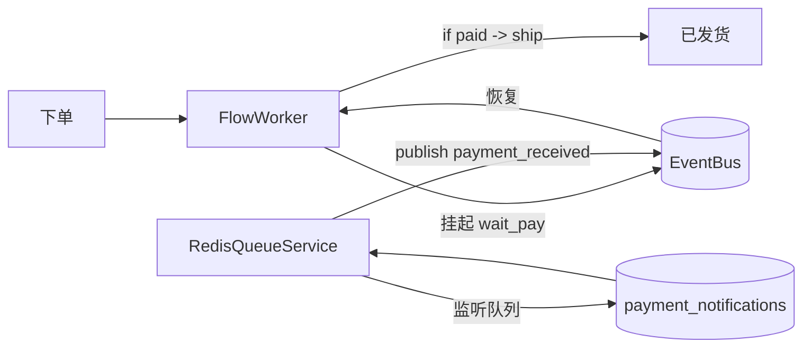

# 队列触发

流程跑到某节点后挂起，等 Redis/Kafka 队列收到消息再继续。典型用途：下单后等支付消息到达再发货。需 `server` extra（`redis_queue`）或 `redis` extra（redis）。

## 流程定义

```json
{
    "flow_id": "order_fulfill",
    "inputType": { "dataType": "object" },
    "nodes": [
        { "type": "start", "id": "start", "next": "wait_pay" },
        {
            "type": "redis_queue",
            "id": "wait_pay",
            "queueName": "payment_notifications",
            "eventType": "payment_received",
            "next": "decide"
        },
        {
            "type": "if",
            "id": "decide",
            "condition": { "field": "$NODE.wait_pay.event_data.paid", "operator": "eq", "value": true },
            "next": "ship",
            "else_next": "cancel"
        },
        { "type": "end", "id": "ship", "output": "已发货", "resultType": "success" },
        { "type": "end", "id": "cancel", "output": "已取消", "resultType": "success" }
    ]
}
```

## 提交订单并挂起

```python
from plaita import FlowExecution
from plaita.event.memory import MemoryEventBus

flow = Flow.from_string(open("order_fulfill.json").read())
bus = MemoryEventBus()
execution = FlowExecution(event_bus=bus)

step = execution.run_distributed(flow, {"order_id": "o-1"})
assert step["is_suspend"] is True
exec_id = execution._ctx.execution_id
save_context(exec_id, step["context"])
```

## 队列消息到达触发恢复

生产中 `RedisQueueService` 阻塞监听 `payment_notifications` 队列，消息到达后包装成 `payment_received` 事件 `publish`。演示里直接 publish：

```python
import asyncio
from plaita.event.core import Event

async def pay(exec_id):
    await bus.publish(Event(
        event_type="payment_received",
        data={"paid": True, "order_id": "o-1"},
        correlation_id=exec_id,
        source="payment_system",
    ))

asyncio.run(pay(exec_id))
```

## 恢复

```python
ctx = load_context(exec_id)
step = execution.run_distributed(
    flow, None, saved_context=ctx,
    resume_type="event",
    resume_data={"paid": True, "order_id": "o-1"},
)
print(step["result"])  # => "已发货"
```

## Kafka 队列

把节点 `type` 换成 `kafka_queue`，配 `topic` / `group` 等，配套 `KafkaQueueService` 监听 Kafka topic。流程侧写法不变。

```json
{
    "type": "kafka_queue",
    "id": "wait_event",
    "topic": "user_events",
    "group": "flow_consumer",
    "eventType": "kafka_user_event",
    "next": "end"
}
```

## 生产闭环



`ServiceManager` 启动 `RedisQueueService`，把队列消息转成事件；`FlowWorker` 监听事件并恢复对应挂起流程。

## 要点回顾

- `redis_queue` / `kafka_queue` 节点声明等待，外延服务负责触发
- `correlation_id=execution_id` 保证消息路由到正确的挂起流程
- 流程侧与触发侧通过 `EventBus` 解耦，可多实例负载均衡

## 下一步

- [生成器调试器](debug-with-generator.md)
- [扩展节点](../distributed/extended-nodes.md)
