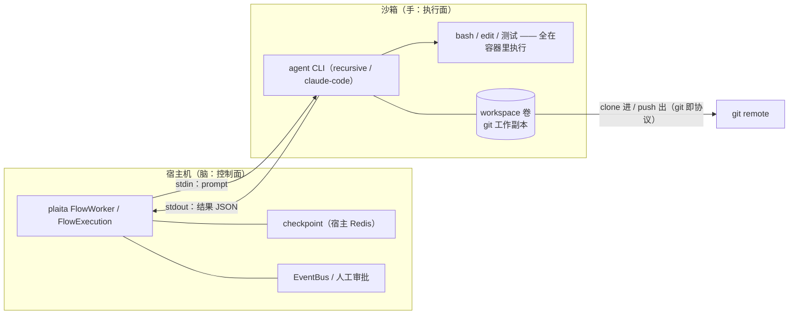

# 沙箱化 Coding Agent

> 让 agent 的「手」进容器，编排的「脑」留宿主——coding 多 agent 协同场景下，隔离执行与断点续跑两全。

coding 场景的 agent 会真实地改文件、跑测试、装依赖——这些工具调用如果直接执行在编排进程的宿主上，一次失控的 `rm -rf` 或一个恶意仓库的安装脚本就是生产事故。本场景给出解法：**把 agentrun 节点的执行面放进沙箱（容器），而 plaita 的控制面（checkpoint / EventBus / 人工审批）留在宿主**——隔离与断点续跑互不牺牲。



功能由节点层 [plaita-nodes](https://github.com/jeffkit/plaita-nodes) 的 `agentrun` 节点承载（执行层走 [agentproc](https://agentproc.dev) 协议）。设计全貌见仓内 [`docs/sandbox-drivers-design.md`](https://github.com/jeffkit/plaita-nodes/blob/main/docs/sandbox-drivers-design.md)。

## 四条设计原则

| 原则 | 一句话 | 对你的含义 |
|------|--------|-----------|
| 边界 = 共享可变状态 | 沙箱按「谁要共享工作副本」划，不按 flow 划 | 同一条接力链共享一个 workspace；并行任务、验证与写作之间分沙箱 |
| 计算层 / 数据层分离 | 容器随时可死，工作副本（volume / git remote）必须活过崩溃 | 挂起时释放计算层省资源，resume 后按名重建 |
| git 即协议 | 数据进出只经 clone / push，不做文件传输 API | 产物天然有版本、可审计；本地与云沙箱同一套语义 |
| 确定性命名 | workspace 句柄由 `(execution_id, ws_key)` 派生 | 断点续跑对沙箱的支持是免费的：按名重算即可重连，无需恢复协议 |

## 断点续跑：三层各有着落

| 层 | 沙箱化之后 | 说明 |
|----|-----------|------|
| flow 级 checkpoint | ✅ 完整保留 | 节点状态每步落宿主 Redis（见 [Checkpoint 概念](../distributed/checkpoint.md)），与 agent 在哪跑无关 |
| agent 级会话续跑 | ⚠️ best-effort | `session_id` 已在节点输出里进 checkpoint；能否跨容器重建续会话取决于镜像/数据层是否覆盖 CLI 会话目录 |
| 节点内中断续传 | ❌ 本来就没有 | at-least-once：执行中崩溃 → 整节点重投。用幂等纪律接住（见下） |

!!! warning "副作用的幂等纪律"

    agent 是副作用大户（写文件、发 PR、发评论）。沙箱化**不提供 exactly-once**：出活分支命名带 `plaita/wip/{execution_id}/{node_id}`，PR/评论挂幂等键，敏感外部动作置于人工门后。参见 [幂等 Resume](../distributed/idempotent-resume.md)。

## 快速开始

前置：宿主机装有 Docker；`pip install plaita-nodes`（`agentrun` 等节点经 entry_points 自动注册，或显式 `plaita_nodes.register_all()`）。

### 1. 注册沙箱 workspace（infra 侧，`.plaita/sandboxes.json`）

定义权在 infra 注册表，不在 flow 里——flow 作者按名引用，未注册名直接报错（fail-closed）：

```json
{
  "sandboxes": {
    "main": {
      "driver": "docker",
      "image": "ghcr.io/your-org/code-sandbox@sha256:abcd1234...",
      "provision": { "git": { "repo": "https://github.com/your-org/your-repo.git" } },
      "resources": { "cpus": "2", "memory": "4g", "timeout": 1800 },
      "egress": "bridge",
      "env": { "GIT_TOKEN": { "credential": "git-token" } }
    }
  }
}
```

要点：

- **镜像必须 digest pin**（`@sha256:...`），或条目显式 `"allow_unpinned": true` 白名单，否则 ensure 拒绝；
- `env` 的值支持 `${VAR}` 插值（缺失即报错）或凭据引用 `{"credential": 名}`（经 plaita 凭据存储解密）——密钥只经 `--env-file`（0600 即焚）进容器，宿主进程 env 的密钥面不扩大，回传内容经 canary 脱敏（注入值命中即替换为 `[REDACTED:<名>]`）；
- 搜索顺序 `~/.plaita → <repo>/.plaita`，深合并，后者覆盖。

**镜像契约**：内含 `git` 与 `timeout`（coreutils 或 busybox）；镜像自身 ENTRYPOINT 不参与执行链（driver 显式 `--entrypoint timeout`）；git 凭据由镜像内 credential helper 消费 envfile 注入的变量（如 `GIT_TOKEN`）。

### 2. 定义 agent（`agents.json`，与既有 agentrun 用法一致）

```json
{
  "agents": {
    "coder": { "executor": "recursive", "provider": "glm-52", "maxSteps": 60 }
  }
}
```

### 3. flow 里按名引用 workspace

=== "@flow"

    ```python
    @flow("sandbox_coding")
    def sandbox_coding(INPUT):
        plan = AGENTRUN(agent=INPUT.agent, workspace="main",
                        prompt=F.concat("阅读仓库，定位 issue 并给出修复计划：", INPUT.issue))
        fix = AGENTRUN(agent=INPUT.agent, workspace="main",
                       prompt=F.concat("按计划修复，跑通测试后 git push 出活：", NODE.plan.text))
        return {"plan": NODE.plan.text, "fix": NODE.fix.text}
    ```

=== "JSON"

    ```json
    {
      "flow_id": "sandbox_coding",
      "nodes": [
        { "type": "start", "id": "start", "next": "plan" },
        {
          "type": "agentrun", "id": "plan", "agent": "coder", "workspace": "main",
          "prompt": "阅读仓库，定位 issue 并给出修复计划：",
          "next": "fix"
        },
        {
          "type": "agentrun", "id": "fix", "agent": "coder", "workspace": "main",
          "prompt": "按计划修复，跑通测试后 git push 出活：",
          "next": "end"
        }
      ]
    }
    ```

两个 agentrun 声明同一个 `workspace`，后一个在前一个的工作副本上接力（串行共享）。`workspace` 支持表达式：fan-out 循环里写 `"task-"`，每次迭代自动得到独立沙箱。不声明 `workspace` 的存量 flow 行为逐字节不变（`repo` 宿主直跑路径原样保留；两者互斥）。

### 4. 跑

```python
from plaita import FlowExecution
from plaita.node import get_default_registry

get_default_registry()          # 激活 entry_points 节点发现（含 agentrun）
execution = FlowExecution()
result = execution.run(flow, params={"issue": "...", "agent": "coder"})
```

节点输出在既有 `{"text", "cli", "model", "session_id", "usage"}` 之外追加观测快照 `"workspace": {ws_key, driver, id, path, env_names}`（env 只含名字不含值）。

!!! tip "先 dry-run"

    `dry_run`（节点级或 `globalContext.dry_run`）最先判：不解析注册表、不解析凭据、零 docker 调用——校验 flow 结构与模板表达式不烧资源。

## 沙箱怎么划：三条判据

| agent 之间要共享的 | 划法 | coding 场景对应 |
|---|---|---|
| **进行中的状态**（未提交工作副本） | **同一 workspace**（串行接力） | writer → fixer → 跑测试迭代 |
| **已完成的产物**（commit / diff） | **分沙箱，走 git 交换** | reviewer 从 fresh clone 冷启动验证，还避免「在我未提交的机器上是好的」 |
| **什么都不共享 + 并行** | **必须分沙箱** | fan-out 领独立任务（git index 锁 / 端口 / 构建缓存互踩） |

同一 workspace 的 agentrun 在并行分支中会被运行期拒绝（workspace 级租约：抢不到快速失败，堵「lease 过期双执行」；机制详见设计文档 §6.5）。

## 进阶：本地 microVM（krunvm 实验档）

同一套 workspace 语义也可以落在**本地 microVM**上（[libkrun](https://github.com/containers/libkrun) / Hypervisor.framework，Apple Silicon）。flow 写法零改动——注册表里把 `driver` 换掉即可，得到比容器更强的硬件虚拟化隔离：

```json
{ "sandboxes": { "main": {
    "driver": "krunvm",
    "image": "alpine:latest",
    "allow_unpinned": true,
    "resources": { "cpus": "2", "mem": "512" }
} } }
```

安装与一次性准备（macOS）：

```bash
brew tap slp/krun && brew install krunvm    # 上游作者指定路径；需 brew trust 该 tap
diskutil apfs addVolume disk3 "Case-sensitive APFS" krunvm   # krunvm 要求大小写敏感卷（非破坏性，与主卷共享空间）
krunvm list                                  # 首跑配置，选默认挂载点 /Volumes/krunvm
```

| 维度 | `docker` driver | `krunvm` driver（实验档） |
|------|-----------------|--------------------------|
| 隔离形态 | namespace 容器 | 硬件虚拟化 microVM |
| 超时击杀 | 三段：墙钟 → 按名强杀 → 宿主兜底 | 宿主 killpg 连 VM 一起死（VMM 在调用进程内）——天然无孤儿 |
| 数据层 | named volume | 宿主数据目录（bind mount 进 VM） |
| git 数据面 | 容器内执行 | **宿主数据目录上执行**——密钥零入 VM，代价是数据面不隔离 |
| 镜像契约 | git + timeout，ENTRYPOINT 不参与执行链 | timeout + agent CLI（无 git、无网络要求） |
| 并发 | 多 workspace 并行 | v1 单 worker 假定（krunvm 的 VM 配置文件存在竞争） |

真 microVM E2E 三条已过（节点往返含 guest exit code 透传 / git 数据面 wip 纪律 / 失败 enforce），见 plaita-nodes 仓 `tests/e2e_krunvm_sandbox.py`。Firecracker 需要 Linux KVM（macOS 不可用）；同一 driver 抽象在 Linux 宿主上对齐 Firecracker 是后续项。

## 可靠性细节

- **生命周期自动释放**：部署侧注册随仓发布的 `SandboxLifecycleCallback`（plaita-nodes `lifecycle.py`），flow 挂起/结束即触发 dirty-check → 强制 wip push（`plaita/wip/{execution_id}/{ws_key}`）→ 释放计算层——挂起等审批期间不为闲置沙箱付费；重建后 working tree == 最后一次 push 的 ref。
- **孤儿回收守护**：`python -m plaita_nodes.sandbox_reaper --redis-url ... --interval 300`（status-aware：`running` 超阈值判僵尸回收、`suspended` 永不回收、终态孤儿清计算层留数据；`--dry-run` 先巡检）。资源经 docker volume labels / krunvm 数据目录 sidecar 反查 execution——不要用 `end_time IS NULL` 巡检，会把等人审批的合法执行当孤儿（见 [FlowWorker 可靠性边界](../distributed/flow-worker.md)）。
- **超时击杀三段**：容器内 `timeout` 墙钟（第一击杀权，宿主客户端死活无关）→ driver `enforce` 按派生名强杀 → runner 超时只兜底宿主侧。conformance 套件含「宿主 SIGKILL 后无孤儿」实跑场景。

## 安全机制

| 机制 | 状态 |
|------|------|
| 定义权收归 infra 注册表、未注册名 fail-closed | ✅ 已实现 |
| digest pin 强校验（未 pin 拒绝 ensure） | ✅ 已实现 |
| env 白名单 + `--env-file`（0600 即焚，密钥不进 argv） | ✅ 已实现 |
| canary 脱敏（回传/日志/checkpoint 命中即替换） | ✅ 已实现 |
| workspace 级租约（防并发双执行） | ✅ 已实现 |
| dry-run 零沙箱调用（含凭据组装） | ✅ 已实现 |
| egress 白名单档（当前支持 `none` / `bridge`） | ⏳ 白名单细分规划中 |
| token 按 execution 签发 + release 吊销 | ⏳ 规划中 |

## 现状与边界

| 能力 | 状态 |
|------|------|
| `docker` driver（本页全部内容） | ✅ 现役，已过真容器 E2E + conformance 实跑套件（含宿主 SIGKILL 无孤儿场景） |
| `krunvm` driver（本地 microVM：libkrun / Hypervisor.framework） | ✅ 实验档，真 microVM E2E 三条已过（数据面在宿主侧——密钥零入 VM；**guest 可出网**，egress 白名单为接入生产前置；macOS 需大小写敏感 APFS 卷，安装 `brew tap slp/krun && brew install krunvm`） |
| 生命周期回调（挂起即释放计算层）+ status-aware reaper | ✅ 已落地（`lifecycle.py` / `python -m plaita_nodes.sandbox_reaper`） |
| `ssh` driver（任意可达 Linux VM） | ✅ 实验档，E2E 以 Docker sshd 为靶机 4 条已过（数据面同盘：远端目录；无 env 注入——凭据应在远端配置；E2E 自动构建 sshd 靶机） |
| 真实 agent 沙箱 E2E（recursive CLI + 真实凭据 + git provision，容器内完成真实 LLM 工具循环并编辑仓库） | ✅ 已落地（`tests/e2e_real_agent_sandbox.py`，缺镜像/凭据自动 skip） |
| `e2b` 等云沙箱 API driver | ⏳ P3 |
| token 按 execution 签发 + release 吊销 | ⏳ P2（需凭据签发方，如 GitHub App） |
| egress 白名单强制档 | ⏳ P2（Linux iptables / Docker 网络策略；macOS 宿主无法实测） |

明确不做（v1）：同一 workspace 内多 agent 并发；文件传输 API（git 即协议）；`recursive_stream_turn` 等宿主直跑路径的沙箱化。

## 相关链接

- 设计全貌与评审记录：[plaita-nodes `docs/sandbox-drivers-design.md`](https://github.com/jeffkit/plaita-nodes/blob/main/docs/sandbox-drivers-design.md)
- 执行层协议：[agentproc](https://agentproc.dev)（stdin turn / stdout NDJSON；沙箱只是换了 spawn 形态，线上协议零改动）
- 断点续跑语义：[Checkpoint 概念](../distributed/checkpoint.md) · [幂等 Resume](../distributed/idempotent-resume.md)
- 写 flow 的完整规范：[plaita-ai flow-coder authoring-spec](https://github.com/jeffkit/plaita-nodes/blob/main/README.md)
