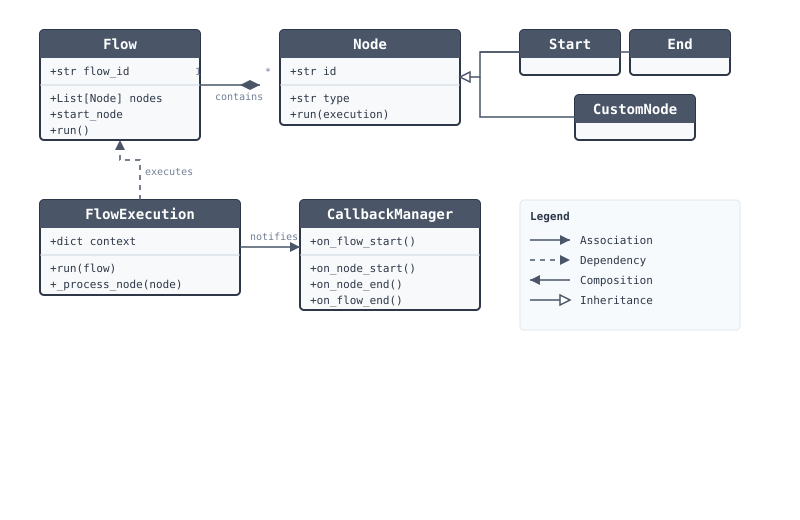
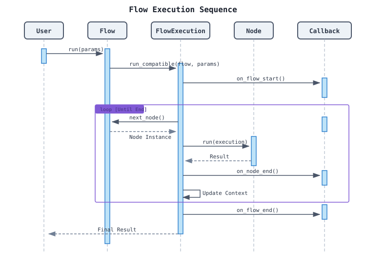
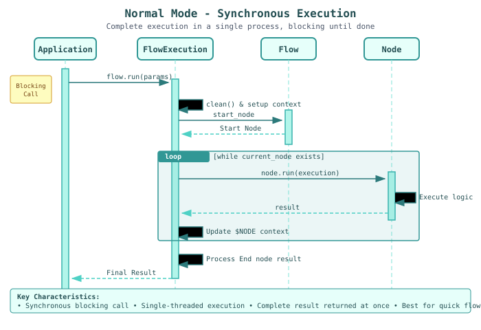
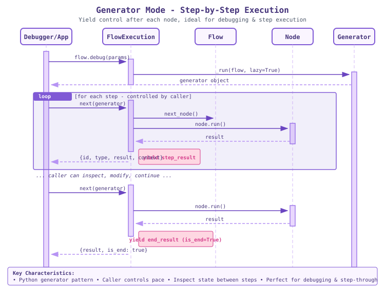
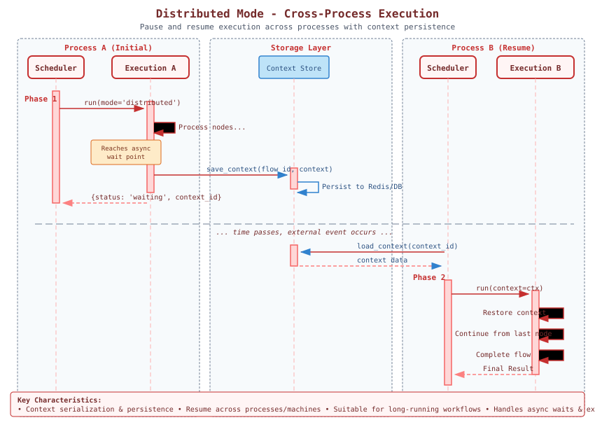

# Architecture

This document describes the architecture of `plaita`, the Python runtime for the Plaita logic orchestration system.

## Overview

`plaita` is designed to execute logic flows defined in JSON format. It separates the flow definition (`Flow`) from the execution logic (`FlowExecution`), and uses a plugin-style architecture for `Node` definitions.

## System Components

### Core Classes

-   **`Flow`**: Represents the static definition of a workflow. It parses the JSON definition and holds a list of `Node` objects and their connections (links/next properties).
-   **`Node`**: The abstract base class for all executable units in a flow. Each node type (e.g., `Start`, `End`, `Assignment`, `Switch`) implements specific logic in its `run` method.
-   **`FlowExecution`**: The runtime engine. It maintains the execution state (`Context`), handles control flow (looping through nodes, handling branches), and manages timeouts and errors. It supports different execution modes (Normal, Generator, Distributed).
-   **`CallbackManager`**: Handles lifecycle events (`flow_start`, `node_start`, `node_end`, `flow_end`), allowing for logging, monitoring, and debugging hook integration.

### Architecture Diagram



## Execution Flow

When `flow.run()` is called, it delegates the execution to `FlowExecution`. The execution engine initializes the context, finds the start node, and enters a loop to process nodes sequentially until an `End` node is reached or the flow terminates.

### Sequence Diagram



## Execution Modes

`plaita` supports three execution modes to accommodate different use cases:

### 1. Normal Mode

The default execution mode. The flow runs synchronously in a single process, blocking until completion.

**Use Cases:**
- Quick, short-running flows
- Simple request-response patterns
- When immediate results are required

**Characteristics:**
- Synchronous blocking call
- Single-threaded execution
- Complete result returned at once



**Usage:**

```python
from plaita import Flow

flow = Flow.from_string(flow_json)
result = flow.run(params)  # Blocks until complete
```

### 2. Generator Mode

Uses Python generators to yield control after each node execution. The caller controls the pace and can inspect/modify state between steps.

**Use Cases:**
- Debugging and step-through execution
- Interactive flow inspection
- Testing individual nodes
- Building visual debuggers

**Characteristics:**
- Python generator pattern (`yield`)
- Caller controls execution pace
- State inspection between steps
- Context available at each step



**Usage:**

```python
from plaita import Flow

flow = Flow.from_string(flow_json)
gen = flow.debug(params)  # Returns generator

for step in gen:
    print(f"Node: {step['id']}")
    print(f"Result: {step['result']}")
    print(f"Context: {step['context']}")
    
    if step['is_end']:
        print("Flow completed!")
        break
    
    # Optionally pause, inspect, or modify state
    input("Press Enter to continue...")
```

### 3. Distributed Mode

Designed for long-running workflows that may span multiple processes or machines. The execution context is serialized and persisted, allowing flows to pause and resume across process boundaries.

**Use Cases:**
- Long-running workflows (hours/days)
- Workflows with external wait points
- Cross-service orchestration
- Fault-tolerant execution

**Characteristics:**
- Context serialization & persistence
- Resume across processes/machines
- Handles async waits & external events
- Suitable for workflow engines



**Usage:**

```python
from plaita.flow import FlowExecution, Flow

flow = Flow.from_string(flow_json)

# Initial execution - may pause at wait points
result = FlowExecution.run(
    flow, 
    params, 
    mode='distributed'
)
# result: {'status': 'waiting', 'context_id': 'xxx'}

# ... later, in another process ...

# Resume execution with saved context
result = FlowExecution.run(
    flow,
    params,
    mode='distributed',
    context=saved_context
)
```

### Mode Comparison

| Feature | Normal | Generator | Distributed |
|---------|--------|-----------|-------------|
| Blocking | Yes | No (yields) | No (may pause) |
| Cross-process | No | No | Yes |
| State inspection | No | Yes | Yes |
| Best for | Quick flows | Debugging | Long workflows |
| Complexity | Low | Medium | High |

## State Management

The `FlowExecution` maintains a `context` dictionary which serves as the memory for the flow.

-   **`$INPUT`**: Stores the initial input parameters.
-   **`$NODE`**: Stores the results of executed nodes, keyed by node ID.
-   **`$GLOBAL`**: Stores global context variables.
-   **`$ENV`**: Stores environment variables.

Expressions in the flow (e.g., `${INPUT.name}`) are evaluated against this context.

## Error Handling

`plaita` provides comprehensive error handling capabilities:

-   **Retry mechanism**: Configurable retry count per node
-   **Error strategies**: `abort`, `continue`, `continue_with` (default value)
-   **Timeout control**: Per-node and flow-level timeouts (ISO 8601 format)
-   **Callback notifications**: Error events propagated to all registered callbacks
