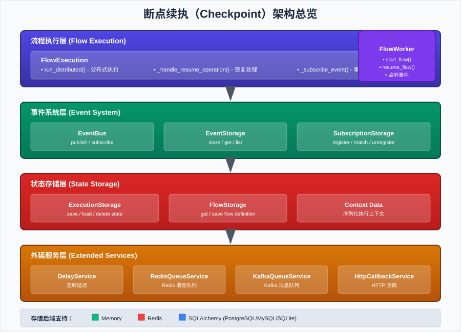
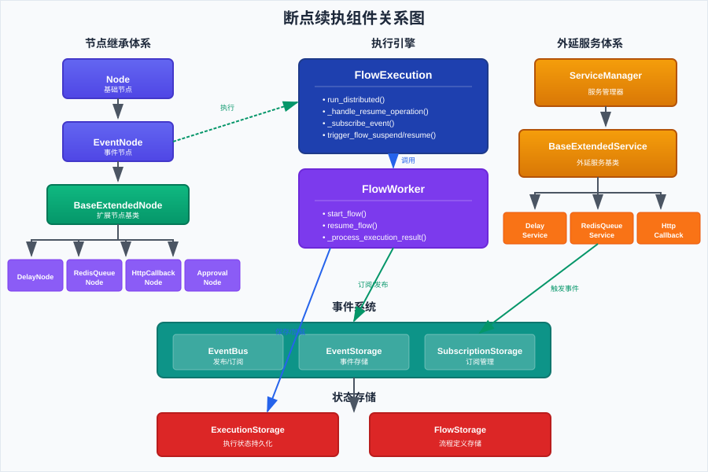
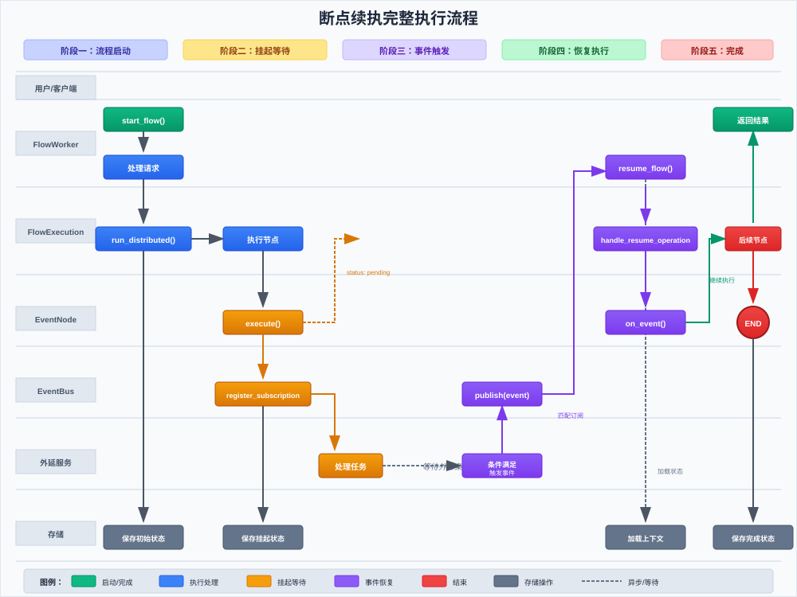

# Checkpoint Architecture Design Document

This document details the Checkpoint architecture design for `plaita`, which is the core feature supporting long-running workflows.

## 1. Overview

### 1.1 Design Background

Traditional workflow engines use synchronous blocking execution mode, which cannot support workflow scenarios requiring long waits. For example:

- **External HTTP Callbacks**: Waiting for asynchronous notifications from third-party systems
- **Manual Approval Processes**: Waiting for human intervention and decisions
- **Message Queue Triggers**: Waiting for Redis/Kafka messages to arrive
- **Delayed Execution**: Continue execution after a specified time

These scenarios require workflows to **suspend** execution state at certain nodes, **persist** context data, and **resume** execution when external events arrive.

### 1.2 Design Goals

1. **State Persistence**: Completely save workflow execution context, supporting cross-process recovery
2. **Event-Driven Recovery**: Trigger workflow recovery based on event mechanism
3. **Extensible Architecture**: Support multiple extended services (delay, queue, callback, approval, etc.)
4. **Distributed Support**: Support multi-instance deployment and load balancing

### 1.3 Core Concepts

| Concept | Description |
|---------|-------------|
| **Checkpoint** | A breakpoint in workflow execution containing complete execution context |
| **Suspend** | Workflow pauses at event node, saves state |
| **Resume** | Continue execution from checkpoint after receiving external event |
| **EventNode** | Special node type that can trigger workflow suspension |
| **Extended Service** | Background service component that handles external events |

## 2. Overall Architecture

### 2.1 Architecture Overview



The Checkpoint architecture consists of four core layers:

```
┌─────────────────────────────────────────────────────────────────┐
│                   Flow Execution Layer                           │
│  ┌─────────────────────────────────────────────────────────┐    │
│  │                    FlowExecution                         │    │
│  │  • run_distributed() - Distributed execution entry       │    │
│  │  • _handle_resume_operation() - Resume operation handler │    │
│  │  • _subscribe_event() - Event subscription               │    │
│  └─────────────────────────────────────────────────────────┘    │
└─────────────────────────────────────────────────────────────────┘
                              │
                              ▼
┌─────────────────────────────────────────────────────────────────┐
│                      Event System Layer                          │
│  ┌──────────────┐  ┌──────────────────┐  ┌─────────────────┐   │
│  │   EventBus   │  │  EventStorage    │  │ Subscription    │   │
│  │  • publish   │  │  • store_event   │  │   Storage       │   │
│  │  • subscribe │  │  • get_event     │  │                 │   │
│  └──────────────┘  └──────────────────┘  └─────────────────┘   │
└─────────────────────────────────────────────────────────────────┘
                              │
                              ▼
┌─────────────────────────────────────────────────────────────────┐
│                     State Storage Layer                          │
│  ┌──────────────────┐  ┌────────────────┐  ┌────────────────┐  │
│  │ ExecutionStorage │  │  FlowStorage   │  │  Context Data  │  │
│  │  • save_state    │  │  • get_flow    │  │  (Serialized   │  │
│  │  • load_state    │  │  • save_flow   │  │   Context)     │  │
│  └──────────────────┘  └────────────────┘  └────────────────┘  │
└─────────────────────────────────────────────────────────────────┘
                              │
                              ▼
┌─────────────────────────────────────────────────────────────────┐
│                   Extended Services Layer                        │
│  ┌──────────┐  ┌──────────┐  ┌──────────┐  ┌──────────────┐    │
│  │  Delay   │  │  Redis   │  │  Kafka   │  │    HTTP      │    │
│  │ Service  │  │  Queue   │  │  Queue   │  │  Callback    │    │
│  └──────────┘  └──────────┘  └──────────┘  └──────────────┘    │
└─────────────────────────────────────────────────────────────────┘
```

### 2.2 Component Relationship Diagram



## 3. Core Component Design

### 3.1 FlowExecution (Workflow Execution Engine)

`FlowExecution` is the core execution engine, providing the following key functions in checkpoint scenarios:

#### 3.1.1 Distributed Execution Mode

```python
def _run_distributed(
    self,
    flow: Flow,
    params: Optional[Dict] = None,
    timeout: Optional[int] = None,
    context: Optional[Dict] = None,
    resume_type: str = "continue",
    resume_data: Optional[Dict] = None,
    **options,
) -> Dict[str, Any]:
    """
    Distributed execution mode
    
    Key logic:
    1. If context is empty, start execution from beginning
    2. When reaching event node, save context and suspend
    3. If context exists, resume from last suspension point
    """
```

**Execution State Output Format**:

```python
{
    "id": "node_id",           # Current node ID
    "type": "event",           # Node type
    "name": "Wait Approval",   # Node name
    "result": {...},           # Node execution result
    "branch": "",              # Branch name
    "context": {...},          # Complete execution context
    "is_end": False,           # Is end
    "is_suspend": True,        # Is suspended
    "execution_id": "xxx"      # Execution ID
}
```

#### 3.1.2 Resume Operation Handling

```python
def _handle_resume_operation(
    self, 
    flow: Flow, 
    resume_type: str, 
    resume_data: Optional[Dict] = None
) -> Dict:
    """
    Handle resume operation
    
    Supported resume types:
    - continue: Continue executing next node
    - cancel: Cancel current wait
    - timeout: Timeout handling
    - event: Received external event
    """
```

#### 3.1.3 Event Subscription Mechanism

When workflow reaches an `EventNode`, `FlowExecution` registers subscription with the event bus:

```python
def _subscribe_event(self, node, flow, node_state):
    """
    Subscribe events for EventNode
    
    Subscription parameters:
    - event_type: Event type
    - filter_condition: Filter condition
    - correlation_id: Correlation ID (execution ID)
    - flow_id: Flow ID
    - node_id: Node ID
    """
```

### 3.2 EventNode

`EventNode` is a special node type that supports suspend/resume, and is the core node base class for checkpoint functionality.

#### 3.2.1 Status Enumeration

```python
class EventNodeStatus(Enum):
    PENDING = "pending"       # Waiting for event
    COMPLETED = "completed"   # Event completed normally
    ERROR = "error"           # Processing error
    TIMEOUT = "timeout"       # Wait timeout
    CANCELLED = "cancelled"   # Listen cancelled
```

#### 3.2.2 Core Interface

| Method | Description |
|--------|-------------|
| `execute(execution)` | Execute node, return event listen info |
| `on_event(execution, event_data)` | Processing logic when event arrives |
| `on_timeout(execution)` | Timeout handling |
| `on_cancel(execution)` | Cancel handling |
| `on_error(execution, error_message)` | Error handling |

#### 3.2.3 Execution Result Format

```python
{
    "event_type": "approval.completed",
    "event_filter": {"order_id": "12345"},
    "event_id": "event_node1_1703945678000",
    "status": "pending",
    "is_async": True
}
```

### 3.3 Event System

The event system is the core infrastructure for workflow recovery, using publish/subscribe pattern.

#### 3.3.1 Core Interface

```python
class EventBus(ABC):
    """Event bus interface"""
    
    async def publish(self, event: Event) -> str:
        """Publish event"""
        pass
    
    async def register_subscription(
        self,
        event_type: str,
        filter_condition: Optional[Dict] = None,
        correlation_id: Optional[str] = None,
        flow_id: Optional[str] = None,
        node_id: Optional[str] = None
    ) -> str:
        """Register event subscription"""
        pass
    
    async def register_handler(
        self,
        event_type: Optional[str] = None,
        handler: EventHandler = None,
        retry_policy: Optional[RetryPolicy] = None
    ) -> str:
        """Register event handler"""
        pass
```

#### 3.3.2 Event Matching Mechanism

Event matching supports multiple patterns:

```python
# 1. Exact match
"user.login" -> Only matches "user.login"

# 2. Prefix wildcard
"user.*" -> Matches "user.login", "user.logout", etc.

# 3. Suffix wildcard
"*.login" -> Matches "user.login", "admin.login", etc.

# 4. Global match
"*" or None -> Matches all events
```

#### 3.3.3 Multiple Backend Implementations

| Implementation | Use Case | Features |
|----------------|----------|----------|
| `InMemoryEventBus` | Single machine/Testing | Simple, high performance, no persistence |
| `RedisEventBus` | Distributed | Multi-instance support, PubSub mechanism |
| `SqlalchemyEventBus` | Strong persistence | Transaction support, complex queries |

### 3.4 State Storage

State storage is responsible for persisting workflow execution state, which is the data foundation for checkpoint recovery.

#### 3.4.1 Execution State Model

```python
class ExecutionState(BaseModel):
    execution_id: str           # Execution ID, unique identifier
    flow_id: Optional[str]      # Flow ID
    flow_name: Optional[str]    # Flow name
    flow_version: Optional[str] # Flow version
    context: Dict[str, Any]     # Execution context
    status: str                 # Status: running/suspended/completed/error
    start_time: Optional[str]   # Start time
    last_update_time: Optional[str]  # Last update time
    end_time: Optional[str]     # End time
    error: Optional[Dict]       # Error information
    invoker: Optional[str]      # Invoker
```

#### 3.4.2 Storage Interface

```python
class ExecutionStorage(ABC):
    def save_execution_state(self, execution_id: str, state: ExecutionState) -> bool:
        """Save execution state"""
        pass
    
    def load_execution_state(self, execution_id: str) -> Optional[ExecutionState]:
        """Load execution state"""
        pass
    
    def delete_execution_state(self, execution_id: str) -> bool:
        """Delete execution state"""
        pass
    
    def list_executions(self, query=None, order_by=None, limit=100, offset=0) -> List[ExecutionState]:
        """List execution states"""
        pass
```

### 3.5 FlowWorker

`FlowWorker` is a background worker responsible for listening to events and resuming suspended workflows.

#### 3.5.1 Core Functions

```python
class FlowWorker:
    """Flow worker"""
    
    def start_flow(self, flow_id: str, params: Dict, version: str = None) -> Dict:
        """Start flow execution"""
        pass
    
    def resume_flow(
        self, 
        flow_id: str, 
        execution_id: str, 
        resume_type: str, 
        data: Dict = None
    ) -> Dict:
        """Resume flow execution"""
        pass
    
    def _process_execution_result(self, flow, result, state) -> Dict:
        """Process execution result, loop until end or suspend"""
        pass
```

#### 3.5.2 Redis Worker

```python
class RedisFlowWorker(FlowWorker):
    """Redis-based flow worker"""
    
    def run(self):
        """
        Get tasks from Redis queue and process
        Message types:
        - start: Start new flow
        - resume: Resume suspended flow
        """
        while True:
            message = self.redis_client.blpop(self.queue_name, timeout=10)
            if message:
                self._process_message(message)
```

## 4. Extended Nodes and Services

### 4.1 Extended Node System

Extended nodes inherit from `EventNode`, providing out-of-the-box solutions for specific scenarios.

#### 4.1.1 Inheritance Hierarchy

```
Node (Base Node)
  └── EventNode (Event Node)
        └── BaseExtendedNode (Extended Node Base)
              ├── DelayNode
              ├── RedisQueueNode
              ├── KafkaQueueNode
              ├── HttpCallbackNode
              └── ApprovalNode
```

#### 4.1.2 BaseExtendedNode

```python
class BaseExtendedNode(EventNode):
    """Extended node base class"""
    
    def execute(self, execution):
        """Execution logic"""
        # Generate service config
        service_config = self.generate_service_config(execution)
        
        # Call parent execute
        result = super().execute(execution)
        
        # Add service config
        result.update({
            "service_config": service_config,
            "node_subtype": self.node_type
        })
        
        return result
    
    @abstractmethod
    def generate_service_config(self, execution) -> Dict[str, Any]:
        """Generate extended service config (subclass must implement)"""
        pass
```

#### 4.1.3 Extended Node List

| Node Type | Description | Event Type Example |
|-----------|-------------|-------------------|
| `DelayNode` | Continue after specified delay | `delay.completed` |
| `RedisQueueNode` | Wait for Redis queue message | `redis_queue.message` |
| `KafkaQueueNode` | Wait for Kafka message | `kafka.message` |
| `HttpCallbackNode` | Wait for HTTP callback | `http.callback` |
| `ApprovalNode` | Wait for manual approval | `approval.decision` |

### 4.2 Extended Service System

Extended services are background components that handle extended node tasks.

#### 4.2.1 Service Base Class

```python
class BaseExtendedService(ABC):
    """Extended service base class"""
    
    def __init__(self, event_bus: EventBus, service_config: Dict = None):
        self.event_bus = event_bus
        self.service_config = service_config or {}
        self.active_tasks: Set[str] = set()
        self.thread_pool = ThreadPoolExecutor(max_workers=self.get_max_workers())
    
    @abstractmethod
    def get_service_type(self) -> str:
        """Get service type"""
        pass
    
    @abstractmethod
    def start_service(self) -> bool:
        """Start service"""
        pass
    
    @abstractmethod
    def stop_service(self) -> bool:
        """Stop service"""
        pass
    
    @abstractmethod
    async def handle_task(self, task_config: Dict) -> bool:
        """Handle task"""
        pass
    
    async def trigger_event(self, event_type: str, event_data: Dict):
        """Trigger event to notify flow resume"""
        event = Event(event_type=event_type, data=event_data)
        await self.event_bus.publish(event)
```

#### 4.2.2 Service Manager

```python
class ServiceManager:
    """Service manager for unified lifecycle management"""
    
    def __init__(self, event_bus: EventBus):
        self.event_bus = event_bus
        self.services: Dict[str, BaseExtendedService] = {}
        self.service_classes = {
            "delay": DelayService,
            "redis_queue": RedisQueueService,
            "kafka_queue": KafkaQueueService,
            "http_callback": HttpCallbackService,
            "approval": ApprovalService,
        }
    
    def start_all_services(self, configs: Dict = None) -> bool:
        """Start all services"""
        pass
    
    def stop_all_services(self, timeout: float = None) -> bool:
        """Stop all services"""
        pass
    
    def submit_task(self, service_type: str, task_config: Dict) -> str:
        """Submit task to specified service"""
        pass
```

## 5. Execution Flow Details

### 5.1 Complete Execution Flow Diagram



### 5.2 Flow Start Phase

```
1. User calls FlowExecution.run(mode="distributed")
2. FlowExecution initializes execution context
3. Generate unique execution_id
4. Start execution from start_node
5. Save initial execution state to ExecutionStorage
```

### 5.3 Event Node Processing Phase

```
1. FlowExecution executes to EventNode
2. EventNode.execute() generates event listen config
3. FlowExecution._subscribe_event() registers subscription with EventBus
4. Update node status to pending
5. Return suspended state (is_suspend=True)
6. FlowWorker saves execution state
7. Extended service starts processing task
```

### 5.4 Wait and Resume Phase

```
1. Extended service processes task (e.g., wait delay time, listen queue)
2. When condition is met, extended service publishes event to EventBus
3. EventBus matches subscription, finds corresponding flow execution
4. FlowWorker receives event notification
5. FlowWorker loads execution state
6. FlowWorker calls resume_flow()
7. FlowExecution._handle_resume_operation() handles resume
8. EventNode.on_event() updates node status
9. Continue executing subsequent nodes
```

### 5.5 Flow End Phase

```
1. FlowExecution executes to EndNode
2. Update execution status to completed
3. Trigger flow_end callback
4. Return final execution result
5. Optional: Clean up subscriptions and temporary data
```

## 6. State Machine and Lifecycle

### 6.1 Flow Execution State Machine

```
                    ┌──────────────┐
                    │   created    │
                    └──────┬───────┘
                           │ start
                           ▼
┌──────────────────────────────────────────────┐
│                                              │
│  ┌──────────────┐       ┌──────────────┐    │
│  │   running    │◄──────│   resumed    │    │
│  └──────┬───────┘       └──────▲───────┘    │
│         │                      │            │
│         │ suspend              │ resume     │
│         ▼                      │            │
│  ┌──────────────┐              │            │
│  │  suspended   │──────────────┘            │
│  └──────────────┘                           │
│         │                                   │
│         │ timeout/cancel/error              │
│         ▼                                   │
└─────────┬────────────────────────────────────
          │
          ▼
    ┌──────────────┐       ┌──────────────┐
    │  completed   │       │    error     │
    └──────────────┘       └──────────────┘
```

### 6.2 Event Node State Machine

```
┌──────────────┐
│   initial    │
└──────┬───────┘
       │ execute
       ▼
┌──────────────┐
│   pending    │───────────────┬───────────────┐
└──────┬───────┘               │               │
       │                       │               │
       │ on_event              │ on_timeout    │ on_cancel
       ▼                       ▼               ▼
┌──────────────┐        ┌──────────────┐ ┌──────────────┐
│  completed   │        │   timeout    │ │  cancelled   │
└──────────────┘        └──────────────┘ └──────────────┘
```

## 7. Callbacks and Event Notifications

### 7.1 FlowCallback Interface

Checkpoint introduces new callback methods:

```python
class FlowCallback(ABC):
    # Flow-level callbacks
    def on_flow_start(self, flow, **kwargs) -> None: ...
    def on_flow_end(self, flow, result, error, exception, **kwargs) -> None: ...
    def on_flow_suspend(self, flow, **kwargs) -> None: ...   # New
    def on_flow_resume(self, flow, **kwargs) -> None: ...    # New
    
    # Node-level callbacks
    def on_node_start(self, flow, node, **kwargs) -> None: ...
    def on_node_end(self, flow, node, result, error, exception, **kwargs) -> None: ...
    def on_node_suspend(self, flow, node, **kwargs) -> None: ...  # New
    def on_node_resume(self, flow, node, **kwargs) -> None: ...   # New
```

### 7.2 Callback Trigger Timing

| Callback Method | Trigger Timing |
|-----------------|----------------|
| `on_flow_suspend` | When flow suspends at event node |
| `on_flow_resume` | When flow resumes from suspended state |
| `on_node_suspend` | When event node starts waiting |
| `on_node_resume` | When event node receives event and resumes |

## 8. Deployment Architecture

### 8.1 Single Machine Deployment

```
┌─────────────────────────────────────────────────┐
│              Single Machine Deployment           │
│                                                 │
│  ┌──────────────────────────────────────────┐  │
│  │           Application Process             │  │
│  │  ┌─────────────┐  ┌─────────────────────┐│  │
│  │  │ FlowWorker  │  │  Extended Services  ││  │
│  │  └─────────────┘  └─────────────────────┘│  │
│  └──────────────────────────────────────────┘  │
│                      │                         │
│                      ▼                         │
│  ┌──────────────────────────────────────────┐  │
│  │   InMemory EventBus / MemoryStorage      │  │
│  └──────────────────────────────────────────┘  │
└─────────────────────────────────────────────────┘
```

### 8.2 Distributed Deployment

```
┌─────────────────────────────────────────────────────────────────┐
│                    Distributed Deployment                        │
│                                                                 │
│  ┌─────────────────┐  ┌─────────────────┐  ┌─────────────────┐ │
│  │  FlowWorker #1  │  │  FlowWorker #2  │  │  FlowWorker #N  │ │
│  └────────┬────────┘  └────────┬────────┘  └────────┬────────┘ │
│           │                    │                    │          │
│           └────────────────────┼────────────────────┘          │
│                                │                               │
│                                ▼                               │
│  ┌─────────────────────────────────────────────────────────┐   │
│  │                 Redis / PostgreSQL                       │   │
│  │  ┌───────────┐  ┌───────────────┐  ┌─────────────────┐  │   │
│  │  │ EventBus  │  │ExecutionStore │  │  FlowStore      │  │   │
│  │  └───────────┘  └───────────────┘  └─────────────────┘  │   │
│  └─────────────────────────────────────────────────────────┘   │
│                                                                 │
│  ┌─────────────────────────────────────────────────────────┐   │
│  │              Extended Services Cluster                   │   │
│  │  ┌──────────┐  ┌──────────┐  ┌──────────┐  ┌──────────┐ │   │
│  │  │  Delay   │  │  Redis   │  │  Kafka   │  │   HTTP   │ │   │
│  │  │ Service  │  │  Queue   │  │  Queue   │  │ Callback │ │   │
│  │  └──────────┘  └──────────┘  └──────────┘  └──────────┘ │   │
│  └─────────────────────────────────────────────────────────┘   │
└─────────────────────────────────────────────────────────────────┘
```

## 9. Usage Examples

### 9.1 Define Flow with Event Nodes

```json
{
  "flow_id": "approval_workflow",
  "version": "1.0.0",
  "nodes": [
    {
      "id": "start",
      "type": "start",
      "next": "submit_request"
    },
    {
      "id": "submit_request",
      "type": "assignment",
      "assignments": [
        {"target": "request_id", "value": "${INPUT.request_id}"}
      ],
      "next": "wait_approval"
    },
    {
      "id": "wait_approval",
      "type": "event",
      "event_type": "approval.decision",
      "event_filter": {
        "request_id": "${NODE.submit_request.request_id}"
      },
      "next": "check_result"
    },
    {
      "id": "check_result",
      "type": "switch",
      "condition": "${NODE.wait_approval.event_data.approved}",
      "branches": [
        {"name": "approved", "next": "process_approved"},
        {"name": "rejected", "next": "process_rejected"}
      ]
    },
    {
      "id": "process_approved",
      "type": "assignment",
      "assignments": [{"target": "status", "value": "approved"}],
      "next": "end"
    },
    {
      "id": "process_rejected",
      "type": "assignment",
      "assignments": [{"target": "status", "value": "rejected"}],
      "next": "end"
    },
    {
      "id": "end",
      "type": "end"
    }
  ]
}
```

### 9.2 Start and Resume Flow

```python
from plaita.flow import FlowExecution, Flow, ExecutionMode
from plaita.server.flow_worker import FlowWorker
from plaita.storage.redis import RedisExecutionStorage, RedisFlowStorage
from plaita.event.redis import RedisEventBus

# Create storage and event bus
execution_storage = RedisExecutionStorage(host="localhost")
flow_storage = RedisFlowStorage(host="localhost")
event_bus = RedisEventBus(redis_url="redis://localhost:6379")

# Create worker
worker = FlowWorker(execution_storage, flow_storage, event_bus)

# Start flow
result = worker.start_flow(
    flow_id="approval_workflow",
    params={"request_id": "REQ-001"},
    version="1.0.0"
)
# result: {"execution_id": "xxx", "is_suspend": True, ...}

# Simulate approval completion, send event
await event_bus.publish({
    "event_type": "approval.decision",
    "data": {
        "request_id": "REQ-001",
        "approved": True,
        "approver": "manager"
    },
    "correlation_id": result["execution_id"]
})

# FlowWorker automatically receives event and resumes flow
```

### 9.3 Using Delay Node

```json
{
  "id": "delay_5_minutes",
  "type": "delay",
  "delay_seconds": 300,
  "next": "continue_processing"
}
```

### 9.4 Using Redis Queue Node

```json
{
  "id": "wait_message",
  "type": "redis_queue",
  "queue_name": "order_updates",
  "timeout": 3600,
  "next": "process_message"
}
```

## 10. Best Practices

### 10.1 Flow Design

1. **Clarify Wait Points**: Clearly identify all possible wait points during flow design
2. **Set Timeouts**: Set reasonable timeout for all event nodes
3. **Handle Edge Cases**: Design timeout, cancel, error handling branches

### 10.2 State Management

1. **Minimize Context**: Only store necessary data in context
2. **Avoid Large Objects**: Don't store large binary data in context
3. **Regular Cleanup**: Regularly clean up completed execution states

### 10.3 Event Design

1. **Unique Event Types**: Use meaningful and unique event type naming
2. **Include Correlation ID**: Include correlation_id in events for tracking
3. **Idempotent Processing**: Ensure event processing is idempotent

### 10.4 Operations Monitoring

1. **Monitor Suspended Flows**: Monitor long-suspended flows
2. **Timeout Alerts**: Set up timeout alert mechanism
3. **Log Tracing**: Complete logging of flow execution

## 11. FAQ

### Q1: What happens if service restarts while flow is suspended?

A: Execution state is persisted to storage. After service restart, FlowWorker will automatically load suspended flows and continue execution when events arrive.

### Q2: How to handle event loss?

A: It's recommended to use Redis or database as event storage backend to ensure event persistence. Also set timeout for event nodes; after timeout, you can retry or go to exception branch.

### Q3: How do multiple FlowWorker instances coordinate?

A: When using Redis as event bus and state storage, multiple FlowWorker instances can coordinate automatically, and events will be processed by one of the instances.

### Q4: How to debug checkpoint flows?

A: Use Generator mode for step-by-step execution, or add detailed log callbacks to trace flow execution.

## 12. References

- [Event System Architecture](../plaita/event/ARCHITECTURE.md)
- [Extended Nodes User Guide](../plaita/server/README.md)
- [Requirements Specification](../requirements/checkpoint-requirements.md)

