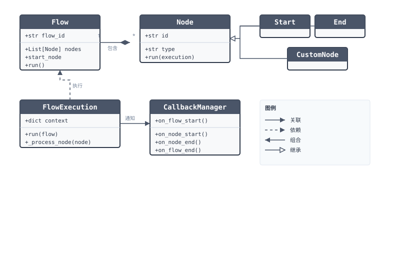
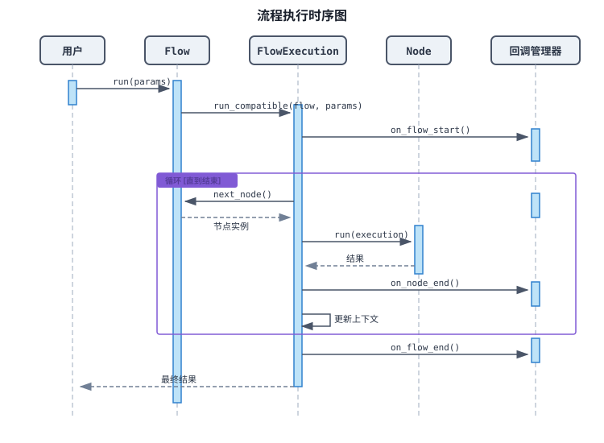
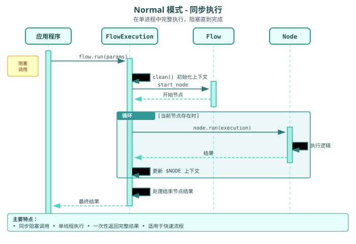

# 系统架构

本文档介绍 `plaita` 的系统架构，这是 Plaita 逻辑编排系统的 Python 运行时。

## 概述

`plaita` 设计用于执行 JSON 格式定义的逻辑流程。它将流程定义（`Flow`）与执行逻辑（`FlowExecution`）分离，并采用插件式架构来管理 `Node` 定义。

## 系统组件

### 核心类

-   **`Flow`**：表示工作流的静态定义。它解析 JSON 定义并持有 `Node` 对象列表及其连接关系（links/next 属性）。
-   **`Node`**：所有流程执行单元的抽象基类。每种节点类型（如 `Start`、`End`、`Assignment`、`Switch`）都在其 `run` 方法中实现特定逻辑。
-   **`FlowExecution`**：运行时引擎。它维护执行状态（`Context`），处理控制流（节点循环、分支处理），并管理超时和错误。支持多种执行模式（Normal、Generator、Distributed）。
-   **`CallbackManager`**：处理生命周期事件（`flow_start`、`node_start`、`node_end`、`flow_end`），支持日志记录、监控和调试钩子集成。

### 架构图



## 执行流程

当调用 `flow.run()` 时，它将执行委托给 `FlowExecution`。执行引擎初始化上下文，找到开始节点，然后进入循环逐个处理节点，直到到达 `End` 节点或流程终止。

### 时序图



## 执行模式

`plaita` 支持三种执行模式以适应不同的使用场景：

### 1. Normal 模式（普通模式）

默认的执行模式。流程在单个进程中同步运行，阻塞直到完成。

**使用场景：**
- 快速、短时运行的流程
- 简单的请求-响应模式
- 需要立即获取结果时

**特点：**
- 同步阻塞调用
- 单线程执行
- 一次性返回完整结果



**使用方法：**

```python
from plaita import Flow

flow = Flow.from_string(flow_json)
result = flow.run(params)  # 阻塞直到完成
```

### 2. Generator 模式（生成器模式）

使用 Python 生成器在每个节点执行后交出控制权。调用方可以控制执行节奏，并在步骤之间检查或修改状态。

**使用场景：**
- 调试和单步执行
- 交互式流程检查
- 测试单个节点
- 构建可视化调试器

**特点：**
- Python 生成器模式（`yield`）
- 调用方控制执行节奏
- 每一步都可检查状态
- 上下文在每步可用


**使用方法：**

```python
from plaita import Flow

flow = Flow.from_string(flow_json)
gen = flow.debug(params)  # 返回生成器

for step in gen:
    print(f"节点: {step['id']}")
    print(f"结果: {step['result']}")
    print(f"上下文: {step['context']}")
    
    if step['is_end']:
        print("流程完成！")
        break
    
    # 可选：暂停、检查或修改状态
    input("按 Enter 继续...")
```

### 3. Distributed 模式（分布式模式）

专为可能跨多个进程或机器的长时间运行工作流设计。执行上下文会被序列化和持久化，允许流程在进程边界之间暂停和恢复。

**使用场景：**
- 长时间运行的工作流（数小时/数天）
- 有外部等待点的工作流
- 跨服务编排
- 容错执行

**特点：**
- 上下文序列化与持久化
- 跨进程/跨机器恢复
- 处理异步等待和外部事件
- 适用于工作流引擎


**使用方法：**

```python
from plaita.flow import FlowExecution, Flow

flow = Flow.from_string(flow_json)

# 初始执行 - 可能在等待点暂停
result = FlowExecution.run(
    flow, 
    params, 
    mode='distributed'
)
# result: {'status': 'waiting', 'context_id': 'xxx'}

# ... 稍后，在另一个进程中 ...

# 使用保存的上下文恢复执行
result = FlowExecution.run(
    flow,
    params,
    mode='distributed',
    context=saved_context
)
```

### 模式对比

| 特性 | Normal | Generator | Distributed |
|------|--------|-----------|-------------|
| 阻塞 | 是 | 否（yield） | 否（可暂停） |
| 跨进程 | 否 | 否 | 是 |
| 状态检查 | 否 | 是 | 是 |
| 最适用于 | 快速流程 | 调试 | 长时间工作流 |
| 复杂度 | 低 | 中 | 高 |

## 状态管理

`FlowExecution` 维护一个 `context` 字典，作为流程的内存。

-   **`$INPUT`**：存储初始输入参数。
-   **`$NODE`**：存储已执行节点的结果，按节点 ID 索引。
-   **`$GLOBAL`**：存储全局上下文变量。
-   **`$ENV`**：存储环境变量。

流程中的表达式（如 `${INPUT.name}`）会根据此上下文进行求值。

## 错误处理

`plaita` 提供全面的错误处理能力：

-   **重试机制**：每个节点可配置重试次数
-   **错误策略**：`abort`（中止）、`continue`（继续）、`continue_with`（使用默认值继续）
-   **超时控制**：节点级别和流程级别的超时（ISO 8601 格式）
-   **回调通知**：错误事件传播到所有注册的回调

